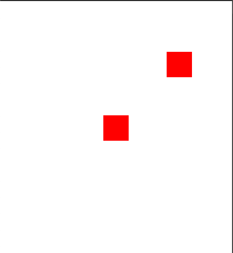

> 出处: https://github.com/sketchpunk/FunWithWebGL2
> 目标: 学习 WebGL
> 概要: 对代码的理解笔记。
> 地点: 北京通州
> 笔记作者: DSLMing
> 时间: 2019.10.7(国庆最后一天)  17:48
> 题目: 绘制一个点

### 一、初始化canvas
使用:
```js
gl = GLInstance("glcanvas").fSetSize(500, 500).fClear();
```

源码代码:
```js
function GLInstance(canvasID){
	var canvas = document.getElementById(canvasID),
		gl = canvas.getContext("webgl2");

	if(!gl){ console.error("WebGL context is not available."); return null; }

	//...................................................
	//Setup GL, Set all the default configurations we need.
	gl.clearColor(1.0,1.0,1.0,1.0);		//Set clear color

	//...................................................
	//Methods
	gl.fClear = function(){ this.clear(this.COLOR_BUFFER_BIT | this.DEPTH_BUFFER_BIT); return this; }

	//...................................................
	//Setters - Getters

	//Set the size of the canvas html element and the rendering view port
	gl.fSetSize = function(w,h){
		//set the size of the canvas, on chrome we need to set it 3 ways to make it work perfectly.
		this.canvas.style.width = w + "px";
		this.canvas.style.height = h + "px";
		this.canvas.width = w;
		this.canvas.height = h;

		//when updating the canvas size, must reset the viewport of the canvas
		//else the resolution webgl renders at will not change
		this.viewport(0,0,w,h);
		return this;
	}

	return gl;
}
```

### 二、着色器
#### 1、着色器的使用步骤
1) 获取`顶点着色器`和`片元着色器`的文本
2) 编译
3) 链接
4) 获取 `Uniforms`和`Attributes`的操作指针。
这里是`a_position` 点的位置和`uPointSize`点的大小。

着色器使用步骤:
```js
//SHADER STEPS
// 1. Get Vertex and Fragment Shader Text
var vShaderTxt = ShaderUtil.domShaderSrc("vertex_shader"),
fShaderTxt = ShaderUtil.domShaderSrc("fragment_shader"),
// 2. Compile text and validate
vShader = ShaderUtil.createShader(gl, vShaderTxt, gl.VERTEX_SHADER),
fShader = ShaderUtil.createShader(gl, fShaderTxt, gl.FRAGMENT_SHADER),
// 3. Link the shaders together as a program.
shaderProg = ShaderUtil.createProgram(gl, vShader, fShader, true);
// 4. Get Location of Uniforms and Attributes.
gl.useProgram(shaderProg);
var aPositionLoc = gl.getAttribLocation(shaderProg, "a_position"),
  uPointSizeLoc = gl.getUniformLocation(shaderProg, "uPointSize");
gl.useProgram(null);
```

顶点着色器代码:
```js
in vec3 a_position;
uniform float uPointSize;
void main(void){
  gl_PointSize = uPointSize;
  gl_Position = vec4(a_position, 1.0);
}
```

片元着色器代码:
```js
precision mediump float;
out vec4 finalColor;
void main(void) {
  finalColor = vec4(1.0, 0.0, 0.0, 1.0);
}
```

#### 2、准备顶点数据
```js
// Set Up Data Buffers
// 顶点坐标(0,0)和(0.5,0.5)
var aryVerts = new Float32Array([0.0, 0.0, 0, 0.5, 0.5, 0]),
  bufVerts = gl.createBuffer();
// 创建缓冲区
gl.bindBuffer(gl.ARRAY_BUFFER, bufVerts);
gl.bufferData(gl.ARRAY_BUFFER, aryVerts, gl.STATIC_DRAW);
gl.bindBuffer(gl.ARRAY_BUFFER, null);
```

#### 3、为缓冲区赋值
```js
//Set Up For Drawing
gl.useProgram(shaderProg);				//Activate the Shader
// 传入顶点的大小
gl.uniform1f(uPointSizeLoc, 50.0);		//Store data to the shader's uniform variable uPointSize

// 传入顶点的坐标
//how its down without VAOs
gl.bindBuffer(gl.ARRAY_BUFFER, bufVerts);					//Tell gl which buffer we want to use at the moment
gl.enableVertexAttribArray(aPositionLoc);					//Enable the position attribute in the shader
gl.vertexAttribPointer(aPositionLoc, 3, gl.FLOAT, false, 0, 0);	//Set which buffer the attribute will pull its data from
gl.bindBuffer(gl.ARRAY_BUFFER, null);						//Done setting up the buffer
```

#### 4、开始绘制
```js
this.gl.drawArrays(gl.POINTS, 0, 2);						//Draw the points
```


