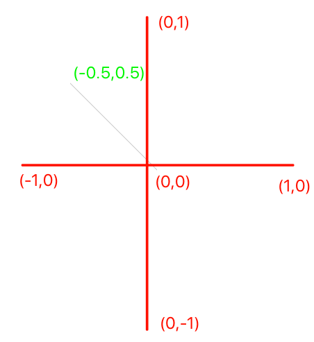

顶点坐标系是从(-1,1)
绘制一条(0,0) 到 (-0.5, 0.5)到直线


关键代码:
```js
verts = [
			-0.5, 0.5, 0,
			0.0, 0.0, 0,
    ]
gl.bufferData(gl.ARRAY_BUFFER, new Float32Array(verts), gl.STATIC_DRAW);
gl.vertexAttribPointer(
			ATTR_POSITION_LOC						//Attribute Location
			, 3										//How big is the vector by number count
			, gl.FLOAT 								//What type of number we passing in
			, false									//Does it need to be normalized?
			, 0								//How big is a vertex chunk of data.
			, 0										//Offset by how much
    );
gl.drawArrays(gl.LINES, 0, 2);
```
