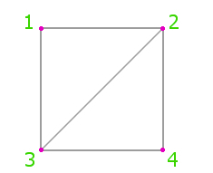
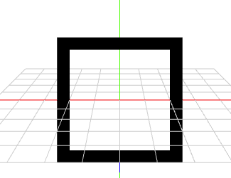
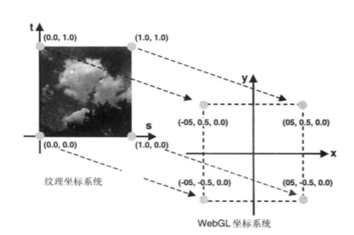

> 参考:
>1) 对应FunWithWebGL2-007
>2) https://www.cnblogs.com/charlee44/p/11628462.html
>3) https://blog.csdn.net/lufy_Legend/article/details/38549421
>4) WebGL 编程指南

#### 1、引入顶点缓冲(IBO)
绘制矩形需要2个三角形,也就是6个顶点坐标。但是顶点2和顶点3的数据是重复的。这个时候就顶点缓存就出现了。


#### 2、矩形数据
使用`顶点坐标`和`顶点索引`就可以绘制四边形了。如果想绘制一个带边框的矩形,还需要使用了`纹理坐标`。
效果为:

```js
// 定义顶点坐标v1, v2, v3, v4
aVert = [-0.5, 0.5, 0,
         -0.5, -0.5, 0,
         0.5, -0.5, 0,
         0.5, 0.5, 0]

// 定义顶点索引:
// 第一个三角形用 aVert[0],aVert[1],aVert[2]
// 第二个三角形用 aVert[2],aVert[3],aVert[0]
aIndex = [0, 1, 2, 2, 3, 0];
// uv 信息,纹理坐标
aUV = [0,0, 0,1, 1,1, 1,0],
```
#### 3、立方体数据
拓展一下,立方体需要的数据为:


#### 4、纹理坐标
纹理坐标的作用常规上是描述一张纹理贴图在3d模型的映射关系。


**纹理**的知识点:
- 纹理中的每一个纹理像素可以通过它的坐标来描述。
- 纹理坐标的范围是0.0～1.0,用(U,V)标识
- 使用时,将纹理坐标分配给顶点坐标,中间的像素用差值计算。

这里, 四边形的顶点坐标有4个v1~v4, 纹理坐标的对应关系定位为:
```js
//     v1,  v2,  v3,  v4
aUV = [0,0, 0,1, 1,1, 1,0],
```

#### 5、着色器代码
顶点着色器代码:
```glsl
#version 300 es
in vec3 a_position;	//Standard position data.
in vec2 a_uv;

uniform mat4 uPMatrix;
uniform mat4 uMVMatrix;
uniform mat4 uCameraMatrix;

out vec2 uv;

void main(void){
  uv = a_uv;
  gl_Position = uPMatrix * uCameraMatrix * uMVMatrix * vec4(a_position, 1.0);
}
```
片元着色器代码:
```glsl
#version 300 es
precision mediump float;
in vec2 uv;

out vec4 finalColor;
void main(void){
  //Square Border
  float c = (uv.x <= 0.1 || uv.x >=0.9 || uv.y <= 0.1 || uv.y >= 0.9)? 0.0 : 1.0;
  finalColor = vec4(c,c,c,1.0-c);

  //Circle
  /*
  vec2 delta = uv - vec2(0.5,0.5); //delta position from center;
  float dist = 0.5 - sqrt(delta.x*delta.x + delta.y*delta.y);

  float border = 0.01;
  float a = 0.0;
  if(dist > border) a = 1.0;
  else if(dist > 0.0) a = dist / border;

  finalColor = vec4(0.0,0.0,0.0,a);
  */
}
```

<我不怕千万人阻挡，只怕自己投降!>

