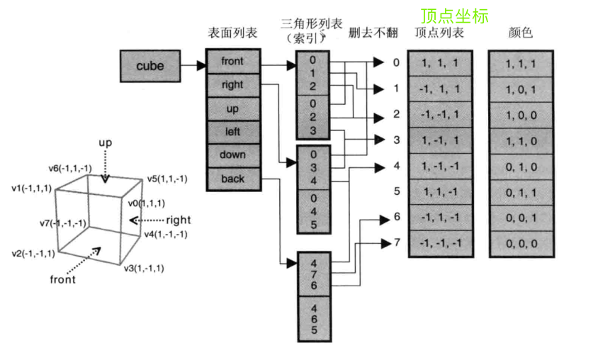
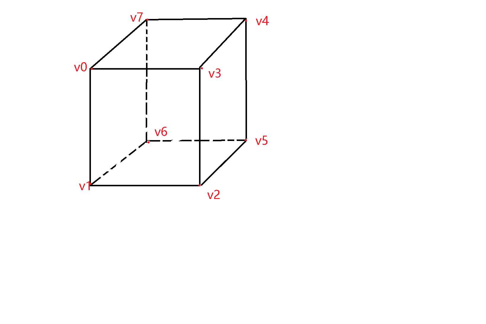
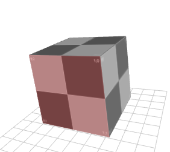

作者: DSLMing
时间: 2019.10.11

> 参考
> WebGL 编程指南.pdf 第7章
> https://cloud.tencent.com/developer/article/1005103

### 创建立方体
从左上角开始，然后逆时针旋转以创建正面。


#### 1、创建顶点
```js
//-----------------------------------------------
  //          (x0,y1,z0)       (x1,y1,z0)
  //           --------------/|
  //         /|            /  |
  //(x0,y1,z1)|     (x1,y1,z1)|
  //     |------------|       |
  //     |    |       |       |
  //     |    - - - - |- - - -| (x1,y0,z0)
  //     |  /  (x0,y0,z0)  /
  //     |------------|
  // (x0,y0,z1)      (x1,y0,z1)
  //
  //
  //-----------------------------------------------
var w = width*0.5, h = height*0.5, d = depth*0.5;
var x0 = x-w, x1 = x+w, y0 = y-h, y1 = y+h, z0 = z-d, z1 = z+d;
var aVert = [
  x0, y1, z1, 0,	//0 Front
  x0, y0, z1, 0,	//1
  x1, y0, z1, 0,	//2
  x1, y1, z1, 0,	//3

  x1, y1, z0, 1,	//4 Back
  x1, y0, z0, 1,	//5
  x0, y0, z0, 1,	//6
  x0, y1, z0, 1,	//7

  x0, y1, z0, 2,	//7 Left
  x0, y0, z0, 2,	//6
  x0, y0, z1, 2,	//1
  x0, y1, z1, 2,	//0

  x0, y0, z1, 3,	//1 Bottom
  x0, y0, z0, 3,	//6
  x1, y0, z0, 3,	//5
  x1, y0, z1, 3,	//2

  x1, y1, z1, 4,	//3 Right
  x1, y0, z1, 4,	//2
  x1, y0, z0, 4,	//5
  x1, y1, z0, 4,	//4

  x0, y1, z0, 5,	//7 Top
  x0, y1, z1, 5,	//0
  x1, y1, z1, 5,	//3
  x1, y1, z0, 5	//4
];
```

#### 2、顶点索引
顶点索引在立方体位置的对应关系:


顶点索引是 aVert 每4个一组的索引,比如aVert[0] =  (x0, y1, z1, 0)。几个一组由传入GPU缓存时是指定。
```js
// aIndex = [
//   0, 1, 2, 2, 3, 0, //Front
//   4, 5, 6, 6, 7, 4, //Back
//   7, 6, 1, 1, 0, 7, //Left
//   3, 2, 5, 5, 4, 3, //Right
//   7, 0, 3, 3, 4, 7, //Top
//   7, 6, 1, 1, 0, 7  //Left
// ];
// 这里的计算结果与上面结果不同,效果一样。因为aVert范围是aVert[0]~aVert[20],
var aIndex = [];
for(var i=0; i < aVert.length / 4; i+=2) {
  aIndex.push(i, i+1, (Math.floor(i/4)*4)+((i+2)%4));
}
```

#### 3、纹理贴图UV
uv信息描述了顶点的贴图信息。一个顶点坐标由(u,v)描述。一个 `v0`~`v7` 8个顶点,所以aUV.length = 16。
```js
// aUV = [
//   0, 0, 0, 1, 1, 1, 1, 0,
//   0, 0, 0, 1, 1, 1, 1, 0
// ],
var aUV = [];
for(var i=0; i < 6; i++) aUV.push(0,0,	0,1,  1,1,  1,0);
```
#### 4、顶点法线信息
顶点法线不同于面法线,WebGL使用顶点法线计算更快。
每个顶点有一条法线。6个面每个面4个点,一共需要24个顶点,那么就需要24个顶点法线。每条法线由(x,y,z)确定一条方向向量。(0,0,1)表示z轴的正方形。这个例子暂时用不到,涉及光着反射才会用的顶点法线。

```js
var aNorm = [
  // Front
  0,0,1, 0,0,1, 0,0,1, 0,0,1,
  // Back
  0,0,-1, 0,0,-1, 0,0,-1, 0,0,-1,
  // Left
  -1,0,0, -1,0,0, -1,0,0, -1,0,0,
  // Bottom
  0,-1,0, 0,-1,0, 0,-1,0, 0,-1,0,
  // Right
  1,0,0, 1,0,0, 1,0,0, 1,0,0,
  // Top
  0,1,0, 0,1,0, 0,1,0, 0,1,0
]
```

#### 5、绘制
顶点着色器:
```js
#version 300 es
//Making it a vec4, the w component is used as color index from uColor
in vec4 a_position;
in vec3 a_norm;
in vec2 a_uv;

uniform mat4 uPMatrix;
uniform mat4 uMVMatrix;
uniform mat4 uCameraMatrix;

uniform vec3 uColor[6];
uniform float uTime;

out lowp vec4 color;
//Interpolate UV values to the fragment shader
out highp vec2 texCoord;

vec3 warp(vec3 p){
  //return p + 0.2 * abs(cos(uTime*0.002)) * a_norm;
  //return p + 0.5 * abs(cos(uTime*0.003 + p.y)) * a_norm;
  return p + 0.5 * abs(cos(uTime*0.003 + p.y*2.0 + p.x*2.0 + p.z)) * a_norm;
}

void main(void){
  texCoord = a_uv;
  color = vec4(uColor[ int(a_position.w) ],1.0);
  // gl_Position = uPMatrix * uCameraMatrix * uMVMatrix * vec4(warp(a_position.xyz), 1.0);
  gl_Position = uPMatrix * uCameraMatrix * uMVMatrix * vec4(a_position.xyz, 1.0);
}
```

片元着色器:
```js
#version 300 es
precision mediump float;

in vec4 color;
in highp vec2 texCoord;		//What pixel to pull from the texture
uniform sampler2D uMainTex;	//Holds the texture we loaded to the GPU

out vec4 finalColor;
void main(void){			//Confusing that UV's coords are S,T but in all honestly it works just like X,Y
  //finalColor = color;
  //finalColor = texture(uMainTex,texCoord);	//Just The Texture
  //finalColor = color * texture(uMainTex,texCoord); //Mixing Texture and Color together
  //finalColor = color * texture(uMainTex,texCoord) * 1.5f; //Making the colors brighter
  //finalColor = color + texture(uMainTex,texCoord); //Mixing the color and textures with addition,Dif effect
  finalColor = mix(color,texture(uMainTex,texCoord),0.8f); //Using mix func to fade between two pixel colors.
}
```

最终效果:

<全文结束>
