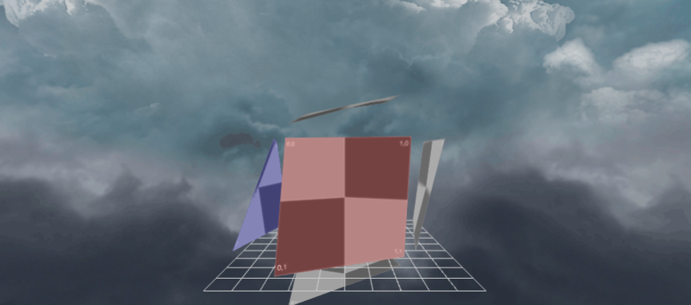

作者: DSLMing
时间: 2019.10.14

> 参考
> WebGL 编程指南.pdf 第7章
> FunWithWebGL2 010-Cubemap

### 立方体贴图
在今天的课程中，我们将学习如何使用6种纹理来构建3d纹理（立方体贴图）。 这将使我们能够使用上一课中的多维数据集在虚拟世界中构建一个天空盒。



#### 1、加载资源
将立方体需要的6张贴图加载出来。然后

#### 2、天空盒结构
创建一个大的立方体。

#### 3、显示天空盒纹理
顶点着色器:
```js
#version 300 es
in vec4 a_position;
in vec2 a_uv;

uniform mat4 uPMatrix;
uniform mat4 uMVMatrix;
uniform mat4 uCameraMatrix;

out highp vec3 texCoord;  //Interpolate UV values to the fragment shader

void main(void){
  texCoord = a_position.xyz;
  gl_Position = uPMatrix * uCameraMatrix * vec4(a_position.xyz, 1.0);
}
```

片段着色器:
```js
#version 300 es
precision mediump float;

in highp vec3 texCoord;
uniform samplerCube uDayTex;
uniform samplerCube uNightTex;
uniform float uTime;

out vec4 finalColor;
void main(void){
  finalColor = mix( texture(uDayTex, texCoord), texture(uNightTex, texCoord), abs(sin(uTime * 0.0005)) );
}
```
