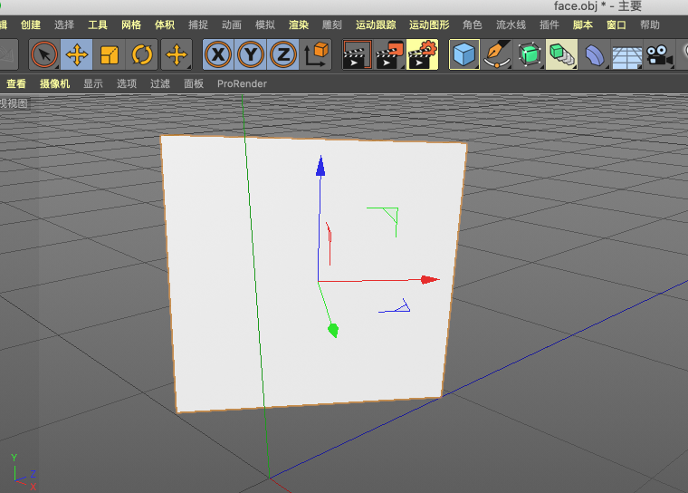

作者: DSLMing
时间: 2019.10.18

> 参考:
> https://www.jianshu.com/p/f7f3e7b6ebf5
> https://blog.csdn.net/charvl/article/details/90183137

#### obj文件格式
#### 1、face.obj文件
这是一个完整的面的.obj文件,该文件可以在c4d中打开。

```js
# WaveFront *.obj file (generated by CINEMA 4D)

mtllib ./face.mtl

v -0.5 0 0.5
v 0.5 0 0.5
v -0.5 0 -0.5
v 0.5 0 -0.5
# 4 vertices

vn 0 1 0
# 1 normal

vt 0 0 0
vt 0 1 0
vt 1 1 0
vt 1 0 0
# 4 texture coordinates

o 平面
usemtl default
s off
f 2/4/1 4/3/1 3/2/1 1/1/1
```

#### 2、解析
##### 1) 通用信息
- 以(#)开始的一行表示注释
- 以(v)开始表示顶点坐标,v -0.5 0 0.5
- 以(vn)开始表示法线信息,vn 0 1 0
- 以(vt)开始表示纹理信息,vt 0 0 0
- 以(f)开始表示面信息,f 2/4/1 4/3/1 3/2/1 1/1/1
- 输出名字,o 平面
- 使用材质,usemtl default
- 关闭光滑组,s off

##### 2)表面单元f
表面单元通过一个包含顶点，纹理以及法线索引的序列来表示。类似四边形这种多边形可以通过多于三个包含顶点/纹理/法线索引来定义。

形如`[VertexIndex/UVIndex/NormalIndex]`这种格式:
```js
f v1/vt1/vn1 v2/vt2/vn2 v3/vt3/vn3
```
那么`f 2/4/1 4/3/1 3/2/1 1/1/1`表示:
- 这个面有4个顶点
- 第一个顶点的几何坐标:vertices[2]
- 第一个顶点的纹理坐标:vt[4]
- 第一个顶点的法线信息:vn[1]
...

**注意:** 这里vertices、vt、vn的索引是从1开始。

<全文结束>
