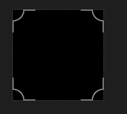
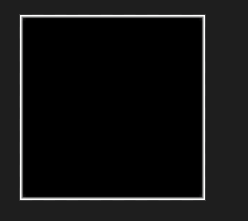
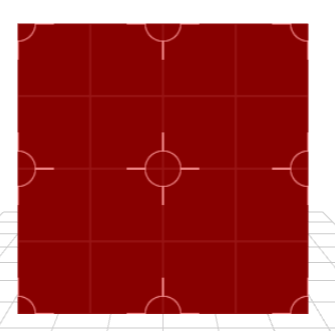
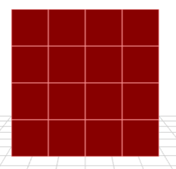
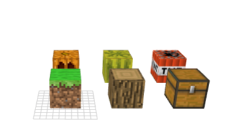

作者: DSLMing
时间: 2019.10.23

> 参考:
> FunWithWebGL2 014 Texture Masks
> FunWithWebGL2 015 Texture Atlas
> FunWithWebGL2 016 Video Texture

### 一、嵌套纹理
指定纹理的位置,从而将2张纹理组合成一个新的纹理。
例如,有纹理A:


还有纹理B:


最终组合为:


#### 1、片元代码
```js
precision mediump float;
uniform sampler2D uMask_A;
uniform sampler2D uMask_B;
uniform vec3[2] uColors;
in highp vec2 vUV;
out vec4 outColor;

void main(void){
  // 0.2 是让mask_a的颜色强度弱一些
  vec4 mask_a = texture(uMask_A,vUV*4.0) * 0.2;
  vec4 mask_b = texture(uMask_B,vUV*2.0);
  float c = min(mask_a.r + mask_b.r,1.0);

  outColor = vec4( mix(uColors[0],uColors[1], c), 1.0);
}
```

这个纹理坐标放大4倍和放大2倍,那么就会重复相应的倍数。例如放大4倍:
```js
vec4 mask_a = texture(uMask_A,vUV*4.0);
float c = min(mask_a.r,1.0);
```


将不同的纹理进行放缩然后混合就可以达到嵌套纹理的效果了。

<全文结束>


### 二、雪碧图
效果如图:



1) 指定每个立方体6个面在雪碧图的位置。
```glsl
var texMap = [
  [3,0, 3,0, 3,0, 2,0, 3,0, 2,9],			//GrassDirt
  [4,1, 4,1, 4,1, 5,1, 4,1, 5,1],			//Log
  [11,1, 10,1, 10,1, 9,1, 10,1, 9,1],		//Chest
  [7,7, 6,7, 6,7, 6,7, 6,7, 6,6],			//Pumpkin
  [8,8, 8,8, 8,8, 9,8, 8,8, 9,8],			//WaterMelon
  [8,0, 8,0, 8,0, 10,0, 8,0, 9,0]			//TNT
];
```

2) 将texMap 传给着色器uFaces.
```js
for(var i=0; i < gCubes.length; i++){
  gShader.setUniforms("uFaces",texMap[i]).renderModel( gCubes[i].preRender() );
}
```

3) 顶点着色器代码
```js
in vec4 a_position;
in vec3 a_norm;
in vec2 a_uv;

uniform mat4 uPMatrix;
uniform mat4 uMVMatrix;
uniform mat4 uCameraMatrix;
uniform vec2[6] uFaces;
out highp vec2 vUV;

const float size = 1.0/16.0;

void main(void){
  int f = int(a_position.w);
  float u = uFaces[f].x * size + a_uv.x * size;
  float v = uFaces[f].y * size + a_uv.y * size;
  // 计算uv坐标给片元着色器中使用
  vUV = vec2(u,v);
  ...
}
```

4) 片元着色器
```js
precision mediump float;
uniform sampler2D uAltas;
in highp vec2 vUV;
out vec4 outColor;

void main(void){ outColor = texture(uAltas,vUV); }
```

### 三、视频纹理
#### 1、加载视频资源
```js
var vid = document.createElement("video");
vid.style.display = "none";
document.body.appendChild(vid);

vid.queueData = itm;
vid.addEventListener("loadeddata", Resources.onDownloadSuccess, false);
vid.onabort = vid.onerror = Resources.onDownloadError;
vid.autoplay = true;
vid.loop = true;
vid.src = itm.src;
vid.load();
vid.play();
window.lm = Resources
Resources.Videos[itm.name] = vid;
```
最终资源存储在 Resources.Videos.vid。

#### 2、获取当前帧更新到纹理
```js
gl.fUpdateTexture("vid",Resources.Videos["vid"],false,true);

gl.fUpdateTexture = function (name, img, doYFlip, noMips) {
  // console.error(img);
  var tex = this.mTextureCache[name];
  if (doYFlip == true) this.pixelStorei(this.UNPACK_FLIP_Y_WEBGL, true);	//Flip the texture by the Y Position, So 0,0 is bottom left corner.

  this.bindTexture(this.TEXTURE_2D, tex);														//Set text buffer for work
  this.texImage2D(this.TEXTURE_2D, 0, this.RGBA, this.RGBA, this.UNSIGNED_BYTE, img);			//Push image to GPU.

  if (noMips === undefined || noMips == false) {
    this.texParameteri(this.TEXTURE_2D, this.TEXTURE_MAG_FILTER, this.LINEAR);					//Setup up scaling
    this.texParameteri(this.TEXTURE_2D, this.TEXTURE_MIN_FILTER, this.LINEAR_MIPMAP_NEAREST);	//Setup down scaling
    this.generateMipmap(this.TEXTURE_2D);	//Precalc different sizes of texture for better quality rendering.
  } else {
    this.texParameteri(this.TEXTURE_2D, this.TEXTURE_MAG_FILTER, this.NEAREST);
    this.texParameteri(this.TEXTURE_2D, this.TEXTURE_MIN_FILTER, this.NEAREST);
    this.texParameteri(this.TEXTURE_2D, this.TEXTURE_WRAP_S, this.CLAMP_TO_EDGE);
    this.texParameteri(this.TEXTURE_2D, this.TEXTURE_WRAP_T, this.CLAMP_TO_EDGE);
  }

  this.bindTexture(this.TEXTURE_2D, null);									//Unbind

  if (doYFlip == true) this.pixelStorei(this.UNPACK_FLIP_Y_WEBGL, false);	//Stop flipping textures
  return tex;
}
```

#### 3、片元着色器
```glsl
#version 300 es
precision mediump float;
uniform sampler2D uTex;
in highp vec2 vUV;
out vec4 outColor;

void main(void){ outColor = texture(uTex,vUV); }
```
<全文结束>
