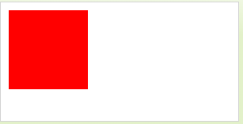

作者: DSLMing
时间: 2019.10.24

> 参考:
> FunWithWebGL2 017 Terrains

### 过程纹理-地形
纹理一般分成两类, 直接贴图的图片、通过代码生成纹理----**过程纹理**(procedural texture)。**过程纹理**简单来说就是一个时间(运算)换空间(内存)的换算。

使用triangle_strip绘制模式来连接顶点网格的点以创建平面。 在perlin噪声的帮助下，我们将平面变成了丘陵地形，然后通过组装一个简单的着色器以应用基本照明来完成它，从而更容易从视觉上看到我们的地形曲率。 我们通过使用一些在网上找到的着色器代码来完成它，以创建低多边形（例如，地形的漫反射着色）。


#### 1、Perlin Noise(柏林噪声)
Perlin Noise 可以用来表现自然界中无法用简单形状来表达的物体的形态，比如火焰、烟雾、表面纹路等,地形的高度图是通过 Perlin Noise 生成的。


Perlin Noise有两种:Simplex噪声、分形噪声。

#### 2、使用canvas 创建图像
创建 100*100 像素的 ImageData 对象，其中每个像素都是红色的，然后把它放到画布上。


```js
var c=document.getElementById("myCanvas");
var ctx=c.getContext("2d");
// imgData.data.length = width * height * 4
var imgData=ctx.createImageData(100,100);
for (var i=0; i<imgData.data.length; i+=4) {
  // RGBA
  imgData.data[i+0]=255;
  imgData.data[i+1]=0;
  imgData.data[i+2]=0;
  imgData.data[i+3]=255;
}
ctx.putImageData(imgData,10,10);
```

每个像素由4个值构成, 分别对应RGBA。例如第一个像素的构成:
```js
R: imgData.data[0]
G: imgData.data[1]
B: imgData.data[2]
A: imgData.data[3]
```

#### 3、随机梯度
- 在生成梯度时，理论上应该任意生成一个长度为1的向量。
- 一维的情况下可以在`{8,7,6,5,4,3,2,1,-1,-2,-3,-4,-5,-6,-7,-8}`这16个整数中任选一个作为斜率，这样可以方便的通过对坐标值进行位操作实现。
- 二维的情况下，梯度可以从`{(1,2),(2,1),(-1,2),(-2,1),(-1,-2),(-2,-1),(1,-2),(2,-1)}`这8个向量之中随机选择一个。这8个向量具有相同的长度，因此点积后的归一化计算可以省略。
- 三维的情况下，梯度可以从以原点为中心，边长为2的正方体每边的中点共12个向量中选择，即从`{(0,1,1),(0,1,-1),(0,-1,-1),(0,-1,1),(1,0,1),(1,0,-1),(-1,0,-1),(-1,0,1),(1,1,0),(-1,1,0),(-1,-1,0),(1,-1,0)}`中选择一个。在实际实现 时也可以通过位操作进行。

#### 4、随机排列数组
Perlin还预计算了一个随机排列数组p[n]，p[n]里面存储的是打乱后的0~n-1的排列值。当我们想要得到`(x, y)`处晶格的梯度向量时，可以使用: $G=G[(x+P[y])_{mod \ n}]$。

#### 5、生成地形
```js
static createMesh(gl,w,h,rLen,cLen,keepRawData){
  // 计算Z位置时行的起始位置
  let rStart = w / -2
  // 计算X位置时列的起始位置
  let cStart = h / -2
  // 创建平面所需的总顶点
  let  vLen = rLen * cLen
  // 创建三角带所需的总索引值（不计算退化三角位置）
  let iLen = (rLen-1)*cLen
  // 计算X位置时列的增量值
  let cInc = w / (cLen-1)
  // 计算Z位置时行的增量值
  let rInc = h / (rLen-1)
  // Current Row
  let cRow = 0
  // Current Column
  let cCol = 0
  // Vertice Array
  let aVert = []
  // Index Array
  let aIndex = []
  // UV Map Array
  let aUV = []
  // 计算UV的X UV位置时列的增量值
  let uvxInc = 1 / (cLen-1)
  // 计算Z UV位置时的行增量值
  let uvyInc = 1 / (rLen-1)

  // Perlin Noise
  noise.seed(1);
  // temporary height
  let h = 0
  // 如何消除佩林噪声的频率
  let freq = 13
  // Max Height
  let  maxHeight = -3

  // ..................................
  // Generate the vertices and the index array.
  for(var i=0; i < vLen; i++){
    cRow = Math.floor(i / cLen);	//Current Row
    cCol = i % cLen;				//Current Column
    h = noise.perlin2((cRow+1)/freq, (cCol+1)/freq) * maxHeight;

    //Create Vertices,x,y,z
    aVert.push(cStart+cCol*cInc, 0.2 + h, rStart+cRow*rInc);

    //Create UV s,t. Spread the 0,0 to 1,1 throughout the whole plane
    aUV.push( (cCol == cLen-1)? 1 : cCol * uvxInc,
      (cRow == rLen-1)? 1 : cRow * uvyInc );

    //Create the index, We stop creating the index before the loop ends creating the vertices.
    if(i < iLen){
      //Column index of row R and R+1
      aIndex.push(cRow * cLen + cCol, (cRow+1) * cLen + cCol);

      //Create Degenerate Triangle, Last AND first index of the R+1 (next row that becomes the top row )
      if(cCol == cLen-1 && i < iLen-1) aIndex.push( (cRow+1) * cLen + cCol, (cRow+1) * cLen);
    }
  }

  //..................................
  //Generate the Normals using finite difference method
  var x,					//X Position in grid
    y,					//Y Position in grid
    p,					//Temp Array Index when calcating neighboring vertices
    pos,				//Using X,Y, determine current vertex index position in array
    xMax = cLen-1,		//Max X Position in Grid
    yMax = rLen -1,		//Max Y Position in Grid
    nX = 0,				//Normal X value
    nY = 0,				//Normal Y value
    nZ = 0,				//Normal Z value
    nL = 0,				//Normal Vector Length
    hL,					//Left Vector height
    hR,					//Right Vector Height
    hD,					//Down Vector height
    hU,					//Up Vector Height
    aNorm = [];			//Normal Vector Array

  for(var i=0; i < vLen; i++){
    y = Math.floor(i / cLen);	//Current Row
    x = i % cLen;				//Current Column
    pos = y*3*cLen + x*3;		//X,Y position to Array index conversion

    //-----------------
    //Get the height value of 4 neighboring vectors: Left,Right,Top Left

    if(x > 0){ //LEFT
      p = y*3*cLen + (x-1)*3;	//Calc Neighbor Vector
      hL = aVert[p+1];		//Grab only the Y position which is the height.
    }else hL = aVert[pos+1];	//Out of bounds, use current

    if(x < xMax){ //RIGHT
      p = y*3*cLen + (x+1)*3;
      hR = aVert[p+1];
    }else hR = aVert[pos+1];

    if(y > 0){ //UP
      p = (y-1)*3*cLen + x*3;
      hU = aVert[p+1];
    }else hU = aVert[pos+1];

    if(y < yMax){ //DOWN
      p = (y+1)*3*cLen + x*3;
      hD = aVert[p+1];
    }else hD = aVert[pos+1];

    //-----------------
    //Calculate the final normal vector
    nX = hL - hR;
    nY = 2.0;
    nZ = hD - hU;
    nL = Math.sqrt( nX*nX + nY*nY + nZ*nZ);	//Length of vector
    aNorm.push(nX/nL,nY/nL,nZ/nL);			//Normalize the final normal vector data before saving to array.
  }

  //..................................
  var mesh = gl.fCreateMeshVAO("Terrain",aIndex,aVert,aNorm,aUV,3);
  mesh.drawMode = gl.TRIANGLE_STRIP;

  if(keepRawData){ //Have the option to save the data to use for normal debugging or modifying.
    mesh.aVert = aVert;
    mesh.aNorm = aNorm;
    mesh.aIndex = aIndex;
  }
  return mesh;
}
```

#### 参考
[【图形学】谈谈噪声](https://blog.csdn.net/candycat1992/article/details/50346469)
[Noise 噪声](https://thebookofshaders.com/11/?lan=ch)
[Perlin noise](https://www.cnblogs.com/VanHu/p/4941258.html)
[Perlin噪声](https://zh.m.wikipedia.org/zh/Perlin%E5%99%AA%E5%A3%B0)
[如何在游戏中使用Perlin Noise](http://devmag.org.za/2009/04/25/perlin-noise/)
[噪音 - Perlin Noise](https://www.cnblogs.com/babyrender/archive/2008/10/27/BabyRender.html)
[Unity3D教程：PerlinNoise原理及实现](https://gameinstitute.qq.com/community/detail/106827)
