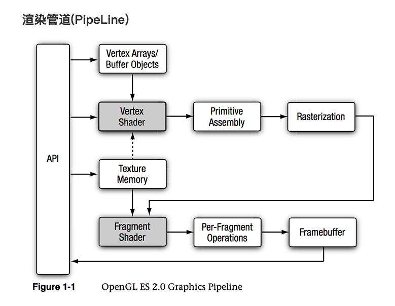
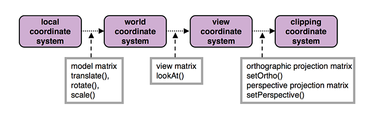
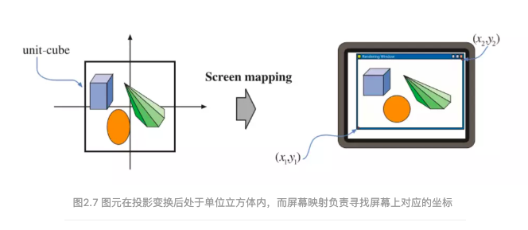
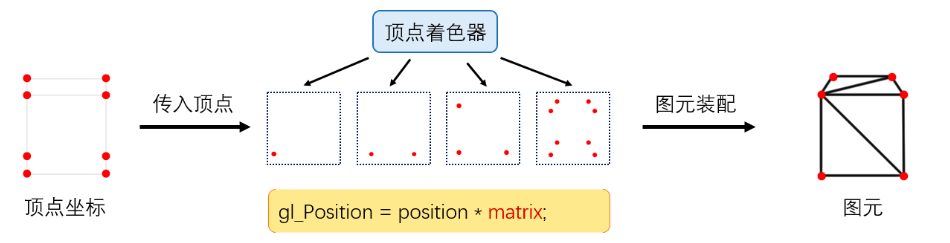
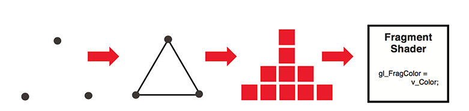
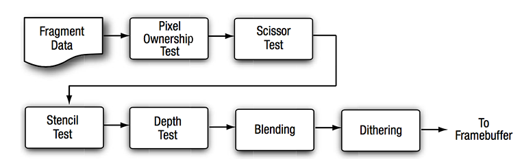
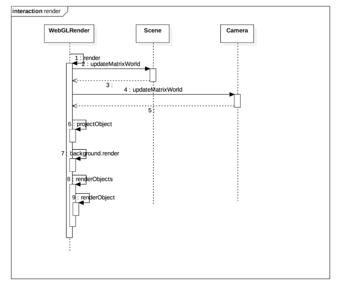

作者: DSLMing
时间: 2019.11.3

> 参考:
> FunWithWebGL2 024 Picking with Framebuffers
> [WebGL 基础知识](http://eux.baidu.com/blog/fe/832)
> [渲染管线的三个概念阶段](https://blog.csdn.net/qq_36383623/article/details/81095366)
> [图形学中的渲染管线](https://www.jianshu.com/p/8ad782b44762)
> [图解WebGL&Three.js工作原理](https://www.cnblogs.com/wanbo/p/6754066.html)

### 一、渲染管线

渲染管线是指将数据从3D场景转换成2D图像，最终在屏幕上显示出来的总过程。
它分为几个阶段:`应用阶段`、`几何阶段`、`光栅阶段`。

- Vertex Array: 顶点数组
- Vertex Shader: 顶点着色器
- Primitive Assemply: 图元组装
- Rasterization: 栅格化
- Fragment Shader: 片段着色器
- Per-Fragment Operations: 逐像素处理
- Framebuffer: 帧缓存

#### 1、应用阶段(CPU负责)
应用阶段最主要的就是把我们准备好的场景数据。
- 准备场景数据、模型及光源
- 剔除（Culling）：剔除不可见物体，提高性能
- 设置渲染状态 材质、纹理、shader的数据
- 输出渲染所需的信息，即输出渲染图元（Rendering Primitives）

#### 2、几何阶段(GPU负责)
几何阶段是用来负责大多数`逐顶点`以及`逐图元`的操作。

##### 1)坐标变换
通常在顶点着色器中应用坐标变换, 计算每个顶点的最终坐标位置。

- 本地坐标系(local coordinate system)
- 世界坐标系(world coordinate system)
- 观察坐标系(view coordinate system)
- 剪裁坐标系(clipping coordinate system)
- 屏幕映射

##### 2)图元装配
根据计算出的`顶点信息`和`绘图命令`绘制基本图形。包括: 三角形(Triangle), 直线(Line), 点(Point-Sprite); 一般3d图形都是由三角形组成的。

#### 3、光栅化阶段(GPU负责)
##### 1) 三角形的建立
利用插值(interpolation)的方法计算顶点之间的边及边之间的内部点的数据, 计算出的数据就是所有需要绘制的像素点, 作为输入传给Fragment Shader。

一般栅格化之前还要经过裁剪(clipping, 把不在可见区域范围内的点去掉); 剔除(culling, 把背对可见方向, 完全不会被看见的面去掉), 来减少计算量。

##### 2)逐像素处理

### 二、WebGL 引擎渲染流程
> 参考:
> [读一个WebGL引擎的渲染流程](https://www.jianshu.com/p/de0e31608622)

渲染的过程可以大致描述为：
1)更新Scene与Camera的世界坐标变换矩阵【2、4】
2)根据二者的矩阵作用到渲染对象上进行投影变换【6】
3)渲染背景【7】
4)渲染场景【8】

<全文结束>

