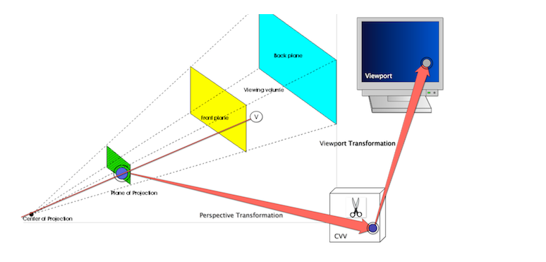
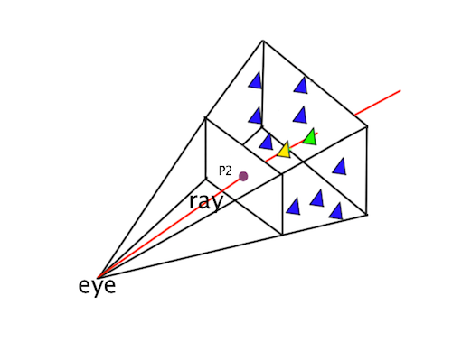

作者: DSLMing
时间: 2019.11.3

> 参考:
> FunWithWebGL2 024 Picking with Framebuffers

### 3D拾取(3D Picking)-射线法

#### 1、3D拾取的概念和原理
1) 对每一个三角形在程序运行时附加一个索引
2) 让片段着色器输出每个像素所在三角形的索引值
3) 得到颜色缓冲，但是并不包含颜色值，而是像素所在的图元的索引值
4) 当鼠标点击在窗口上，我们将根据鼠标的点击位置来获得这个索引并将这个三角形渲染成红色
5) 由于有深度测试，所以能够保证当片元之间相互覆盖时也可以得到最顶部的片元的索引（离相机最近的）

#### 2、从相机空间到屏幕坐标


这里共涉及3个平面:
- 投影平面(CVV)
- 剪裁平面(Projection Plane)
- 屏幕平面(Viewport)

相机空间中的一个顶点v，经过透视变换后进入了CVV中。
1) 顶点从3D空间投影到2D的投影平面（Projection Plane）上。
2) 将投影平面上的2D投影点通过线性插值变换到齐次裁剪空间CVV中。
3) 将CVV中的点通过线性插值变换到 viewport 中。

#### 3、从屏幕坐标到相机空间
我们可以先把顶点从viewport中先变换回投影平面上，也就是我们可以先完成（2）和（3）的逆处理。这里我们不用考虑裁剪和透视除法这些操作，因为反推的时候，处于视口中的点，已经是经过裁剪后留下的有效点了，必定处于CVV内，也必定处于projection plane内！而且从viewport逆变换到projection plane，点一直保持2D形式。

#### 4、得到拾取的2D信息
1) 拾取的开始是玩家在屏幕上点击一个位置——这实际上是在viewport中进行了点击。
2) 我们通过响应玩家的点击事件，得到在==viewport==中的点击位置，记为`p0(Xp0,Yp0)`。
3) 然后我们把p0从viewport中线性插值到==CVV==中，得到`p1(Xp1,Yp1)`。
4) 再把P1从CVV中变换到==projection plane==中，得到`p2(Xp2,Yp2)`。

#### 5、得到拾取的结果
构建一条射线, ray就是一端固定，另一端无限延伸的线性模型。如下图所示：


1) 它的固定端就是eye的位置（也就是相机空间的原点），并且穿过我们刚刚求出来的projection plane上面的点`p2`。
2) 射线向空间无限延伸，第一个穿过的几何体(polygon)应该就是picking到的结果。
3) 在图中，有两个polygon被picking到：绿色和黄色的。其中黄色的polygon是第一个被穿过的，因此picking操作返回的结果就是这个黄色的polygon。

#### 6、射线的表示
```c
// 方式1
struct Ray3D {
  // 起点
  Point3D m_startingPos;
  // 任意一个穿过点
  Point3D m_penetratedPos;
};

// 方式2
struct Ray3D {
  // 起点
  Point3D m_startingPos;
  // 方向
  Point3D m_direction;
};
```

#### 7、射线和三角形相交判断算法
在有了ray的表示法之后，我们要做的就是判断ray是否和各个polygon产生了相交——这实际上是一个射线和三角形的相交判断算法。

思路:
判断射线是否与平面相交
判断交点是否在三角形内


#### 参考
[深入探索3D拾取技术](https://blog.csdn.net/popy007/article/details/8477484)


<全文结束>
