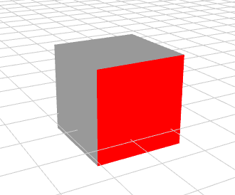

作者: DSLMing
时间: 2019.11.3

> 参考:
> FunWithWebGL2 024 Picking with Framebuffers

### 3D拾取(3D Picking)-帧缓存(FBO)
#### 1、原理
1) 以colorID颜色渲染几何物体,然后存储到离屏帧中
2) 用户点击屏幕时,根据坐标在离屏帧中查看颜色
3) 如果该颜色与colorID相同那么,用户点击的就是几何物体

#### 2、步骤1-得到离屏帧
每帧的渲染函数,将目标物体以colorID颜色存储到离屏帧中。
```js
// 每次渲染要执行的函数
onItemRendered = function (itm) {
  gShader.setUniforms("uColorID", colorID);
  Fungi.Shaders.FBO.activate(fbo);
  itm.draw();
  Fungi.Shaders.FBO.deactivate();
  gShader.setUniforms("uColorID", blankID);
}
```
这里渲染2次:
- 渲染到离屏帧: 使用参数:colorID 设置 uColorID。
- 渲染到屏幕: 使用参数:blankID 设置 uColorID。


顶点着色器:
```js
const vec3 blankColorID = vec3(0.0,0.0,0.0);
uniform vec3 uColorID;

void main(void){
  if(uColorID != blankColorID)	color = uColorID;
  else if(a_position.w == 0.0)	color = vec3(1.0,0.0,0.0);
  else if(a_position.w == 1.0)	color = vec3(0.0,1.0,0.0);
  else	color = vec3(0.6,0.6,0.6);
  ...
}
```
这里每个顶点着色器也运行两次:
离屏帧: color = uColorID
屏幕帧: 立方体原本颜色。


#### 3、步骤2-拾取判断
```js
// 当鼠标按下时
setDownOverride(function (e, ctrl, x, y) {
  // 翻转y坐标
  var yi = Fungi.gl.fHeight - y
  // 根据点击坐标(x,y)在离屏帧中得到该像素
  var pixel = Fungi.Shaders.FBO.readPixel(fbo, x, yi)
  // 根据像素值得到颜色值
  var id = colorToID(pixel);
  // ignore Black and white.
  if (id == 0 || id == 16777215) return;
  // 点击区域的颜色与之前设置的 uColorID 相同,那么就拾取到了该对象
  ctrl.switchHandler("pick");
});
```

#### 参考
`gl.readPixels` 参考:[WebGL 进入三维世界](https://www.cnblogs.com/w-wanglei/p/6670811.html?utm_source=itdadao&utm_medium=referral)。
