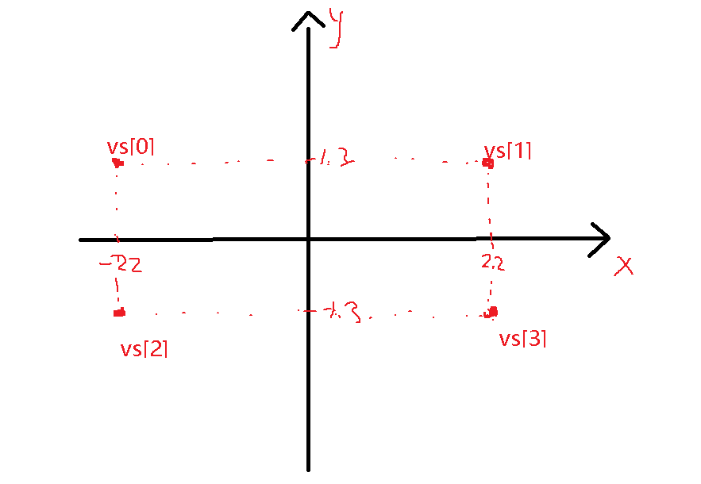
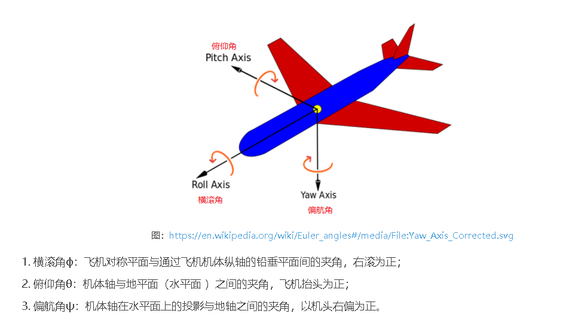

> **Geometry 源码解读**: https://www.jianshu.com/p/5f6d0cd75443
> 案例参考: 
### Geometry
#### 1、face
* 一个面由若干三角形组成
* 对于一个planGeometry来说只有一个面, 那么他由2个三角形组成。
#### 2、vetices
三角形由若干顶点组成。

#### 3、举例
planGeometry
```js
vertices = [(-22, 1.3), (22, 1.3), (-22, -1.3), (22, -1.3)]
face[2] =  [
  {a: 0, b: 2, c: 1},
  {a: 2, b: 3, c: 1},
]
```


#### 4、faceVertexUvs
* 片元的uv信息
* faceVertexUvs的内容数量 = face.length
* 每个片元的uv信息由3个顶点信息组成
* 每个顶点由2维坐标组成，表示纹理的坐标

#### 5、相机概念

