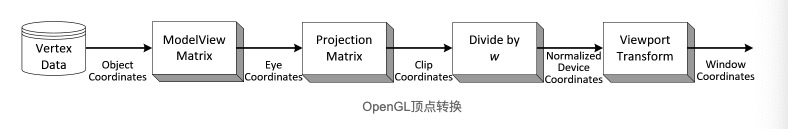
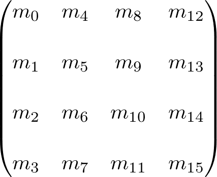
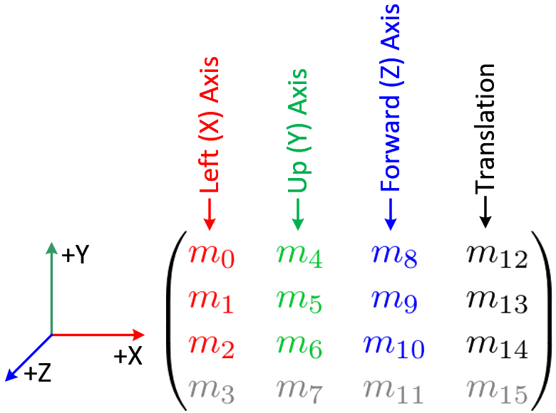
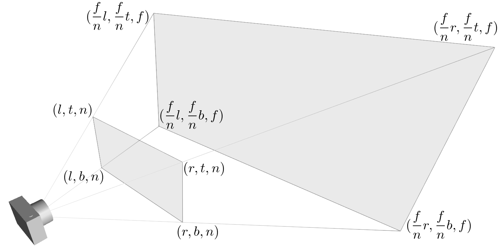
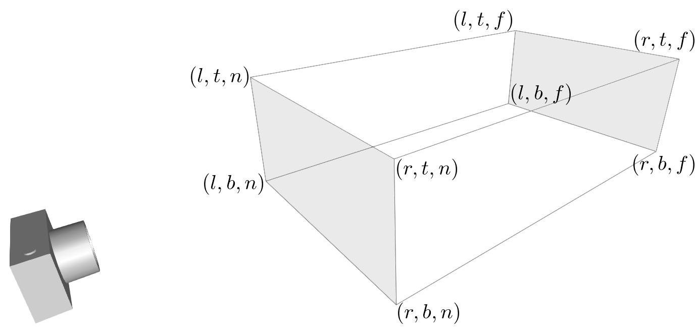
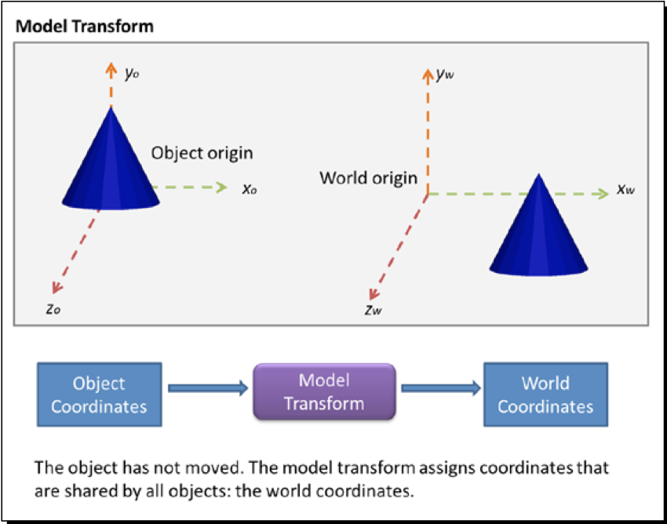
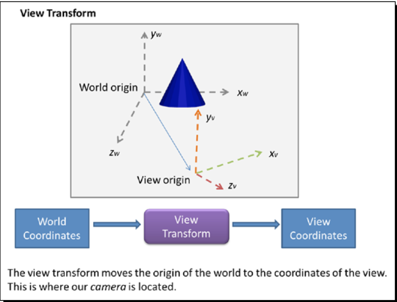
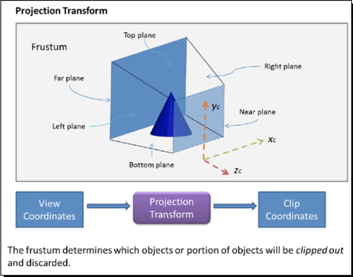
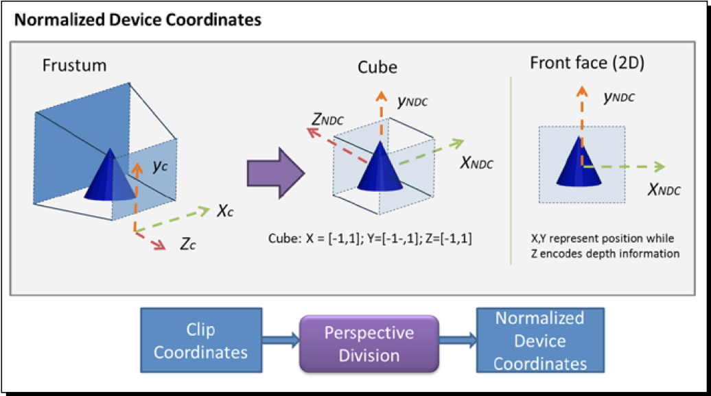
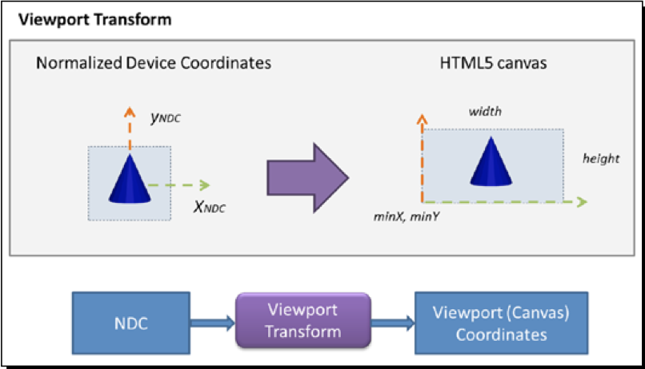

> 参考:
> https://blog.csdn.net/u011153817/article/details/51899091
> http://www.songho.ca/opengl/gl_transform.html#example1
> http://www.songho.ca/index.html
> http://www.yanhuangxueyuan.com/Three.js_course/advanced/shader2.html
> https://qiita.com/kitasenjudesign/items/1657d9556591284a43c8

## 一、顶点坐标转换

1)坐标系
- Object or Model coordinates(模型本地坐标系)
- World coordinates(世界坐标系)
- Eye/Camera coordinates(视坐标系)
- Clip coordinates(裁剪坐标系)
- Normalized device coordinates(归一化设备坐标系)
- Window/Screen coordinates(屏幕坐标系)

2)变换矩阵
- 模型视图矩阵(ModelViewMatrix)
- 投影矩阵(ProjectionMatrix)
- 视图矩阵(viewMatrix)
- 法线矩阵(normalMatrix)

### 一、坐标系
[坐标系参考](https://github.com/fem-d/webGL/blob/master/blog/WebGL%E5%9F%BA%E7%A1%80%E5%AD%A6%E4%B9%A0%E7%AF%87%EF%BC%88Lesson%204%EF%BC%89.md)

#### 1、模型坐标
它是模型的局部坐标系，是应用任何变换之前模型的初始位置和方向。

#### 2、眼睛坐标
- 它是模型坐标乘以ModelViewMatrix产生的
- ModelViewMatrix是Model矩阵和View矩阵的组合
- 模型转换是从对象空间转换为世界空间
- 视图变换是从世界空间转换到眼睛空间。
model-view转换: model => world => camera

#### 3、剪辑坐标
- 眼睛坐标乘以ProjectionMatrix成为剪辑坐标。
- 它被称为剪辑坐标的原因是通过与±w比较来剪切变换后的顶点（x，y，z）。

#### 4、标准化设备坐标(NDC)
- 通过将剪辑坐标除以w来产生。
- 它更像是屏幕坐标，但尚未翻译并缩放到屏幕像素。
- 现在，在所有3个轴中，值范围从-1到1归一化。

#### 5、屏幕坐标
- 通过将标准化设备坐标（NDC）应用于视口转换来产生
- NDC被缩放和翻译以适合渲染屏幕。

### 二、变换矩阵
#### 1、OpenGL矩阵
OpenGL使用4 x 4矩阵进行转换。请注意，矩阵中的16个元素按列主顺序存储为1纬数组。

#### 2、模型视图矩阵

#### 3、投影矩阵
一个矩阵，它根据各种摄像机参数将三维投影到两个维度，并将它们转换为剪辑坐标系。

1) 透视投影

2) 正交投影

#### 4、模型矩阵
一个几何体经过了多次旋转、平移等几何变换，每一个变换都有一个对应的矩阵可以表示，所有几何变换对应矩阵的乘积就是一个复合矩阵，可以称为模型矩阵modelMatrix。
- 从模型坐标转换为世界坐标

#### 5、视图矩阵
从世界坐标转换为视点坐标
<全文结束>

### 三坐标系和矩阵的关系

使用gl.viewport来将NDC映射到视图坐标上.

## 二、ThreeJS 中的矩阵
参考: [ThreeJS三维物体（Object3D）](https://threejs.org/docs/index.html#api/zh/core/Object3D)

关于矩阵的部分:
| 名字             | 类型    | 解释                                                                                                               |
| ---------------- | ------- | ------------------------------------------------------------------------------------------------------------------ |
| .matrix          | Matrix4 | 局部变换矩阵,其实也就是模型矩阵                                                                                    |
| .matrixWorld     | Matrix4 | 世界变换矩阵                                                                                                       |
| .modelViewMatrix | Matrix4 | 模型视图矩阵,这个值传递给着色器，用于计算物体的位置,用于计算物体在相机空间的位置                                   |
| .normalMatrix    | Matrix3 | 法线矩阵,这个值传递给着色器，用于计算物体的光照。 它是物体的modelViewMatrix矩阵中，左上角3x3子矩阵的逆的转置矩阵。 |

