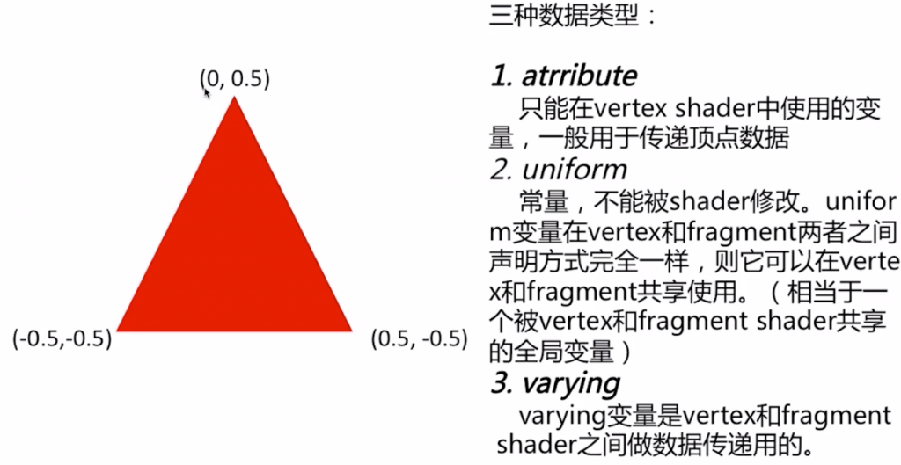

> 博客: https://nogson2.hatenablog.com/archive/category/Three.js
> WebGL 和 Three.js 工作原理图解:http://www.codeceo.com/article/webgl-and-three-js.html
> 总结: https://qiita.com/kitasenjudesign

#### glsl 数据类型

#### 参考:
https://webglfundamentals.org/webgl/lessons/zh_cn/webgl-scene-graph.html

