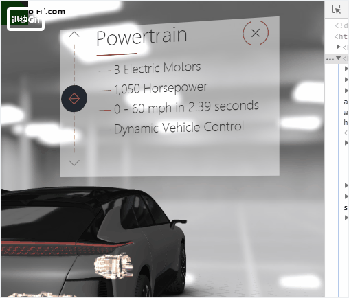
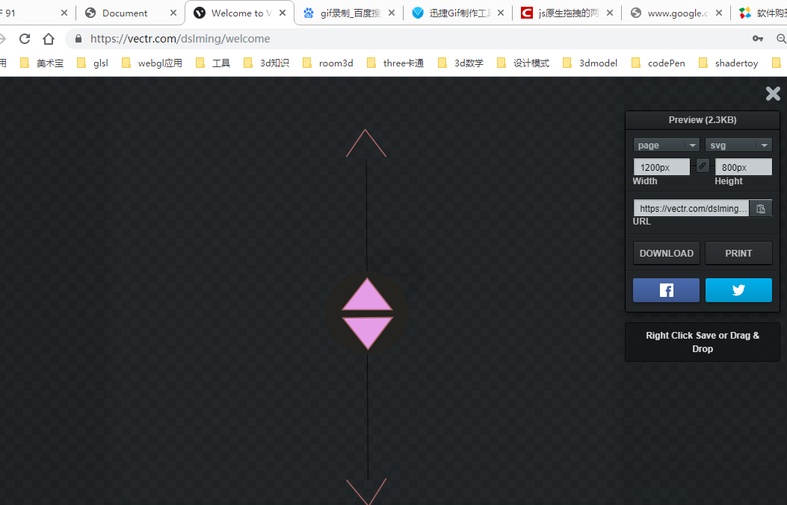
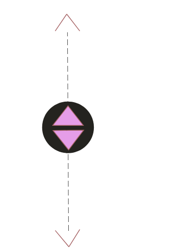

### 滑块的实现
效果:


#### 1、制作模型
使用在线svg制作工具:
https://vectr.com/dslming/welcome

#### 2、画出图形

然后导出svg

#### 3、控制
实现效果:


```html
<!DOCTYPE html>
<html lang="en">

<head>
    <meta charset="UTF-8">
    <meta name="viewport" content="width=device-width, initial-scale=1.0">
    <meta http-equiv="X-UA-Compatible" content="ie=edge">
    <title>Document</title>
</head>

<body>

    <!-- 原版 -->
    <!-- <svg id="powertrainSlider" class="svgSlider">
        <polyline class="lineArrow" points="70 22 50 2 30 22"/>
        <polyline class="lineArrow" points="30 478 50 498 70 478"/>
        <line class="lineDashed" x1="50" y1="50" x2="50" y2="450"/>
        <g id="powerKnob" class="knob">
            <circle class="circle" cx="50" cy="250" r="50"/>
            <polyline class="lineDiamond" points="30 250 50 270 70 250 50 230 30 250 70 250"/>
        </g>
    </svg> -->

    <style>
            .line {
                stroke-dasharray: 16 8;
            }
    </style>
    <svg version="1.1" xmlns="http://www.w3.org/2000/svg" xmlns:xlink="http://www.w3.org/1999/xlink"
        preserveAspectRatio="xMidYMid meet" viewBox="0 0 1200 800" width="1200" height="800">
        <defs>
            <path d="M678.04 644.01L675.14 104.88" id="aTu8uMeA"></path>
            <path
                d="M746.88 362.96C746.88 401.57 715.39 432.91 676.59 432.91C637.8 432.91 606.3 401.57 606.3 362.96C606.3 324.35 637.8 293.01 676.59 293.01C715.39 293.01 746.88 324.35 746.88 362.96Z"
                id="b7tMExcB76"></path>
            <path d="M697.35 331.18L718.1 357.76L676.59 357.76L635.08 357.76L655.84 331.18L676.59 304.61L697.35 331.18Z"
                id="a4MrjX3Xn"></path>
            <path
                d="M657.04 397.91L635.97 371.59L677.47 371.09L718.98 370.58L698.55 397.41L678.12 424.24L657.04 397.91Z"
                id="a1E1olJRcO"></path>
            <path d="M641.81 101.52L673.12 55.61" id="bQNyw4Cs0"></path>
            <path d="M708.48 101.52L673.12 55.61" id="a5GN1mNan"></path>
            <path d="M708.48 640.15L679.05 687.29" id="a20GOX7pZm"></path>
            <path d="M641.86 642.84L679.05 687.29" id="b1hsPIzOtN"></path>
        </defs>
        <g>
            <g>
                <g class="line">
                    <g>
                        <use xlink:href="#aTu8uMeA" opacity="1" fill-opacity="0" stroke="#000000" stroke-width="1"
                            stroke-opacity="1"></use>
                    </g>
                </g>
                <g id="rootlm" draggable="true">
                    <g>
                        <use xlink:href="#b7tMExcB76" opacity="1" fill="#24231f" fill-opacity="1"></use>
                    </g>
                    <g>
                        <use xlink:href="#a4MrjX3Xn" opacity="1" fill="#e59de8" fill-opacity="1"></use>
                        <g>
                            <use xlink:href="#a4MrjX3Xn" opacity="1" fill-opacity="0" stroke="#a66365" stroke-width="2"
                                stroke-opacity="1"></use>
                        </g>
                    </g>
                    <g>
                        <use xlink:href="#a1E1olJRcO" opacity="1" fill="#e59de8" fill-opacity="1"></use>
                        <g>
                            <use xlink:href="#a1E1olJRcO" opacity="1" fill-opacity="0" stroke="#a66365" stroke-width="2"
                                stroke-opacity="1"></use>
                        </g>
                    </g>
                </g>
                <g>
                    <g>
                        <g>
                            <use xlink:href="#bQNyw4Cs0" opacity="1" fill-opacity="0" stroke="#a66365" stroke-width="2"
                                stroke-opacity="1"></use>
                        </g>
                    </g>
                    <g>
                        <g>
                            <use xlink:href="#a5GN1mNan" opacity="1" fill-opacity="0" stroke="#a66365" stroke-width="2"
                                stroke-opacity="1"></use>
                        </g>
                    </g>
                </g>
                <g>
                    <g>
                        <g>
                            <use xlink:href="#a20GOX7pZm" opacity="1" fill-opacity="0" stroke="#a66365" stroke-width="2"
                                stroke-opacity="1"></use>
                        </g>
                    </g>
                    <g>
                        <g>
                            <use xlink:href="#b1hsPIzOtN" opacity="1" fill-opacity="0" stroke="#a66365" stroke-width="2"
                                stroke-opacity="1"></use>
                        </g>
                    </g>
                </g>
            </g>
        </g>
    </svg>


    <script>
    let drag = document.getElementById('rootlm');  
    let start = {
        x: 0,
        y: 0,
        lock: false
    }
    
    let curent = {
        x: 0,
        y: 0
    }
    let end =  {
        x: 0,
        y: 0
    }

    drag.onmousedown = function(e) {
    !start.lock && (start = {
                x: e.clientX,
                y: e.clientY,
                lock: true
            })

        drag.onmousemove = function(e) {  
            curent = {
                x: e.clientX,
                y: e.clientY
            }
            curent.y = curent.y > 185 ? curent.y : 185
            curent.y = curent.y < 589 ? curent.y : 589
            let diffX = curent.x - start.x
            let diffY = curent.y - start.y
            drag.setAttribute('transform', `translate(${0},${diffY})`)
            console.error(e.clientY)
        }; 

        document.onmouseup = function(e) { //当鼠标弹起来的时候不再移动 
            drag.onmousemove = null;
            drag.onmouseup = null;
            drag.setAttribute('transform', `translate(${0},${0})`)
          } 
    };  
    </script>
</body>

</html>
```

