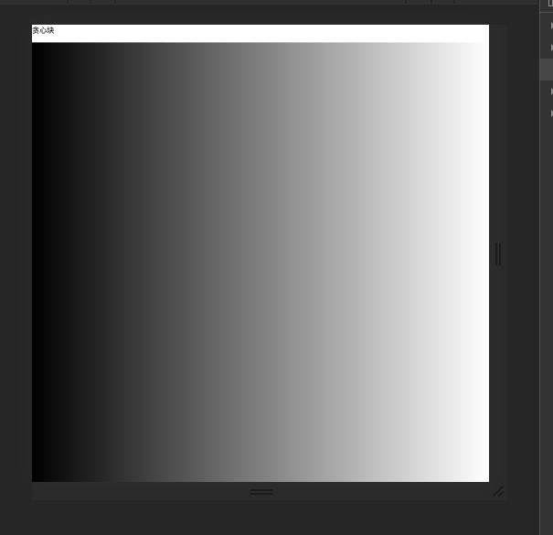
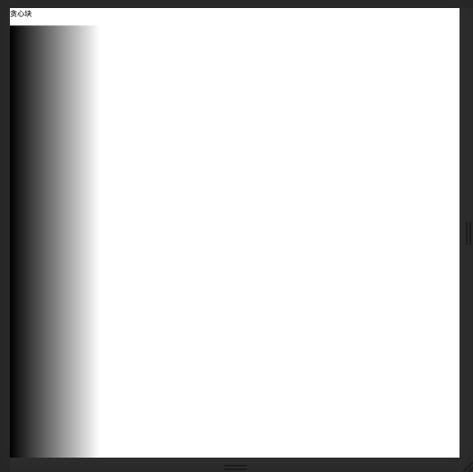
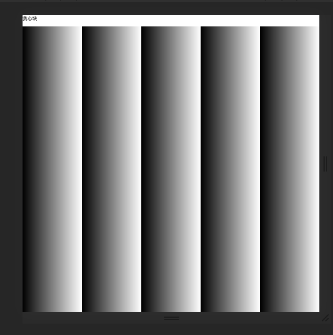

[Three.js和Shadertoy](https://threejsfundamentals.org/threejs/lessons/threejs-shadertoy.html)


#### 1、uv 的周期性
```js
// fragmentShader
vec2 uv = fragCoord.xy / u_resolution.xy;
uv.x *= u_resolution.x / u_resolution.y;
```

1) 正常情况:
```js
vec2 r = uv*1.;
gl_FragColor = vec4(r.x, r.x, r.x, 1.);
```


2) 当把uv放大5倍后:
```js
vec2 r = uv*5.;
gl_FragColor = vec4(r.x, r.x, r.x, 1.);
```


那么表现为提取5倍结束。


3) 利用mod使其具有周期性:
```js
vec2 r = mod(uv*5., 1.0);
gl_FragColor = vec4(r.x, r.x, r.x, 1.);
```



#### 2、glsl内建函数
取模, 取余数。
```js
mod(x,y)  {return x - y*floor(x/y)}
```

x 的 y次方
```js
pow(x,y)
```

向量x与向量y之间的点积, a*b = x1 * x2 + y1 * y2
```js
dot(x, y)
```
