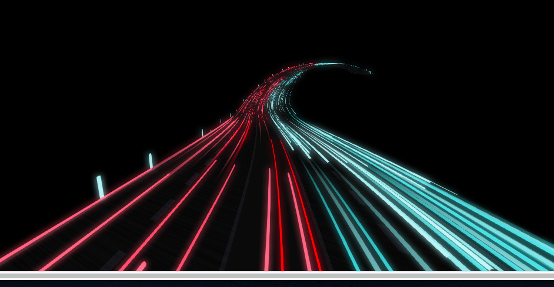
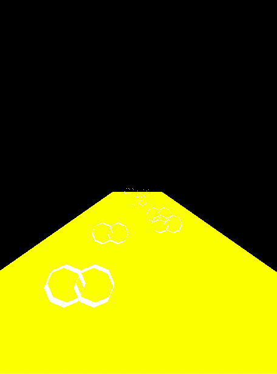
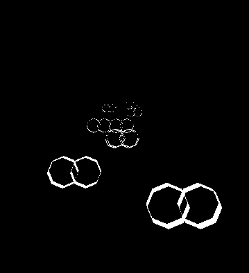

> 翻译自: https://tympanus.net/codrops/2019/11/13/high-speed-light-trails-in-three-js/

## 无限灯光
灵感来自 [海报](https://www.pinterest.com/pin/321514860899167708/)


[完整代码]( step6-end 终结)
最后效果:



### 第一阶段
[完整代码](step1-Lights radius and length)
最后效果:


#### 1、准备舞台
Three.js 工作的必要准备。
```js
export class Stage {
  constructor(container) {
    this.container = container;
    // 场景
    this.scene = new THREE.Scene();
    this.scene.name = "moumade";
    window.scene = this.scene;

    // 环境光
    var ambient = new THREE.AmbientLight(0xffffff, 1);
    ambient.name = "ambient";
    this.scene.add(ambient);

    // 渲染器
    this.containerEle = document.querySelector(container);
    let vW = this.containerEle.clientWidth;
    let vH = this.containerEle.clientHeight;
    this.renderer = new THREE.WebGLRenderer();
    this.renderer.setClearColor(0x000000, 0.0);
    this.renderer.setPixelRatio(window.devicePixelRatio);
    this.renderer.setSize(vW, vH, false);
    this.containerEle.appendChild(this.renderer.domElement);

    // 相机
    this.camera = new THREE.PerspectiveCamera(45, this.containerEle.clientWidth / this.containerEle.clientHeight, 10, 2000);
    this.camera.name = "camera";
    this.camera.position.set(0, 7, -5)
    this.camera.rotation.set(0, 0, 0)
    this.scene.add(this.camera);
    window.addEventListener("resize", this.handleResize);
    this.handleResize();
  }

  handleResize() {
    // 获取新的大小
    let vpW = that.containerEle.clientWidth;
    let vpH = that.containerEle.clientHeight;
    // 设置场景
    that.renderer.domElement.width = vpW;
    that.renderer.domElement.height = vpH;
    that.renderer.setSize(that.containerEle.clientWidth, that.containerEle.clientHeight);
    // 设置相机
    that.camera.aspect = vpW / vpH;
    that.camera.updateProjectionMatrix();
  }


  run() {
    setInterval(v => {
      that.renderer.render(that.scene, that.camera);
    }, 200)
  }
}
```

#### 2、准备道路
新建一个平面模拟道路,`PlaneBufferGeometry` 的宽高分别对应道路的宽和长。

我们希望这个平面垂直于屏幕相里延伸,但是在Tree.js场景中心创建了一个垂直的屏幕。因此我们需要让其沿X轴旋转以使其垂直于屏幕。

```js
const options = {
  length: 200,
  width: 20,
};

const geometry = new THREE.PlaneBufferGeometry(
  options.width,
  options.length,
  10,
  500
);

var material = new THREE.MeshBasicMaterial({ color: 0xffff00, side: THREE.DoubleSide });
const mesh = new THREE.Mesh(geometry, material);
mesh.rotation.x = -Math.PI / 2;
mesh.position.z = -options.length / 2;
mesh.name = "road"
this.scene.add(mesh);
```


#### 3、创建一个车灯
```js
addObjLightsOne() {
  let curve = new THREE.LineCurve3(
    new THREE.Vector3(0, 0, 0),
    new THREE.Vector3(0, 0, -1)
  );

  // 绘制一个圆柱体,圆柱体的半径1,圆柱体的走向为曲线curve,就是一个管道。
  let baseGeometry = new THREE.TubeBufferGeometry(curve, 64, 1, 8, false);
  let material = new THREE.MeshBasicMaterial({ color: 0xff0000, side: THREE.DoubleSide });
  let mesh = new THREE.Mesh(baseGeometry, material);
  mesh.position.set(0, 0, -30)
  this.camera.position.set(0, 0, -5)

  this.scene.add(mesh)
}
```

这是一个管道,长度为1,方向为垂直屏幕向外。


#### 4、创建更多的车灯
```js
const options = {
  length: 200,
  width: 20,
  // 车道总宽 9
  roadWidth: 9,
  islandWidth: 2,
  // 圆环的对儿数
  nPairs: 10,
  // 一共3个车道
  roadSections: 3
};
addObjLightsNoBuffer(o) {
  const options = o
  // 每个车道的宽度 3
  let sectionWidth = options.roadWidth / options.roadSections;
  let material = new THREE.MeshBasicMaterial({ color: 0xfafafa });

  for (let i = 0; i < options.nPairs; i++) {
    let section = i % 3; // 0,1,2
    let sectionX =
      section * sectionWidth - options.roadWidth / 2 + sectionWidth / 2;
    let carWidth = 0.5 * sectionWidth;
    let offsetX = 0.5 * Math.random();
    let offsetY = 1.3;
    let offsetZ = Math.random() * options.length;

    let curve1 = {
      x: sectionX - carWidth / 2 + offsetX,
      y: offsetY,
      z: -offsetZ
    }

    let curve2 = {
      x: sectionX + carWidth / 2 + offsetX,
      y: offsetY,
      z: -offsetZ
    }
    // console.error(curve1, curve2);

    let curve11 = new THREE.LineCurve3(
      new THREE.Vector3(curve1.x, curve1.y, curve1.z - 1),
      new THREE.Vector3(curve1.x, curve1.y, curve1.z),
    );
    let curve22 = new THREE.LineCurve3(
      new THREE.Vector3(curve2.x, curve2.y, curve2.z - 1),
      new THREE.Vector3(curve2.x, curve2.y, curve2.z),
    );
    let geom11 = new THREE.TubeBufferGeometry(curve11, 25, 1, 8, true);
    let mesh11 = new THREE.Mesh(geom11, material);
    this.scene.add(mesh11)

    let geom22 = new THREE.TubeBufferGeometry(curve22, 25, 1, 8, true);
    let mesh22 = new THREE.Mesh(geom22, material);
    this.scene.add(mesh22)
  }
}
```

这种方法性能比较浪费。下面看改进的方法。


#### 5、InstancedBufferGeometry创建多车灯
```js
addObjLights(o) {
  const options = o

  // 三维线段曲线
  let curve = new THREE.LineCurve3(
    new THREE.Vector3(0, 0, 0),
    new THREE.Vector3(0, 0, -1)
  );

  // 管道缓冲几何体 (path, tubularSegments, radius, radialSegments, closed)
  let baseGeometry = new THREE.TubeBufferGeometry(curve, 25, 1, 8, true);

  // 创建一个instancedBufferGeometry
  let instanced = new THREE.InstancedBufferGeometry().copy(baseGeometry);
  instanced.maxInstancedCount = options.nPairs * 2;

  let aOffset = [];
  // 每个车道的宽度 3
  let sectionWidth = options.roadWidth / options.roadSections;

  for (let i = 0; i < options.nPairs; i++) {
    // 1a. 获取车道索引,保持每个车道的灯光一致,而不是随机照明
    let section = i % 3; // 0,1,2

    // 1b. 获取车道的中心位置 -3,0,3
    let sectionX =
      section * sectionWidth - options.roadWidth / 2 + sectionWidth / 2;

    // 车宽是路宽的一半
    let carWidth = 0.5 * sectionWidth;

    // 生成 0～0.5的随机数
    let offsetX = 0.5 * Math.random();
    let offsetY = 1.3;
    let offsetZ = Math.random() * options.length;

    aOffset.push(sectionX - carWidth / 2 + offsetX);
    aOffset.push(offsetY);
    aOffset.push(-offsetZ);

    aOffset.push(sectionX + carWidth / 2 + offsetX);
    aOffset.push(offsetY);
    aOffset.push(-offsetZ);
  }


  // Add the offset to the instanced geometry.
  instanced.addAttribute(
    "aOffset",
    new THREE.InstancedBufferAttribute(new Float32Array(aOffset), 3, false)
  );

  const material = new THREE.ShaderMaterial({
    fragmentShader,
    vertexShader,
    uniforms: {
      uColor: new THREE.Uniform(new THREE.Color("0xfafafa"))
    }
  });
  let mesh = new THREE.Mesh(instanced, material);
  mesh.frustumCulled = false;
  mesh.name = "carLights"
  this.scene.add(mesh);
}
```
效果应该和上面的是相同的。



#### 参考资料
[教程](https://tympanus.net/codrops/2019/11/13/high-speed-light-trails-in-three-js/)
[打包工具](https://parceljs.org/getting_started.html)
[InstancedBufferGeometry](https://github.com/nicoptere/FluffyPredator)
[InstancedBufferGeometry 官网](https://threejs.org/docs/index.html#api/zh/core/InstancedBufferGeometry)


### 第二阶段
[完整代码](step2-Two sided road)
最后效果:

