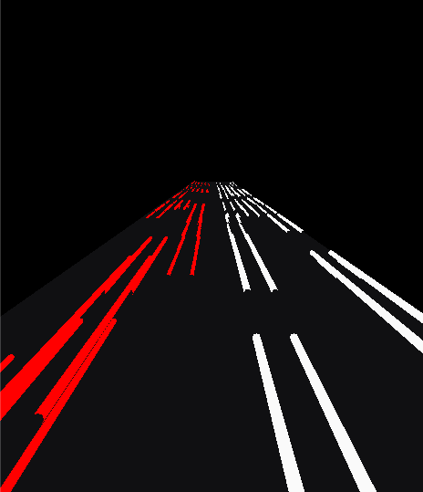
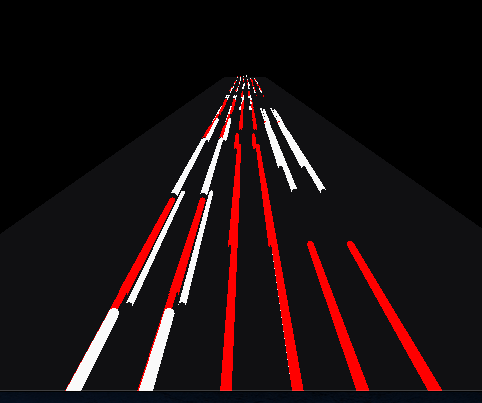

> 翻译自: https://tympanus.net/codrops/2019/11/13/high-speed-light-trails-in-three-js/

> 代码: https://github.com/dslming/learningComputerGraphics/tree/master/ThreejsLearning/017-InfiniteLights

### 无限灯光-第二阶段

[完整代码](step2-Two sided road)
最后效果:


#### 1、赋予灯光不同的长度和半径
CarLights.js 顶点着色器代码:
```glsl
attribute vec3 aOffset;
attribute vec2 aMetrics;
void main() {
  vec3 transformed = position.xyz;

  float radius = aMetrics.x;
  float len = aMetrics.y;

  // x,y 等比例放大,也就是半径被放大,长度同理
  transformed.xy *= radius;
  transformed.z *= len;

  transformed.z = transformed.z + aOffset.z;
  transformed.xy += aOffset.xy;

  vec4 mvPosition = modelViewMatrix * vec4(transformed,1.);
  gl_Position = projectionMatrix * mvPosition;
}
```


设置半径和长度:
```js
let radius = Math.random() * 0.1 + 0.1;
let length = Math.random() * options.length * 0.08 + options.length * 0.02;
aMetrics.push(radius);
aMetrics.push(length);
instanced.addAttribute(
  "aMetrics",
  new THREE.InstancedBufferAttribute(new Float32Array(aMetrics), 2, false)
);
```

#### 2、定位灯
我们希望有两条来自不同方向的灯光之路。我们还将为每种光源赋予其颜色，并修改材质以使用该颜色：
```js
class App {
  init() {
    ...
    this.leftLights = new CarLights(this.stage, options, 0xff102a);
    this.rightLights = new CarLights(this.stage, options, 0xfafafa);

    this.leftLights.init()
    this.leftLights.mesh.position.setX(
      -options.roadWidth / 2 - options.islandWidth / 2
    );

    this.rightLights.init();
    this.rightLights.mesh.position.setX(
      options.roadWidth / 2 + options.islandWidth / 2
    );
  }
}
```

<全文结束, 多多点赞会变好看, 多多评论会变有钱>
