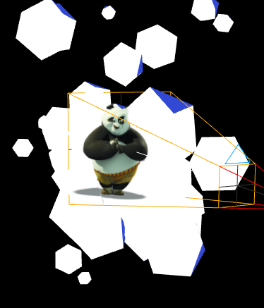

[教程](https://tympanus.net/codrops/2020/01/07/playing-with-texture-projection-in-three-js/)

### 投影纹理


#### 1、投影纹理
将相机矩阵和模型矩阵相乘,最后得到纹理采样坐标:

顶点着色器:
```js
uniform mat4 viewMatrixCamera;
uniform mat4 projectionMatrixCamera;
varying vec4 vTexCoords;

void main() {
  ...
  // in: position,顶点局部坐标
  // in: modelMatrix,模型的世界坐标矩阵
  // out: vWorldPosition,模型世界坐标
  vWorldPosition = modelMatrix * vec4(position, 1.0);

  // in: projectionMatrixCamera,相机的投影矩阵
  // in: viewMatrixCamera,视图模型矩阵
  // in: position,顶点局部坐标
  // out: vTexCoords,模型在相机上的投影,在片元着色器中将作为纹理采样坐标
  vTexCoords = projectionMatrixCamera * viewMatrixCamera * vWorldPosition;
  ...
}
```

片元着色器:
```js
varying vec4 vTexCoords;
void main() {
  ...
  // 从世界空间转换为剪辑空间,将向量除以其.w分量来实现
  vec2 uv = vTexCoords.xy / vTexCoords.w;

  // 从剪裁空间[-1, 1]转换为uv查找范围（即）[0, 1]
  uv = uv * 0.5 + 0.5;

  // 纹理采样,投影坐标作为纹理采样坐标
  vec4 outColor = texture2D(texture, uv);
  ...
}
```

#### 2、如何确定背面
片元着色器:
```js
void main() {
  ...
  // ------这可以确保我们不在对象的背面也渲染纹理 start --------
  // in: projPosition,相机的位置
  // in: vWorldPosition,目标物体的位置
  // out: projectorDirection,投影方向,视点指向目标物体
  vec3 projectorDirection = normalize(projPosition - vWorldPosition.xyz);
  // 通过查看法线和相机方向的点积来检查人眼是否真的朝向相机
  float dotProduct = dot(vNormal, projectorDirection);
  if (dotProduct < 0.0) {
    outColor = vec4(color, 1.0);
  }
  // ------这可以确保我们不在对象的背面也渲染纹理 end --------

  gl_FragColor = outColor;
}
```

<全文结束>
