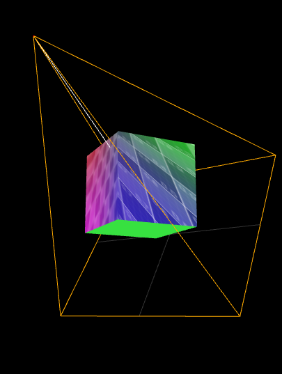
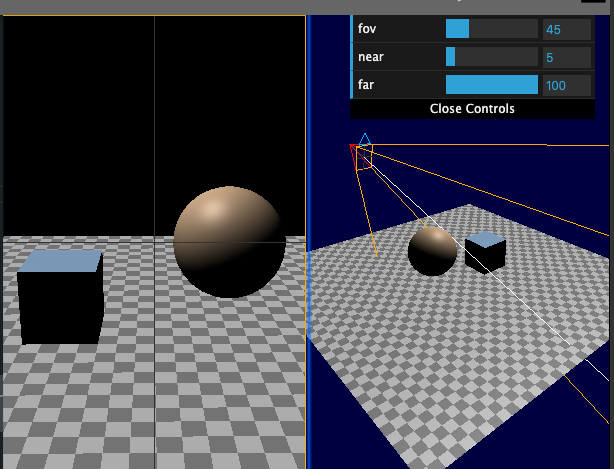

[代码参考](https://threejsfundamentals.org/threejs/lessons/threejs-cameras.html)

### ThreeJS中CameraHelper的使用



想达到这种效果,都必须使用2个相机。
- 一个是**屏幕相机**,最终投影成像在屏幕
- 一个是**带相机助手**的相机

就如上图2所示,**屏幕相机**的投影是整个屏幕(左右两个小窗口共同组成),**带相机助手**的投影是左面的画面。

伪代码:
```js
// 屏幕相机
let camera = new THREE.PerspectiveCamera(45, 1, 0.01, 300)
camera.position.set(-1, 1.2, 1.5)
camera.lookAt(0, 0, 0)

// 带相机助手的相机
const camera1 = new THREE.PerspectiveCamera(45, 1, 0.01, 3)
camera1.position.set(-1, 1.2, 1.5)
camera.lookAt(0, 0, 0)
let cameraHelper = new THREE.CameraHelper(camera1)
scene.add(cameraHelper)

// 需要每帧更新旋转矩阵
stage.onUpdate(() => {
  cameraHelper.update()
  camera1.updateMatrix()
  camera1.lookAt(0, 0, 0)
})
```

<全文结束>
