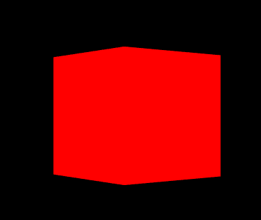

> WebGL 对于我来说操作太繁琐了;
> ThreeJS太方便了,但是相关的数学计算也封装起来了,
> 但是这一部分又很重要,所以通过ThreeJS 来学习底层相机的实现。


这是一篇学习笔记,学习的内容出自:[代码](https://download.csdn.net/download/weixin_37683659/10329752),[教程](https://blog.csdn.net/weixin_37683659/article/details/79830278)。更多的代码也来自ThreeJS库。

> WebGL本不存在相机,想的多了也就有了。


### 模拟ThreeJS相机

#### 1、着色器代码
glsl.fragmentShader.js
```js
export let fragmentShader = `
uniform vec3 color;
void main() {
 // 给此片元的颜色值
 gl_FragColor = vec4(color,1.0);
}
`
```

glsl.vertexShader.js
```js
export let vertexShader =
  `
  uniform mat4 myProjectionMatrix;
  uniform mat4 myModelViewMatrix;
  void main() {
      // gl_Position = projectionMatrix * modelViewMatrix * vec4(position, 1.0);
      gl_Position = myProjectionMatrix * myModelViewMatrix *vec4(position,1);
  }
`
```

#### 2、自己模拟的相机
```js
export class PerspectiveCamera {
  constructor({ fov = 50, aspect = 1, near = 0.1, far = 2000, position }) {
    // 世界矩阵
    this.matrixWorld = new Matrix4();
    this.matrixWorldInverse = new Matrix4();

    // 局部坐标矩阵
    this.matrix = new Matrix4();
    this.position = new Vector3(position.x, position.y, position.z);
    this.quaternion = new Quaternion();
    this.scale = new Vector3(1, 1, 1);

    // 视图模型矩阵
    this.modelViewMatrix = new Matrix4();

    // 投影矩阵
    this.projectionMatrix = new Matrix4()
    let top = near * Math.tan(_Math.DEG2RAD * 0.5 * fov)
    let height = 2 * top
    let width = aspect * height
    let left = - 0.5 * width
    this.projectionMatrix.makePerspective(left, left + width, top, top - height, near, far);
    this.updateMatrix()
  }

  updateMatrix() {
    this.matrix.compose(this.position, this.quaternion, this.scale);
    this.matrixWorld = this.matrix.clone()
    this.matrixWorldInverse.getInverse(this.matrixWorld);
  }

  /**
   * 获取目标对象在相机坐标下的转换矩阵
   * @param {*} obj 被相机观察的目标对象
   */
  getModelViewMatrix(obj) {
    if (!obj) {
      return new Matrix4()
    }
    return this.modelViewMatrix.multiplyMatrices(this.matrixWorldInverse, obj.matrixWorld);
  }
}
```

#### 4、使用相机
```js
class App {
  constructor() {
    ...
    // 新建一个Three.js 的场景stage
    let camera = this.initCamera("#app")
    this.addBox(stage, camera)
    ...
  }

  initCamera() {
    // 新建一个自己定义的相机
    let camera = new PerspectiveCamera({
      fov: 45,
      aspect: 1,
      near: 0.1,
      far: 2000,
      position: {
        x: 0,
        y: 0,
        z: 10
      }
    })
    return camera
  }

  // 场景中, 增加一个立方体
  addBox(stage, camera) {
    var geometry = new THREE.BoxGeometry(2, 2, 2);

    // 把相机矩阵信息传递给着色器
    let uniforms = {
      myProjectionMatrix: {
        type: 'm4',
        value: camera.getProjectionMatrix()
      },
      myModelViewMatrix: {
        type: 'm4',
        value: camera.getModelViewMatrix()
      },
      color: {
        type: "c",
        value: new THREE.Color(0xff0000)
      }
    }

    // var material = new THREE.MeshBasicMaterial({
    //   color: 0x00ff7c,
    // });

    let material = new THREE.ShaderMaterial({
      uniforms,
      vertexShader: vertexShader,
      fragmentShader: fragmentShader
    });
    var cube = new THREE.Mesh(geometry, material);
    cube.name = "cube"
    stage.scene.add(cube)

    // 更新视图模型矩阵
    stage.onUpdate(() => {
      cube.rotation.y -= 0.003
      uniforms.myModelViewMatrix.value = camera.getModelViewMatrix(cube)
    })
    return cube
  }
}

window.onload = () => {
  new App()
}
```

#### 最后效果


[完整代码](https://github.com/dslming/learningComputerGraphics/tree/master/ThreejsLearning) 中的这个: 023-模拟ThreeJS相机。
如果链接失效应该是项目路径调整,但内容都在。
<全文结束>
