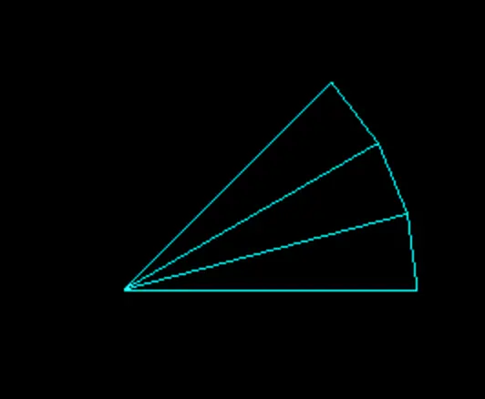
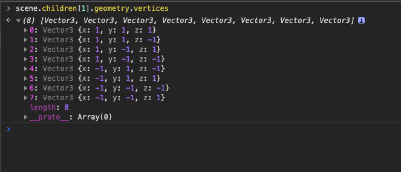
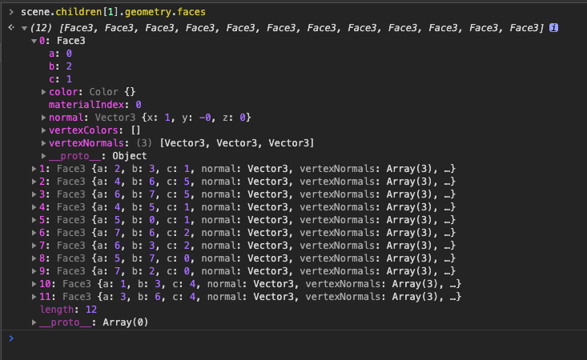
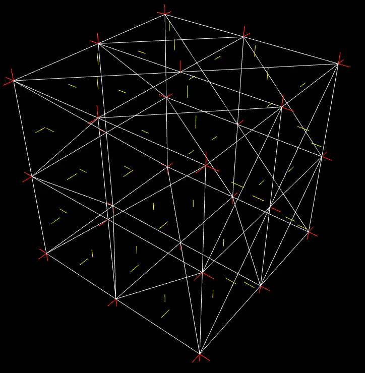
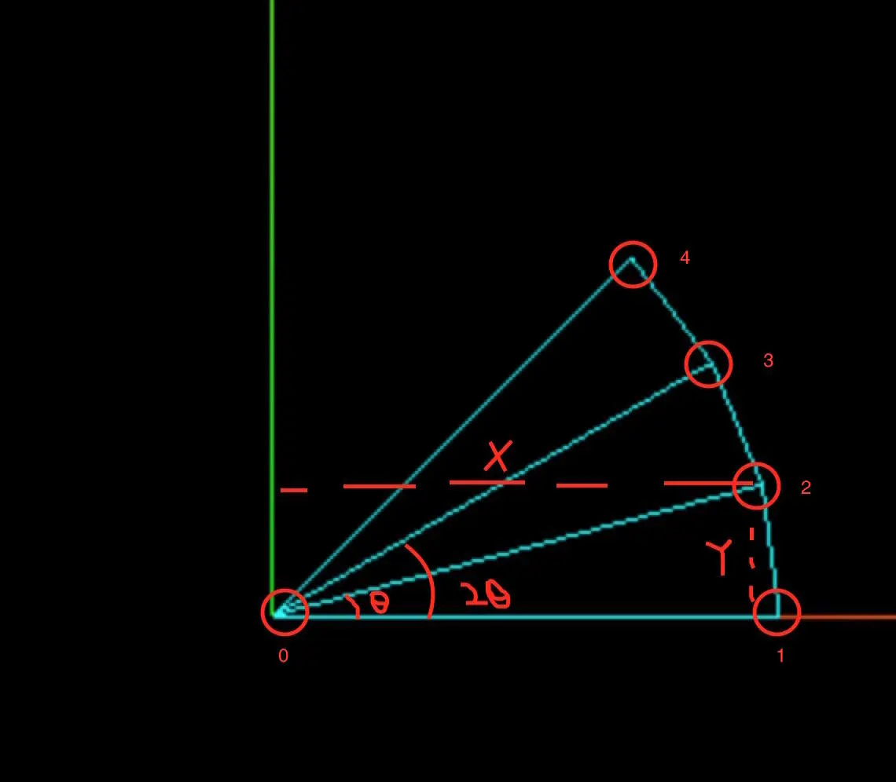
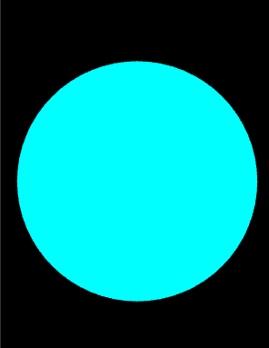

> 参考:
> https://threejsfundamentals.org/threejs/lessons/threejs-custom-buffergeometry.html
> https://www.jianshu.com/p/5f6d0cd75443

[文本代码](https://github.com/dslming/learningComputerGraphics/tree/master/ThreejsLearning/) 中的第24篇。


### 024-模拟ThreeJS扇形几何体


#### 1、网格(Mesh)
在ThreeJS中3D物体的网格(Mesh)由几何体(Geometry)和材质(Material)组成。下面着重看一下几何体。

```js
const geometry = new THREE.PlaneGeometry(1,1);
const material = new THREE.MeshBasicMaterial();
const mesh = new THREE.Mesh(geometry, material);

scene.add(mesh);
```

#### 2、几何体(Geometry)
几何体由三角形组成，三角形由点组成。组成三角形的点叫做顶点(vertex)，法向量(normal)决定了每个顶点在光照下所呈现出的颜色。

Geometry 的要素:
**(1) 顶点(Vertex)**
ThreeJS中的属性 `geometry.vertices`查看顶点数据。


**(2) 面(Face)**
ThreeJS中的属性 `geometry.faces`通过数组的形式保存了一个3D物体所有的三角面信息。


数组每一项的内容:
- a,b,c: `geometry.vertices`的顶点索引
- normal: THREE.Vector3 : 三角面的法向量
- vertexNormals: Array: 每个顶点的法向量
- color: THREE.Color: 指定面的颜色
- vertexColors:Array 指定每个顶点的颜色
  **注意**
  一个三角面只会有一个法向量。一个顶点会属于不同的三角面，因此一个顶点会有多个法向量。
  

**(3) 顶点索引(index)**
`geometry.index`查看.
  

#### 3、WebGL绘制方式
[参考](http://www.yanhuangxueyuan.com/webgl_course/vertexindex.html)
```js
// 绘制顶点索引的数据
gl.drawElements()
// 直接绘制顶点
gl.drawArrays()
```

> 猜测: 在ThreeJS中,如果指定了`geometry`的索引(index),那么就是调用`gl.drawElements`,否则调用`gl.drawArrays`进行顶点绘制。性能考虑以后的绘制几何体都采用**顶点索引**方式绘制。

#### 4、顶点绘制顺序
[参考](https://blog.csdn.net/u012283902/article/details/21736471)
在OpenGL中,决定三角面的正反由这个函数指定:
```js
// GL_CCW: 顶点顺序为逆时针方向的表面为正面
// GL_CW: 顶点顺序为顺时针方向的表面为正面
glFrontFace(mode)
```

WebGL中:
```js
// 逆时针顶点顺序为正面
gl.frontFace(gl.CCW);
// 顺时针顶点顺序为正面
gl.frontFace(gl.CW);
// 开启背面剔除
gl.enable(gl.CULL_FACE);
// 剔除背面
gl.cullFace(gl.BACK);
```

ThreeJS中:
```js
// 将多边形的缠绕顺序设置为顺时针方向
THREE.FrontFaceDirectionCW = 0
// 将多边形的缠绕顺序设置为逆时针方向
THREE.FrontFaceDirectionCCW = 1
```

#### 3、计算圆形的顶点
开始计算圆形的顶点坐标和索引。


```js
// 顶点的数量
vertices.length = 1(圆心) + (segments + 1);
// 每个顶点的X,Y值
//Θ等于每个三角形的所经过的圆心角度数
Θ = thetaStart + (thetaLength / segments) * index
X = radius * cos(Θ)
Y = radius * sin(Θ)
```

顶点坐标:
```js
for(s =0; s<= segments;s++) {
  var segment = thetaStart + s / segments * thetaLength;
  vertex.x = radius * Math.cos( segment );
  vertex.y = radius * Math.sin( segment );
  vertex.z = 0;
  vertices.push(vertex.x,vertex.y,vertex.z = 0)
}
```

顶点索引:
```js
//保存顶点索引
//(1,2,0),(2,3,0),(3,4,0)...
for ( i = 1; i <= segments; i ++ ) {
    indices.push( i, i + 1, 0 );
}
```

#### 5、放到场景中工作起来
[代码改写自这里](https://github.com/mrdoob/three.js/blob/master/src/geometries/CircleGeometry.js)

CircleData.js
```js
/**
 * 产生圆的数据
 */
class CircleData {
  constructor({ radius, segments, thetaStart, thetaLength }) {
    // 参数检查
    radius = radius || 1
    segments = segments !== undefined ? Math.max(3, segments) : 8;
    thetaStart = thetaStart !== undefined ? thetaStart : 0;
    thetaLength = thetaLength !== undefined ? thetaLength : Math.PI * 2;

    // ---- buffers ----
    // 顶点索引
    let indices = []
    // 顶点坐标
    let vertices = [];
    // 法线
    let normals = [];
    // uv坐标
    let uvs = [];

    // ---- helper variables ----
    let i, s;
    let vertex = new Vector3();
    let uv = new Vector2();

    // ---- center point ----
    vertices.push(0, 0, 0);
    normals.push(0, 0, 1);
    uvs.push(0.5, 0.5);

    for (s = 0, i = 3; s <= segments; s++ , i += 3) {
      var segment = thetaStart + s / segments * thetaLength;
      // vertex
      vertex.x = radius * Math.cos(segment);
      vertex.y = radius * Math.sin(segment);
      vertices.push(vertex.x, vertex.y, vertex.z);

      // normal
      normals.push(0, 0, 1);

      // uvs
      uv.x = (vertices[i] / radius + 1) / 2;
      uv.y = (vertices[i + 1] / radius + 1) / 2;
      uvs.push(uv.x, uv.y);
    }

    // indices
    for (i = 1; i <= segments; i++) {
      indices.push(i, i + 1, 0);
    }

    this.indices = indices
    this.normal = normals
    this.position = vertices
    this.uvs = uvs
    // build geometry
    // this.setIndex(indices);
    // this.setAttribute('position', new Float32BufferAttribute(vertices, 3));
    // this.setAttribute('normal', new Float32BufferAttribute(normals, 3));
    // this.setAttribute('uv', new Float32BufferAttribute(uvs, 2));
  }

  getData() {
    return {
      uvs: this.uvs,
      indices: this.indices,
      normal: this.normal,
      position: this.position,
    }
  }
}
```

App.js
```js
class App {
  ...
  addCircle(stage) {
    let circleData = new CircleData({
      radius: 5,
      segments: 64,
      thetaLength: Math.PI * 2
    })

    let { position, indices } = circleData.getData()
    var geometry = new THREE.BufferGeometry();

    // 设置顶点索引
    geometry.setIndex(indices)
    // 设置顶点坐标
    geometry.setAttribute('myPosition', new THREE.Float32BufferAttribute(position, 3));

    let circle = new THREE.Mesh(geometry, material);
    circle.name = "circle"
    stage.scene.add(circle)
  }
  ...
}
```

着色器代码:
```js
export let vertexShader = `
  attribute vec3 myPosition;
  void main() {
    gl_Position = projectionMatrix * modelViewMatrix * vec4(myPosition, 1.0);
  }
`

export let fragmentShader = `
void main() {
 vec3 color = vec3(0.,1.,1.);
 gl_FragColor = vec4(color,1.0);
}
`
```
最后效果:

<全文结束>
