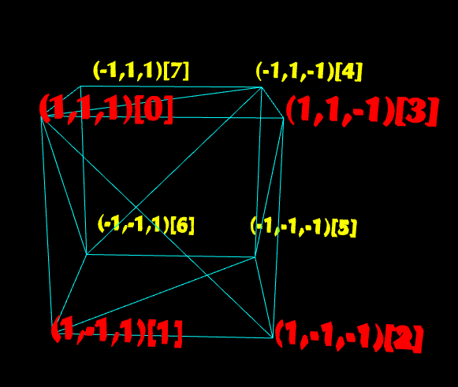

### 025-几何造型-立方体


生成顶点数据:
```js
export default class BoxData {
  constructor({ width, height, depth }) {
    // 参数检查
    width = width || 1;
    height = height || 1;
    depth = depth || 1;

    // 顶点索引
    let indices = [
      // front
      0, 1, 2, 2, 3, 0,
      // back
      4, 5, 6, 6, 7, 4,
      // left
      0, 1, 6, 6, 7, 0,
      // right
      3, 2, 5, 5, 4, 3,
      // top
      0, 3, 4, 4, 7, 0,
      // bottom
      1, 2, 5, 5, 6, 1
    ]

    // 顶点坐标
    let vertices = [
      // front
      1, 1, 1,
      1, -1, 1,
      1, -1, -1,
      1, 1, -1,

      // back
      -1, 1, -1,
      - 1, -1, -1,
      -1, -1, 1,
      - 1, 1, 1,
    ];

    this.indices = indices
    this.position = vertices
  }

  getData() {
    return {
      indices: this.indices,
      position: this.position,
    }
  }
}

```
