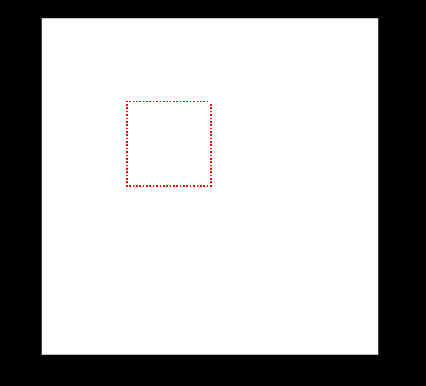

### 028-动态选择框-数据纹理

通过生成纹理数据，构造一个选择框。



#### 1、关键代码

App.js
```js
class App {
  generateDataTexture() {
    // 生成数据纹理并初始化为白色。
    var width = 200;
    var height = 200;
    var data = new Uint8Array(width * height * 4);
    let dataTexture = new THREE.DataTexture(data, width, height, THREE.RGBAFormat);
    for (let i = 0, j = 0; i < dataTexture.image.data.length; i += 4, j++) {
      dataTexture.image.data[i + 0] = 255
      dataTexture.image.data[i + 1] = 255
      dataTexture.image.data[i + 2] = 255
      dataTexture.image.data[i + 3] = 1
    }
    ...

    // 指定一个区域,开始画线
    const rect = {
      x: 50,
      y: 100,
      w: 50,
      h: 50
    }
    line1.drawLine({
      start: {
        x: rect.x,
        y: rect.y
      },
      end: {
        x: rect.x + rect.w,
        y: rect.y
      },
      lineWidth: 2,
      color: "ff0000",
      imgWidth: 200,
      imgData: dataTexture.image.data
    })
  }
}
```

Line.js
```js
export default class Line {
  ...
  drawLine({ start, end, color, lineWidth, imgData, imgWidth }) {
    let point = 2
    for (let x = start.x; x < end.x; x += 1) {
      if (x % point == 0 && this.falg == true) {
        Line.setPixel(x, start.y, color, imgWidth, imgData)
        continue
      }

      if (x % point == 1 && this.falg == false) {
        Line.setPixel(x, start.y, color, imgWidth, imgData)
        continue
      }
    }

    for (let y = start.y; y < end.y; y += 1) {
      if (y % point == 0 && this.falg == true) {
        Line.setPixel(start.x, y, color, imgWidth, imgData)
        continue
      }
      if (y % point == 1 && this.falg == false) {
        Line.setPixel(start.x, y, color, imgWidth, imgData)
        continue
      }
    }

    this.falg = !this.falg
  }
}

```


#### 2、完整代码
App.js
```js
import * as THREE from './lib/three.module.js'
import { Stage } from './Stage.js'
import Line from './Line.js'

window.THREE = THREE
let line1 = new Line()
let line2 = new Line()
let line3 = new Line()
let line4 = new Line()

let that = null
let count = 0
// var dataTexture = []

class App {
  constructor() {
    that = this
    this.srcTexturen = null
    this.stage = new Stage("#app")
    window.lm = this.stage
    this.addBox()
    this.stage.run()
  }


  generateDataTexture() {
    var width = 200;
    var height = 200;
    var data = new Uint8Array(width * height * 4);
    let dataTexture = new THREE.DataTexture(data, width, height, THREE.RGBAFormat);
    for (let i = 0, j = 0; i < dataTexture.image.data.length; i += 4, j++) {
      dataTexture.image.data[i + 0] = 255
      dataTexture.image.data[i + 1] = 255
      dataTexture.image.data[i + 2] = 255
      dataTexture.image.data[i + 3] = 1
    }

    const rect = {
      x: 50,
      y: 100,
      w: 50,
      h: 50
    }

    line1.drawLine({
      start: {
        x: rect.x,
        y: rect.y
      },
      end: {
        x: rect.x + rect.w,
        y: rect.y
      },
      lineWidth: 2,
      color: "ff0000",
      imgWidth: 200,
      imgData: dataTexture.image.data
    })
    line2.drawLine({
      start: {
        x: rect.x,
        y: rect.y
      },
      end: {
        x: rect.x,
        y: rect.y + rect.h
      },
      lineWidth: 2,
      color: "ff0000",
      imgWidth: 200,
      imgData: dataTexture.image.data
    })
    line3.drawLine({
      start: {
        x: rect.x + rect.h,
        y: rect.y
      },
      end: {
        x: rect.x,
        y: rect.y + rect.h
      },
      lineWidth: 2,
      color: "ff0000",
      imgWidth: 200,
      imgData: dataTexture.image.data
    })
    line4.drawLine({
      start: {
        x: rect.x,
        y: rect.y + rect.h
      },
      end: {
        x: rect.x + rect.w,
        y: rect.y + rect.h
      },
      lineWidth: 2,
      color: "ff0000",
      imgWidth: 200,
      imgData: dataTexture.image.data
    })
    return dataTexture
  }

  // 增加一个立方体
  addBox() {
    let texture = this.generateDataTexture()
    const material = new THREE.MeshBasicMaterial({ map: texture });
    let geometry = new THREE.BoxGeometry(10, 10, 10)
    let cube = new THREE.Mesh(geometry, material);
    cube.name = "cube"
    this.stage.scene.add(cube)
    this.stage.onUpdate(() => {
      count++
      if (count > 20) {
        let texture = this.generateDataTexture()
        cube.material.map = texture
      }

      if (count > 20) {
        count = 0
      }
    })
  }
}

window.onload = () => {
  new App()
}
```

Line.js
```js

export default class Line {
  constructor() {
    this.falg = true
  }

  static getPixelColor(x, y, imgWidth, imgData) {
    const w = imgWidth
    const d = imgData

    var color = []
    color[0] = d[(y * w + x) * 4]
    color[1] = d[(y * w + x) * 4 + 1]
    color[2] = d[(y * w + x) * 4 + 2]
    color[3] = d[(y * w + x) * 4 + 3]
    let ret = Line.rgbToHex(color)
    return ret
  }

  static setPixel(x, y, color, imgWidth, imgData) {
    const w = imgWidth
    const d = imgData
    const hexColor = Line.hexToRgba(color)
    d[(y * w + x) * 4 + 0] = hexColor[0]
    d[(y * w + x) * 4 + 1] = hexColor[1]
    d[(y * w + x) * 4 + 2] = hexColor[2]
    d[(y * w + x) * 4 + 3] = 255
  }

  static rgbToHex(c) {
    const [r, g, b, a] = c
    return ((r << 16) | (g << 8) | b).toString(16);
  }

  static hexToRgba(hex) {
    let ret = []
    ret[0] = parseInt("0x" + hex.slice(0, 2))
    ret[1] = parseInt("0x" + hex.slice(2, 4))
    ret[2] = parseInt("0x" + hex.slice(4, 6))
    return ret
  }

  drawLine({ start, end, color, lineWidth, imgData, imgWidth }) {
    let point = 2
    for (let x = start.x; x < end.x; x += 1) {
      if (x % point == 0 && this.falg == true) {
        Line.setPixel(x, start.y, color, imgWidth, imgData)
        continue
      }

      if (x % point == 1 && this.falg == false) {
        Line.setPixel(x, start.y, color, imgWidth, imgData)
        continue
      }
    }

    for (let y = start.y; y < end.y; y += 1) {
      if (y % point == 0 && this.falg == true) {
        Line.setPixel(start.x, y, color, imgWidth, imgData)
        continue
      }
      if (y % point == 1 && this.falg == false) {
        Line.setPixel(start.x, y, color, imgWidth, imgData)
        continue
      }
    }

    this.falg = !this.falg


  }
}

```
