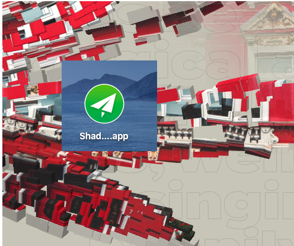

### 通过操作数据合并图片
因为这种方式只是单纯的操作数组,不涉及操作dom，为后面 webassembly 合并图片提供可能。

#### 1、Image 数据结构
canvas 或者 image 的数据都是 Uint8Array。
```js
let imgData = ctx.getImageData(0, 0, w, h)
// 或者通过canvas 创建图片
var imgData = ctx.createImageData(100,100);
```

每个像素由4个值构成, 分别对应RGBA。例如第一个像素的构成:
```js
R: imgData.data[0]
G: imgData.data[1]
B: imgData.data[2]
A: imgData.data[3]
```

### 2、常用操作
```js
// 根据索引获取坐标
getXYbyIndex(index){
  x = index % imgData.width
  y = Number.parseInt(index / imgData.width)
}

getPixelColor(x, y) {
  const w = this.width
  const d = this.bitmap.data

  var color = []
  color[0] = d[(y * w + x) * 4]
  color[1] = d[(y * w + x) * 4 + 1]
  color[2] = d[(y * w + x) * 4 + 2]
  color[3] = d[(y * w + x) * 4 + 3]
  let ret = this.rgbToHex(color)
  return ret
}

setPixel(x, y, color) {
  const w = this.width
  const d = this.bitmap.data
  const hexColor = this.hexToRgba(color)
  d[(y * w + x) * 4 + 0] = hexColor[0]
  d[(y * w + x) * 4 + 1] = hexColor[1]
  d[(y * w + x) * 4 + 2] = hexColor[2]
  d[(y * w + x) * 4 + 3] = 255
}

rgbToHex(c) {
  const [r, g, b, a] = c
  return ((r << 16) | (g << 8) | b).toString(16);
}

hexToRgba(hex) {
  let ret = []
  ret[0] = parseInt("0x" + hex.slice(0, 2))
  ret[1] = parseInt("0x" + hex.slice(2, 4))
  ret[2] = parseInt("0x" + hex.slice(4, 6))
  return ret
}
```

### 3、完整代码
App.js
```js
class App {
  constructor() {
    this.data = []
    this.overCb = null
    this.position = {
      x: 0, y: 0, w: 100, h: 100
    }
  }

  setPosition({ x, y, w, h }) {
    this.position = {
      x, y, w, h
    }
  }

  setOverCb(cb) {
    this.overCb = cb
  }

  setData({ name, data }) {
    this.data.push({ name, data })
    if (this.data.length == 2) {
      console.error("start merges...");
      this.startMerge()
    }
  }

  /**
   *
   * @param {*} (x,y) img2 插入 img1的位置
   */
  startMerge() {
    // let { x, y } = this.position
    let { data: img1Data } = this.data.find((img) => { return img.name == "img1" })
    let { data: img2Data } = this.data.find((img) => { return img.name == "img2" })
    let imgData = img1Data

    let tempI = 0
    let x = 0
    let y = 0
    for (let i = 0, j = 0; i < imgData.data.length; i += 4, j++) {
      // 获取坐标
      x = j % imgData.width
      y = Number.parseInt(j / imgData.width)

      // 设置颜色
      if (x >= this.position.x &&
        y >= this.position.y &&
        y < this.position.y + this.position.h &&
        x < this.position.x + this.position.w
      ) {
        imgData.data[j * 4 + 0] = img2Data.data[tempI * 4 + 0]
        imgData.data[j * 4 + 1] = img2Data.data[tempI * 4 + 1]
        imgData.data[j * 4 + 2] = img2Data.data[tempI * 4 + 2]
        imgData.data[j * 4 + 3] = img2Data.data[tempI * 4 + 3]
        tempI++
      }
    }

    this.overCb(imgData)
  }

  getPixelColor(x, y) {
    const w = this.width
    const d = this.bitmap.data

    var color = []
    color[0] = d[(y * w + x) * 4]
    color[1] = d[(y * w + x) * 4 + 1]
    color[2] = d[(y * w + x) * 4 + 2]
    color[3] = d[(y * w + x) * 4 + 3]
    let ret = this.rgbToHex(color)
    return ret
  }

  setPixel(x, y, color) {
    const w = this.width
    // const d = this.bitmap.data
    const hexColor = this.hexToRgba(color)
    d[(y * w + x) * 4 + 0] = hexColor[0]
    d[(y * w + x) * 4 + 1] = hexColor[1]
    d[(y * w + x) * 4 + 2] = hexColor[2]
    d[(y * w + x) * 4 + 3] = 255
  }

  rgbToHex(c) {
    const [r, g, b, a] = c
    return ((r << 16) | (g << 8) | b).toString(16);
  }

  hexToRgba(hex) {
    let ret = []
    ret[0] = parseInt("0x" + hex.slice(0, 2))
    ret[1] = parseInt("0x" + hex.slice(2, 4))
    ret[2] = parseInt("0x" + hex.slice(4, 6))
    return ret
  }
}

```


index.html
```js
<!DOCTYPE html>
<html lang="en">

  <head>
    <meta charset="UTF-8">
    <meta name="viewport" content="width=device-width, initial-scale=1.0">
    <meta http-equiv="X-UA-Compatible" content="ie=edge">
    <title>Document</title>
    <script src="./App.js"></script>
    <style>
      #canvas1,
      #canvas2 {
        display: none;
      }

    </style>
  </head>

  <body>
    <canvas id="canvas1"></canvas>
    <canvas id="canvas2"></canvas>
    <canvas id="output"></canvas>
    <script>
      window.onload = () => {
        let app = new App()
        window.lm = app
        app.setPosition({
          x: 100,
          y: 100,
          w: 161,
          h: 153
        })

        let canvas1 = document.querySelector("#canvas1")
        let ctx1 = canvas1.getContext("2d")
        let img1 = new Image()
        img1.src = "./03.png"
        img1.onload = function (e) {
          let w = img1.width
          let h = img1.height
          canvas1.width = w
          canvas1.height = h
          ctx1.drawImage(img1, 0, 0, w, h)
          let img1Data = ctx1.getImageData(0, 0, w, h)
          // console.error(img1Data);
          app.setData({
            name: "img1",
            data: img1Data
          })
        }

        let canvas2 = document.querySelector("#canvas2")
        let ctx2 = canvas1.getContext("2d")
        let img2 = new Image()
        img2.src = "./02.png"
        img2.onload = function (e) {
          let w = img2.width
          let h = img2.height
          canvas2.width = w
          canvas2.height = h
          ctx2.drawImage(img2, 0, 0, w, h)
          let img2Data = ctx2.getImageData(0, 0, w, h)
          // console.error(img2Data);
          app.setData({
            name: "img2",
            data: img2Data
          })
        }

        let output = document.querySelector("#output")
        let ctx = output.getContext("2d")
        let img = new Image()

        app.setOverCb((data) => {
          output.width = data.width
          output.height = data.height
          ctx.putImageData(data, 0, 0);
        })
        //
      }
    </script>
  </body>

</html>

```



<结束>
