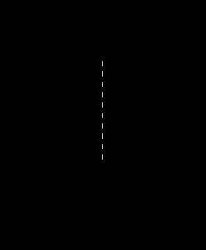
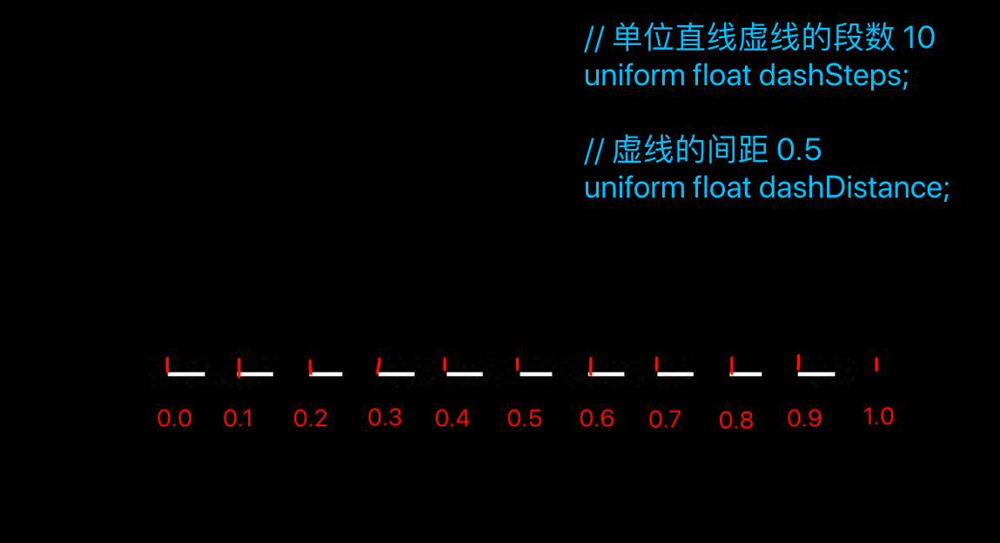

代码出处:
https://github.com/mattdesl/three-line-2d/tree/master/test/shader-dash.js

参考文章：
https://mattdesl.svbtle.com/drawing-lines-is-hard

### 031-绘制虚线-自定义shader实现

最后效果:


#### 1、使用Three.js 内置方法
App.js
```js
addLine() {
  var lineGeometry = new THREE.Geometry();//生成几何体
  lineGeometry.vertices.push(new THREE.Vector3(0, 0, 25));//线段的两个顶点
  lineGeometry.vertices.push(new THREE.Vector3(0, 1, 25));

  let material = new THREE.LineDashedMaterial({
    color: 0xffffff,//线段的颜色
    dashSize: 1,//短划线的大小
    gapSize: 3//短划线之间的距离
  })
  var line = new THREE.Line(lineGeometry, material);

  // 不可或缺的，若无，则线段不能显示为虚线
  line.computeLineDistances();
  this.stage.scene.add(line);
}
```

#### 2、自定义shader实现
shader-dash.js
```js
export default class ShaderDash{
  static getShaderData(opt){
    opt=opt||{};
    var ret=Object.assign({
        transparent:true,
        uniforms:{
          dashSteps:{type:'f',value:10},
          dashDistance:{type:'f',value:.5},
        },
        vertexShader:`
        attribute float lineDistance;
        varying float lineU;

        void main(){
          lineU=lineDistance;
          gl_Position=projectionMatrix*modelViewMatrix*vec4(position,1.);
        }`,
        fragmentShader:`
        // 当前点距离起点的距离
        varying float lineU;
        uniform float dashSteps;
        uniform float dashDistance;

        void main(){
          float lineUMod=mod(lineU,1./dashSteps)*dashSteps;
          float dash=step(dashDistance,lineUMod);
          gl_FragColor=vec4(vec3(dash),1.);
        }`
    },opt);

    return ret;
  }
}

```

App.js
```js
class App {
  ...
  addDashLine() {
    var lineGeometry = new THREE.Geometry();//生成几何体
    lineGeometry.vertices.push(new THREE.Vector3(0, 0, 25));//线段的两个顶点
    lineGeometry.vertices.push(new THREE.Vector3(0, 1, 25));

    let material = new THREE.ShaderMaterial(ShaderDash.getShaderData({
      side: THREE.DoubleSide
    }))

    var line = new THREE.Line(lineGeometry, material);
    // 不可或缺的，若无，则线段不能显示为虚线
    line.computeLineDistances();
    this.stage.scene.add(line);
  }
  ...
}
```

#### 3、代码原理
对于片元着色器:
```c
// lineU 当前像素点距离起点的距离
varying float lineU;

// 单位直线虚线的段数 10
uniform float dashSteps;

// 虚线的间距 0.5
uniform float dashDistance;

void main(){
  float lineUMod=mod(lineU,1./dashSteps)*dashSteps;
  float dash=step(dashDistance,lineUMod);
  gl_FragColor=vec4(vec3(dash),1.);
}
```



- 一共10段。
- 每段间距 = 1/段数 * 间距 = 1/10 * 0.5。
- 每个像素点都把当前像素点的距离, 映射到0~每段间距。
  ```c
  float lineUMod=mod(lineU,1./dashSteps);
  ```
- 将当前像素点距离和线段距离做比较,小于返回0,大于返回1,作为该像素点的颜色。
  ```c
  float dash=1-step(dashDistance,lineUMod);
  gl_FragColor=vec4(vec3(dash),1.);
  ```

<全文结束>
