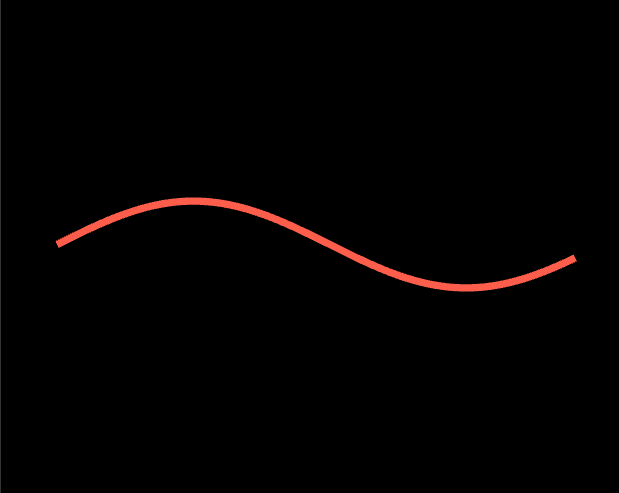

[参考教程](https://mattdesl.svbtle.com/drawing-lines-is-hard)
[参考代码](https://github.com/spite/THREE.MeshLine)

### 032-绘制宽线


Line.js
```js
import * as THREE from './lib/three.module.js'
import { lineVert } from './glsl_mesh_line_vert.js'
import { lineFrag } from './glsl_mesh_line_frag.js'


export class Line {
  constructor() {
    this.positions = [];
    this.previous = [];
    this.next = [];
    // 边
    this.side = [];
    this.indices_array = [];
    this.geometry = new THREE.BufferGeometry();
    this.widthCallback = null;
  }

  setGeometry(g, callback) {
    this.widthCallback = callback;
    this.positions = [];

    if (g instanceof Float32Array || g instanceof Array) {
      for (var j = 0; j < g.length; j += 3) {
        var c = j / g.length;
        this.positions.push(g[j], g[j + 1], g[j + 2]);
        this.positions.push(g[j], g[j + 1], g[j + 2]);
      }
    }
    this.process();
  }

  compareV3(a, b) {
    var aa = a * 6;
    var ab = b * 6;
    let ret = false
    ret =
      (this.positions[aa] === this.positions[ab]) &&
      (this.positions[aa + 1] === this.positions[ab + 1]) &&
      (this.positions[aa + 2] === this.positions[ab + 2]);
    return ret
  }

  copyV3(a) {
    var aa = a * 6;
    return [this.positions[aa], this.positions[aa + 1], this.positions[aa + 2]];
  }

  process() {
    let l = this.positions.length / 6;
    this.l = l
    this.previous = [];
    this.next = [];
    this.side = [];
    this.indices_array = [];

    // 边
    for (var j = 0; j < l; j++) {
      this.side.push(1);
      this.side.push(-1);
    }

    // 前一个
    let v = this.copyV3(0);
    this.previous.push(v[0], v[1], v[2]);
    this.previous.push(v[0], v[1], v[2]);
    for (var j = 0; j < l - 1; j++) {
      v = this.copyV3(j);
      this.previous.push(v[0], v[1], v[2]);
      this.previous.push(v[0], v[1], v[2]);
    }

    // 下一个
    for (var j = 1; j < l; j++) {
      v = this.copyV3(j);
      this.next.push(v[0], v[1], v[2]);
      this.next.push(v[0], v[1], v[2]);
    }
    v = this.copyV3(l - 1);
    this.next.push(v[0], v[1], v[2]);
    this.next.push(v[0], v[1], v[2]);

    // 顶点索引
    for (var j = 0; j < l - 1; j++) {
      var n = j * 2;
      this.indices_array.push(n, n + 1, n + 2);
      this.indices_array.push(n + 2, n + 1, n + 3);
    }
    console.error(this);

    this.attributes = {
      position: new THREE.BufferAttribute(new Float32Array(this.positions), 3),
      previous: new THREE.BufferAttribute(new Float32Array(this.previous), 3),
      next: new THREE.BufferAttribute(new Float32Array(this.next), 3),
      side: new THREE.BufferAttribute(new Float32Array(this.side), 1),
      index: new THREE.BufferAttribute(new Uint16Array(this.indices_array), 1),
    }

    this.geometry.setAttribute('position', this.attributes.position);
    this.geometry.setAttribute('previous', this.attributes.previous);
    this.geometry.setAttribute('next', this.attributes.next);
    this.geometry.setAttribute('side', this.attributes.side);
    this.geometry.setIndex(this.attributes.index);
  }
}

export class LineMaterial extends THREE.ShaderMaterial {
  isMeshLineMaterial = true

  constructor(parameters) {
    super({
      uniforms: Object.assign({},
        {
          lineWidth: { value: 1 },
          useAlphaMap: { value: 0 },
          color: { value: new THREE.Color(0xffffff) },
          resolution: { value: new THREE.Vector2(1, 1) },
          sizeAttenuation: { value: 1 },
        }
      ),
      vertexShader: lineVert,
      fragmentShader: lineFrag,
    })
    this.type = 'MeshLineMaterial';

    Object.defineProperties(this, {
      lineWidth: {
        enumerable: true,
        get: function () {
          return this.uniforms.lineWidth.value;
        },
        set: function (value) {
          this.uniforms.lineWidth.value = value;
        }
      },
      color: {
        enumerable: true,
        get: function () {
          return this.uniforms.color.value;
        },
        set: function (value) {
          this.uniforms.color.value = value;
        }
      },
      resolution: {
        enumerable: true,
        get: function () {
          return this.uniforms.resolution.value;
        },
        set: function (value) {
          this.uniforms.resolution.value.copy(value);
        }
      }
    });

    this.setValues(parameters);
  }
  copy(source) {
    this.copy(source)
    this.lineWidth = source.lineWidth;
    this.color.copy(source.color);
    this.resolution.copy(source.resolution);
    this.sizeAttenuation = source.sizeAttenuation;

    return this;

  }
}
```

glsl_mesh_line_frag.js
```js
export const lineFrag=`
varying vec4 vColor;
void main(){
  vec4 c=vColor;
  gl_FragColor=c;
}`
```

glsl_mesh_line_vert.js
```js
export const lineVert=`
attribute vec3 previous;
attribute vec3 next;
attribute float side;

uniform vec2 resolution;
uniform float lineWidth;
uniform vec3 color;

varying vec4 vColor;

vec2 fix(vec4 i,float aspect){
  vec2 res=i.xy/i.w;
  res.x*=aspect;
  return res;
}

void main(){
  vColor=vec4(color,1.);
  mat4 m=projectionMatrix*modelViewMatrix;

  vec4 finalPosition=m*vec4(position,1.);
  vec4 prevPos=m*vec4(previous,1.);
  vec4 nextPos=m*vec4(next,1.);

  float aspect=resolution.x/resolution.y;
  vec2 currentP=fix(finalPosition,aspect);
  vec2 prevP=fix(prevPos,aspect);
  vec2 nextP=fix(nextPos,aspect);

  vec2 dir;
  if(nextP==currentP){
    dir=normalize(currentP-prevP);
  }else if(prevP==currentP){
    dir=normalize(nextP-currentP);
  }else{
    vec2 dir1=normalize(currentP-prevP);
    vec2 dir2=normalize(nextP-currentP);
    dir=normalize(dir1+dir2);
  }

  vec2 offset=vec2(-dir.y,dir.x)*side*lineWidth;
  finalPosition.xy+=offset.xy;
  finalPosition.z=0.;
  gl_Position=finalPosition;
}`

```

App.js
```js
class App {
	...
	addMyLine() {
	    var lineGeo = new Float32Array(600);
	    for (var j = 0; j < 200 * 3; j += 3) {
	      lineGeo[j] = -30 + .1 * j;
	      lineGeo[j + 1] = 5 * Math.sin(.01 * j);
	      lineGeo[j + 2] = 0;
	    }

	    var g = new Line();
	    g.setGeometry(lineGeo);

	    var material = new LineMaterial({
	      useMap: false,
	      color: new THREE.Color(colors[0]),
	      opacity: 1,
	      resolution: new THREE.Vector2(window.innerWidth, window.innerHeight),
	      sizeAttenuation: !false,
	      lineWidth: 2,
	      near: this.stage.camera.near,
	      far: this.stage.camera.far
	    });
	    var mesh = new THREE.Mesh(g.geometry, material);
	    mesh.name = "line"
	    this.stage.camera.position.set(0, 0, 100);
	    this.stage.scene.add(mesh);
	    let t = 0
	    this.stage.onUpdate(() => {
	      t++
	      let lineWidth = Math.sin(t * 0.05) + 2
	      mesh.material.uniforms.lineWidth.value = lineWidth
	      // mesh.rotation.x += 0.005
	    })
	  }
	...
}
```
<全文结束>
