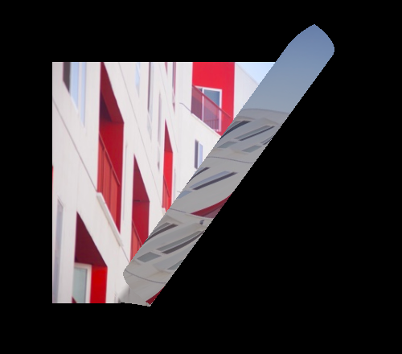

[教程地址](https://tympanus.net/codrops/2020/01/22/how-to-unroll-images-with-three-js/)

[参考代码](https://github.com/akella/UnrollingImages)

### 034-图片展开


可以展开图片的平面:Plane.js
```js
import * as THREE from './lib/three.module.js'
import { fragment } from "./glsl.fragment.js";
import { vertex } from "./glsl.vertex.js";

const gsap = window.gsap

export default class Plan {
  constructor({
    img,
    width,
    height
  }, stage) {
    this.stage = stage
    this.mesh = this.createMesh({
      width,
      height,
      image: img,
      iWidth: img.width,
      iHeight: img.height
    });

    this.mesh.name = "test"
    this.stage.scene.add(this.mesh);
  }

  createMesh(o) {
    let texture = new THREE.Texture(o.image);
    texture.needsUpdate = true;
    // image cover
    let imageAspect = o.iHeight / o.iWidth;
    let a1;
    let a2;
    if (o.height / o.width > imageAspect) {
      a1 = (o.width / o.height) * imageAspect;
      a2 = 1;
    } else {
      a1 = 1;
      a2 = o.height / o.width / imageAspect;
    }
    texture.minFilter = THREE.LinearFilter;

    const geometry = new THREE.PlaneBufferGeometry(1, 1, 80, 80);
    const material = new THREE.ShaderMaterial({
      side: THREE.DoubleSide,
      uniforms: {
        progress: { type: "f", value: 0 },
        angle: { type: "f", value: 0 },
        texture1: { type: "t", value: null },
        resolution: { type: "v4", value: new THREE.Vector4() },
      },
      vertexShader: vertex,
      fragmentShader: fragment
    });
    material.uniforms.resolution.value.x = o.width;
    material.uniforms.resolution.value.y = o.height;
    material.uniforms.resolution.value.z = a1;
    material.uniforms.resolution.value.w = a2;
    material.uniforms.progress.value = 0.5;
    material.uniforms.angle.value = 0.5;
    material.uniforms.texture1.value = texture;
    material.uniforms.texture1.value.needsUpdate = true;

    let mesh = new THREE.Mesh(geometry, material);
    mesh.scale.set(o.width, o.height, o.width / 2);
    return mesh;
  }

  startRoll(angle) {
    let radians = (angle * Math.PI) / 180;
    this.mesh.material.uniforms.angle.value = radians
    gsap.fromTo(
      this.mesh.material.uniforms.progress,
      {
        value: 0,
      },
      {
        duration: 2.5,
        value: 1,
        ease: "power2.out",
        onUpdate: () => {
        }
      }
    );
  }
}
```


顶点着色器:glsl.vertex.js
```c
const float pi=3.1415925;

uniform float angle;
uniform float progress;
uniform vec4 resolution;
varying vec2 vUv;
varying float vFrontShadow;
uniform sampler2D texture1;
uniform vec2 pixels;

mat4 rotationMatrix(vec3 axis,float angle){
  axis=normalize(axis);
  float s=sin(angle);
  float c=cos(angle);
  float oc=1.-c;

  return mat4(oc*axis.x*axis.x+c,oc*axis.x*axis.y-axis.z*s,oc*axis.z*axis.x+axis.y*s,0.,
    oc*axis.x*axis.y+axis.z*s,oc*axis.y*axis.y+c,oc*axis.y*axis.z-axis.x*s,0.,
    oc*axis.z*axis.x-axis.y*s,oc*axis.y*axis.z+axis.x*s,oc*axis.z*axis.z+c,0.,
  0.,0.,0.,1.);
}

vec3 rotate(vec3 v,vec3 axis,float angle){
  mat4 m=rotationMatrix(axis,angle);
  return(m*vec4(v,1.)).xyz;
}

void main(){
  vUv=uv;
  float finalAngle=angle-0.*.3*sin(progress*6.);

  // @todo account for aspect ratio!!!
  vec3 newposition=position;

  float rad=.1;
  float rolls=8.;
  // rot
  newposition=rotate(newposition-vec3(-.5,.5,0.),vec3(0.,0.,1.),-finalAngle)+vec3(-.5,.5,0.);

  float offs=(newposition.x+.5)/(sin(finalAngle)+cos(finalAngle));// -0.5..0.5 -> 0..1
  float tProgress=clamp((progress-offs*.99)/.01,0.,1.);

  // shadows
  vFrontShadow=clamp((progress-offs*.95)/.05,.7,1.);

  newposition.z=rad+rad*(1.-offs/2.)*sin(-offs*rolls*pi-.5*pi);
  newposition.x=-.5+rad*(1.-offs/2.)*cos(-offs*rolls*pi+.5*pi);

  // // rot back
  newposition=rotate(newposition-vec3(-.5,.5,0.),vec3(0.,0.,1.),finalAngle)+vec3(-.5,.5,0.);
  // unroll
  newposition=rotate(newposition-vec3(-.5,.5,rad),vec3(sin(finalAngle),cos(finalAngle),0.),-pi*progress*rolls);
  newposition+=vec3(
    -.5+progress*cos(finalAngle)*(sin(finalAngle)+cos(finalAngle)),
    .5-progress*sin(finalAngle)*(sin(finalAngle)+cos(finalAngle)),
    rad*(1.-progress/2.)
  );

  // animation
  vec3 finalposition=mix(newposition,position,tProgress);
  gl_Position=projectionMatrix*modelViewMatrix*vec4(finalposition,1.);
}
```

片元着色器: glsl.fragment.js
```c
uniform float progress;
uniform sampler2D texture1;
uniform vec4 resolution;

varying vec2 vUv;
varying float vFrontShadow;

void main(){
    vec2 newUV=(vUv-vec2(.5))*resolution.zw+vec2(.5);
    gl_FragColor=texture2D(texture1,newUV);
    gl_FragColor.rgb*=vFrontShadow;
    gl_FragColor.a=clamp(progress*5.,0.,1.);
}
```
<全文结束>
