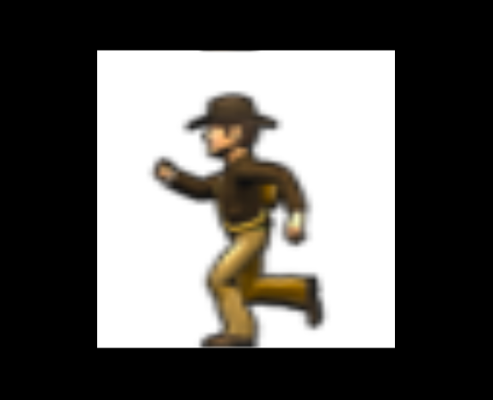

[代码出处](https://stemkoski.github.io/Three.js/Texture-Animation.html)


[文字教程](https://medium.com/@soffritti.pierfrancesco/animations-with-alpha-textures-in-three-js-52a33654e137)

### 动态纹理-基于多帧合成图片(Animated Textures)


#### 1、定义动态纹理
TextureAnimator.js 代码
```js
import * as THREE from './lib/three.module.js'

export default class TextureAnimator {
  constructor(texture, tilesHoriz, tilesVert, numTiles, tileDispDuration) {
    // note: texture passed by reference, will be updated by the update function.
    this.texture = texture
    this.tilesHorizontal = tilesHoriz;
    this.tilesVertical = tilesVert;

    // how many images does this spritesheet contain?
    //  usually equals tilesHoriz * tilesVert, but not necessarily,
    //  if there at blank tiles at the bottom of the spritesheet.
    this.numberOfTiles = numTiles;
    texture.wrapS = texture.wrapT = THREE.RepeatWrapping;
    texture.repeat.set(1 / this.tilesHorizontal, 1 / this.tilesVertical);

    // how long should each image be displayed?
    this.tileDisplayDuration = tileDispDuration;

    // how long has the current image been displayed?
    this.currentDisplayTime = 0;

    // which image is currently being displayed?
    this.currentTile = 0;
  }

  update(milliSec) {
    this.currentDisplayTime += milliSec;
    while (this.currentDisplayTime > this.tileDisplayDuration) {
      this.currentDisplayTime -= this.tileDisplayDuration;
      this.currentTile++;
      if (this.currentTile == this.numberOfTiles)
        this.currentTile = 0;
      var currentColumn = this.currentTile % this.tilesHorizontal;
      this.texture.offset.x = currentColumn / this.tilesHorizontal;
      var currentRow = Math.floor(this.currentTile / this.tilesHorizontal);
      this.texture.offset.y = currentRow / this.tilesVertical;
    }
  };
}
```

#### 2、使用动态纹理
App.js
```js
class App {
	...
	addRunner() {
    const clock = new THREE.Clock()
    var runnerTexture = new THREE.ImageUtils.loadTexture('./run.png');
    // texture, #horiz, #vert, #total, duration.
    var annie = new TextureAnimator(runnerTexture, 10, 1, 10, 100);
    var runnerMaterial = new THREE.MeshBasicMaterial({ map: runnerTexture, side: THREE.DoubleSide });
    var runnerGeometry = new THREE.PlaneGeometry(50, 50, 1, 1);
    var runner = new THREE.Mesh(runnerGeometry, runnerMaterial);
    runner.position.set(0, 0, -100);
    this.stage.scene.add(runner)
    this.stage.onUpdate(() => {
      var delta = clock.getDelta()
      annie.update(1000 * delta);
    })
  }
	...
}
```

最后效果:小人在跑步.gif

<全文结束>
