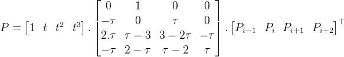
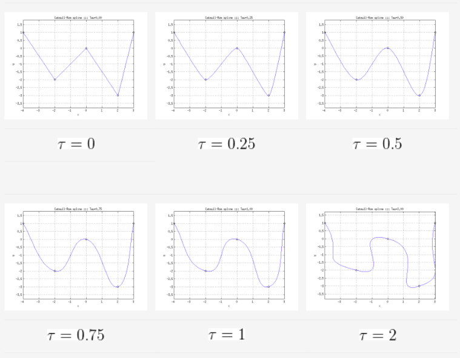

#### 222

经过4个点($P_0$,$P_1$,$P_2$,$P_3$)的曲线方程为:
$$
B(t) = c_0 + c_1 t + c_2 t^2 + c_3 t^3
$$

其切线方程为:
$$
C(t) = c_1 + 2 c_2 t + 3 c_3 t^2
$$

满足如下条件:

~~~math
\begin{aligned}
B(0) &= P_1, 故 c_0 = P_1 \\

C(0) &= \frac{P_2-P_0}{2}, 故c_1 = \frac{P_2-P_0}{2} \\

B(1) &= P_2, 故c_0+c_1+c_2+c_3 = P_2 \\

C(1) &= \frac{P_3-P1}{2}, 故 c_1+2c_2+3c_3 = \frac{P_3-P1}{2}

\end{aligned}
~~~

由上式可推出:

~~~math
\begin{aligned}

c_0 &= P_1      \\
c_1 &= \frac{P_2-P_1}{2}   \\
c_2 &= \frac{2P_0-5P_1+4P_2-P_3}{2} \\
c_3 &= \frac{-P_0+3P_1-3P_2+P_3}{2}

\end{aligned}
~~~

那么样条的表达式:
$$
Q(t) = [(2 * P_1) + (-P_0 + P_2) * t + (2P_0 - 5P_1 + 4P_2 - P_3) * t^2 + (-P0 + 3P_1- 3P_2 + P_3) * t^3 ] * \frac{1}{2}
$$

矩阵形式:
$$
Q(t) = \frac{1}{2} *
\left[
  \begin{matrix}
  1 & t & t^2 & t^3 \\
  \end{matrix}
\right]
*
\left[
  \begin{matrix}
  0 & 2 & 0 & 0  \\
  -1 & 0 & 1 & 0  \\
  2 & -5 & 4 & -1  \\
  -1 & 3 & -3 & 1
  \end{matrix}
\right]
*
\left[
  \begin{matrix}
  P_0 \\
  P_1 \\
  P_2 \\
  P_3 \\
  \end{matrix}
\right]
$$

这个公式$y=x+1$是

$$
\theta = x+1
$$
<全文结束>

#### 4、CatmullRom 分类

- 向心(centripetal)
- 和弦(chordal)

#### 5、深入

那么,一个位于$P_i$和$P_{i+1}$的点$P$的计算公式:

考虑张力($\tau$)的情况:

不同张力对曲线的影响:

