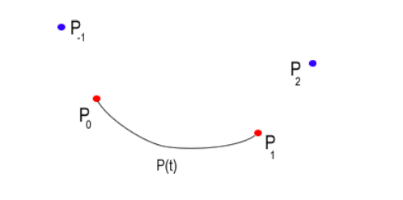
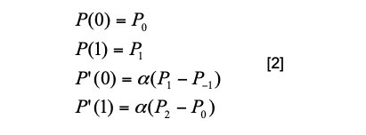

[B样条教程](https://www.cnblogs.com/WhyEngine/p/4020380.html)

### 样条曲线-CatmullRom

#### 1、样条曲线

所谓**样条曲线**是指给定一组控制点而得到一条曲线，曲线的大致形状由这些点予以控制，一般可分为`插值样条`和`逼近样条`两种。

**插值样条:**

- 要求必须经过给定所有数据点
- 代表算法有: `CatmullRom`

**逼近样条：**

- 不要求一定要经过数据点
- 代表算法有: `B样条`

#### 2、参数连续性

> 参考: 计算机图形学(第4版)-第14章第2节

#### 3、 CatmullRom 要求参数1阶连续

[截图出处](https://wenku.baidu.com/view/bb7f8ff4910ef12d2bf9e70d.html)

#### 4、 CatmullRom 公式原理

[参考教程1](http://algorithmist.net/docs/catmullrom.pdf)
[参考教程2](https://www.lucidarme.me/catmull-rom-splines/#)

要绘制曲线$P_iP_{i+1}$,需要额外两个辅助点, $P_{i-1}$和$P_{i+2}$。

几乎所有的三次曲线构造都与 Hermite 曲线有些相似。考虑在两点之间拟合三次曲线的情况。除了通过两个点之外，还需要两个其他约束来定义曲线。假设在每个端点处指定了导数值，如下图所示:

这种情况与 Hermite 曲线非常相似，只不过上面的曲线没有超出控制点。由于切线会影响曲线的形状，因此可以明确提供切线或从其他控制点推断出切线。

考虑单个曲线$P(t)$的推导，该曲线对上面的点$P_0$和$P_1$进行插值。

假设如下所示指定了其他控制点$P_{-1}$和$P_2$。

$P(t)$是三次曲线，条件为t=0产生$P_0$，t=1产生$P_1$。
辅助点$P_{-1}$和$P_2$用于通过隐式定义切线来调整曲线的形状:

其中$α$在0到1之间。此定义使每个端点处的切线平行于相邻控制点之间的弦。曲线的一般方程为

可以从端点和切线规范提供的几何约束条件确定系数。该过程类似于Hermite插值的推导。

Since $P'(t)=3at2 +2bt+c$

