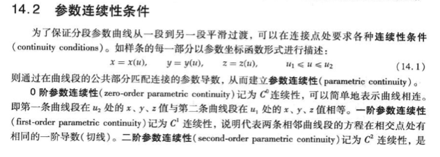
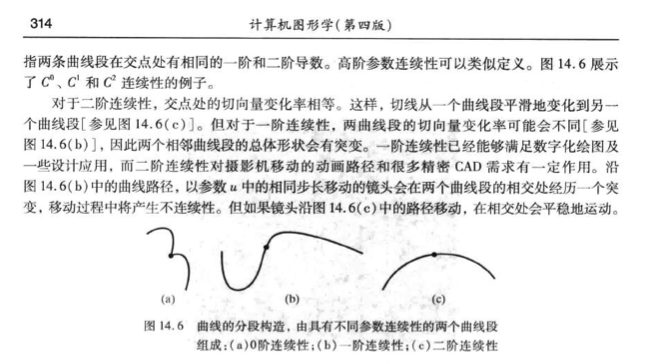
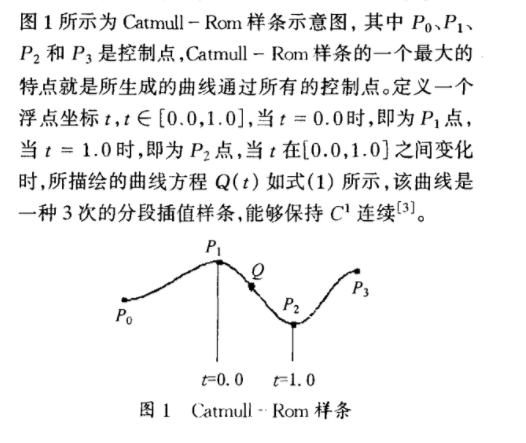
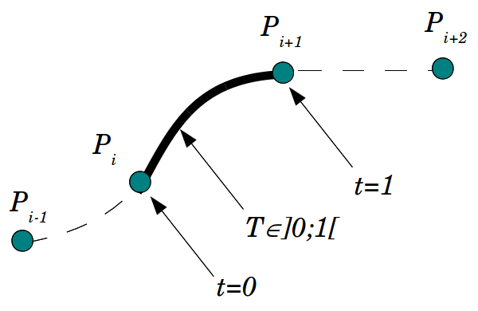
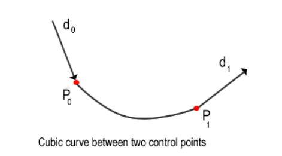
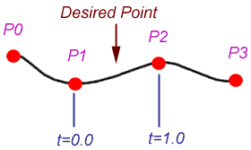

[B样条教程](https://www.cnblogs.com/WhyEngine/p/4020380.html)

### 样条曲线-CatmullRom

#### 1、样条曲线

所谓**样条曲线**是指给定一组控制点而得到一条曲线，曲线的大致形状由这些点予以控制，一般可分为`插值样条`和`逼近样条`两种。

**插值样条:**

- 要求必须经过给定所有数据点
- 代表算法有: `CatmullRom`


**逼近样条：**

- 不要求一定要经过数据点
- 代表算法有: `B样条`


#### 2、参数连续性

> 参考: 计算机图形学(第4版)-第14章第2节




#### 3、 CatmullRom 要求参数1阶连续

[截图出处](https://wenku.baidu.com/view/bb7f8ff4910ef12d2bf9e70d.html)



#### 4、 CatmullRom 几何原理

[参考教程1](http://algorithmist.net/docs/catmullrom.pdf)
[参考教程2](https://www.lucidarme.me/catmull-rom-splines/#)


要绘制曲线$P_iP_{i+1}$,需要额外两个辅助点, $P_{i-1}$和$P_{i+2}$。

考虑在两点之间拟合三次曲线的情况。除了通过两个点之外，还需要两个其他约束来定义曲线。假设在每个端点处指定了导数值，如下图所示:


由于切线会影响曲线的形状，因此可以明确提供切线或从其他控制点推断出切线。

#### 4、CatmullRom 公式推导



经过4个点($P_0$,$P_1$,$P_2$,$P_3$)的曲线方程为:
$$
B(t) = a + b t + c t^2 + d t^3 \tag{1}
$$

其切线方程为:
$$
C(t) = b + 2ct + 3 d t^2 \tag{2}
$$

考虑单个曲线$B(x)$的推导,这里:

~~~math
\begin{aligned}

P_0 &= x_0 \\
P_1 &= x_1 \\
P_2 &= x_2 \\
P_3 &= x_3
\end{aligned}
~~~

将t=0和t=1分别带入公式(1)(2),可以得出:

~~~math
\begin{aligned}

B(0) &= a = x_1 \\
C(0) &= b \\
B(1) &= a + b + c + d = x_2 \\
C(1) &= b + 2c +3d

\end{aligned}
~~~

令 $C(0)=t_0$,$C(1)=t_1$,写成矩阵形式为:
$$
\left[
  \begin{matrix}
  1 & 0 & 0 & 0  \\
  0 & 1 & 0 & 0  \\
  1 & 1 & 1 & 1  \\
  0 & 1 & 2 & 3
  \end{matrix}
\right]
*
\left[
  \begin{matrix}
  a \\
  b \\
  c \\
  d \\
  \end{matrix}
\right]
= \left[
  \begin{matrix}
  x_1 \\
  t_0 \\
  x_2 \\
  t_1 \\
  \end{matrix}
\right]
$$

根据矩阵乘法:

~~~math
\begin{aligned}

A * X &= B   \\
A^{-1} * A * X &= A^{-1} * B \\
\end{aligned}
~~~

有:
$$
X = A^{-1}*B
$$

这里$A^{-1}$等于:
$$
\left[
  \begin{matrix}
  1 & 0 & 0 & 0  \\
  0 & 1 & 0 & 0  \\
  -3 & -2 & 3 & -1  \\
  2 & 1 & -2 & 1
  \end{matrix}
\right]
$$

那么:
$$
\left[
  \begin{matrix}
  a \\
  b \\
  c \\
  d \\
  \end{matrix}
\right]
= \left[
  \begin{matrix}
  1 & 0 & 0 & 0  \\
  0 & 1 & 0 & 0  \\
  -3 & -2 & 3 & -1  \\
  2 & 1 & -2 & 1
  \end{matrix}
\right]
*
\left[
  \begin{matrix}
  x_1 \\
  t_0 \\
  x_2 \\
  t_1 \\
  \end{matrix}
\right]
$$

于是可以得出:
~~~math
\begin{aligned}

a &= x_1 \\
b &= t_0 \\
c &= -3x_1 -2t_0 + 3x_2 + t1 \\
d & = 2x_1 + t_0 -2x_2 + t_1

\end{aligned}
~~~

#### 5、CatmullRom代码

```js
// 三次多项式
class CubicPoly {
  constructor() {
    this.c0 = 0
    this.c1 = 0
    this.c2 = 0
    this.c3 = 0
  }

  /*
   * 计算三次多项式的系数
   * Compute coefficients for a cubic polynomial
   *   p(s) = c0 + c1*s + c2*s^2 + c3*s^3
   * such that
   *   p(0) = x0, p(1) = x1
   *  and
   *   p'(0) = t0, p'(1) = t1.
   */
  init(x0, x1, t0, t1) {
    this.c0 = x0;
    this.c1 = t0;
    this.c2 = - 3 * x0 + 3 * x1 - 2 * t0 - t1;
    this.c3 = 2 * x0 - 2 * x1 + t0 + t1;
  }

  initCatmullRom(x0, x1, x2, x3, tension) {
    this.init(x1, x2, tension * (x2 - x0), tension * (x3 - x1));
  }

  calc(t) {
    var t2 = t * t;
    var t3 = t2 * t;
    return this.c0 + this.c1 * t + this.c2 * t2 + this.c3 * t3;
  }
}

```
<全文结束>
