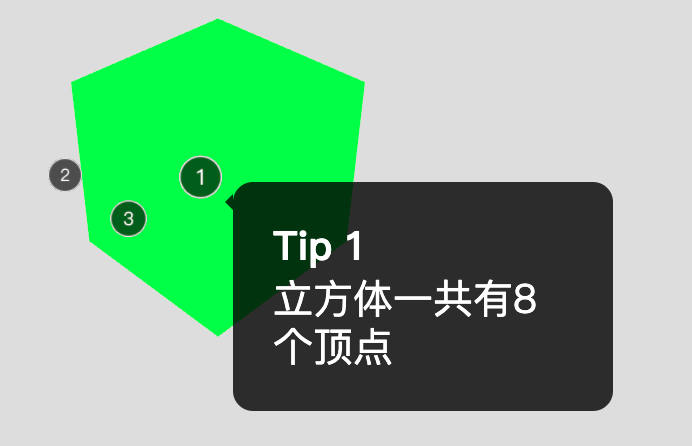

[文字教程](https://manu.ninja/webgl-three-js-annotations)
[热点代码教程](https://codepen.io/Lorti/pen/Vbppap/)
[几何图标签](http://stemkoski.github.io/Three.js/Labeled-Geometry.html)
[热点效果例子](https://xeogl.org/examples/#annotations_tronTank)
[d3中的提示工具]([https://link](https://bl.ocks.org/susielu/63269cf8ec84497920f2b7ef1ac85039))
[热点效果例子](https://sketchfab.com/3d-models/samba-dancing-f2e0523dc27847259c9818ad41a0e308)
[相机控制](https://github.com/yomotsu/camera-controls)

### 045-热点标注

最后效果:


[在线体验](http://dslming.com/learningComputerGraphics/ThreejsLearning/045-%E7%83%AD%E7%82%B9%E6%A0%87%E6%B3%A8/index.html)


#### 1、热点
热点使用THREE.Sprite,纹理用canvas绘制出来。
HotPoint.js
```js
export default class HotPoint {
  constructor(stage, index, position) {
    const mesh = this._getMeshSprite(index, position)
    mesh.name = `${index}`
    stage.scene.add(mesh);

    this.sprite = mesh
    this.click = false
    this.name = index
  }

  /**
   * 使用canvas绘制序号的纹理
   * @param {*} index 显示的序号
   */
  _getTextureByNumber(index) {
    const width = 64
    const height = 64

    // Number
    const canvas = document.createElement("canvas");
    const scale = 2
    canvas.width = width * scale
    canvas.height = width * scale
    const ctx = canvas.getContext("2d");
    const x = canvas.width / 2;
    const y = canvas.width / 2;
    const radius = canvas.width / 2 - 10;
    const startAngle = 0;
    const endAngle = Math.PI * 2;
    ctx.clearRect(0, 0, canvas.width, canvas.height)
    ctx.fillStyle = "rgba(0, 0, 0, 0.65)";
    ctx.beginPath();
    ctx.arc(x, y, radius, startAngle, endAngle);
    ctx.fill();

    var grd = ctx.createRadialGradient(x, y, radius - 10, x, y, radius);
    grd.addColorStop(0, "rgb(250,250,250)");
    grd.addColorStop(1, "rgb(230,230,230)");
    // ctx.strokeStyle = "rgb(255, 255, 255)";
    ctx.strokeStyle = grd
    ctx.lineWidth = 5;
    ctx.beginPath();
    ctx.arc(x, y, radius, startAngle, endAngle);
    ctx.stroke();

    ctx.fillStyle = "rgb(255, 255, 255)";
    ctx.font = "56px sans-serif";
    ctx.textAlign = "center";
    ctx.textBaseline = "middle";
    ctx.fillText(`${index}`, x, y);

    ctx.scale(scale, scale)
    const numberTexture = new THREE.CanvasTexture(
      canvas
    );
    return numberTexture
  }

  /**
   * 制作一个精灵
   * @param {*} index 显示的序号
   * @param {*} position
   */
  _getMeshSprite(index, position) {
    const spriteMaterial = new THREE.SpriteMaterial({
      map: this._getTextureByNumber(index),
      alphaTest: 0.5,
      transparent: true,
      depthTest: true,
      depthWrite: true
    });
    spriteMaterial.needsUpdate = false
    let sprite = new THREE.Sprite(spriteMaterial);
    sprite.name = "showInfo"
    sprite.position.set(position.x, position.y, position.z);
    sprite.scale.set(2, 2, 1);
    return sprite
  }

  changeColor(isActive) {
    const color = isActive ? 0x00d4fb : 0xffffff
    this.sprite.material.color.setHex(color)
  }
}

```

#### 2、展示提示文字
文字展示是DOM-DIV,给对应的热点增加点击事件,控制显示隐藏即可。
index.html
```js
<div class="annotation tip1">
  <p><strong>Tip 1</strong></p>
  <p class="p-content">立方体一共有8个顶点</p>
</div>
```

#### 3、相机控制
相机控制使用[camera-controls](https://github.com/yomotsu/camera-controls)。

<全文结束>
