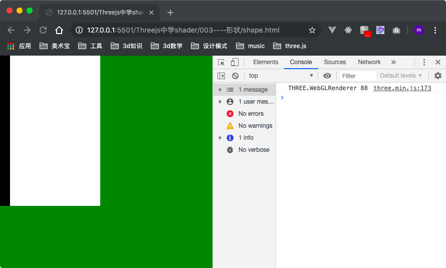
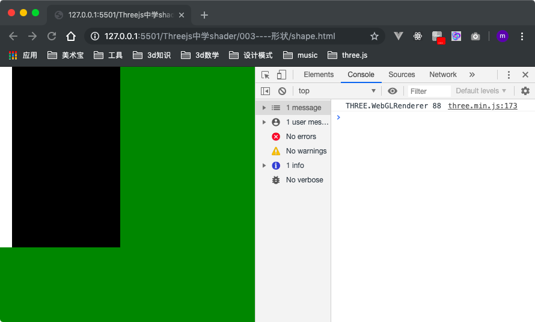
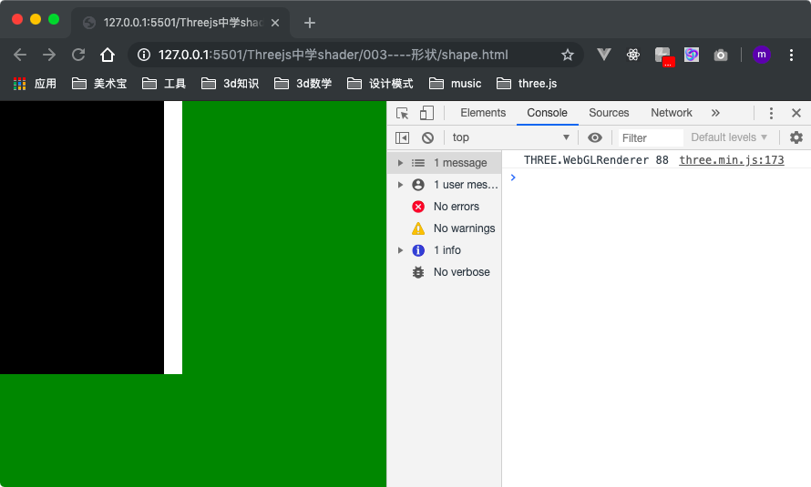
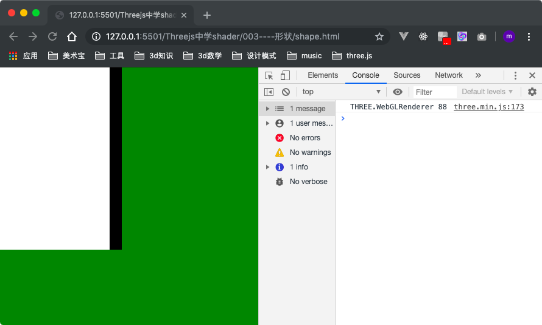
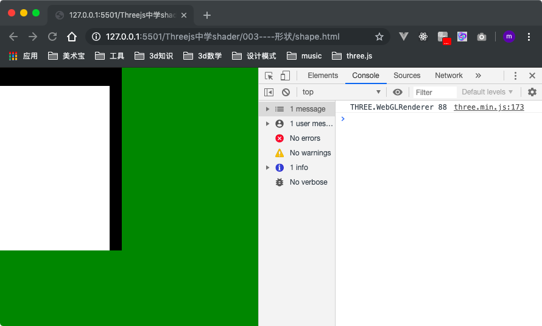
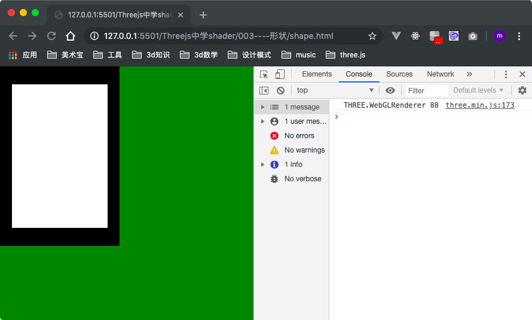

> 参考: https://thebookofshaders.com/07/?lan=ch
### 做一个黑框

#### 1、botton-left 黑框
左边和底部有一个黑边,那么让让坐标大于(0.1,0.1)的像素颜色值都为白色。代码为:
```js
float left = st.x > 0.1 ? 1. : .0;
float bottom = st.y > 0.1 ? 1. : .0;
color = vec3(left * bottom);
```
效果为:


上面的代码还可以使用glsl内建函数step实现, 大部分都使用这种方式, 效果相同:
```js
float left = step(0.1,st.x);
float bottom = step(0.1,st.y);
color = vec3(left * bottom);
```

`step`函数还可以操作向量,这样还可以精简为:
```js
vec2 bl = step(vec2(0.1),st);
color = vec3(bl.x * bl.y);
```

#### 2、几种变形
1) 情况A
将`st.x`大于0.1的部分设置为白色,小于0.1的部分设置为黑色。
```js
float pct = step(0.1,st.x);
color = vec3(pct);
```


2) 情况B
将上面的情况A颜色分别对应取反。
```js
float pct = 1.-step(0.1,st.x);
color = vec3(pct);
```


3) 情况C
常规操作,大于0.9的部分设置为白色。
```js
float pct = step(1.-0.1,st.x);
color = vec3(pct);
```


4) 情况D
常规操作,直接理解即可, 同时它也是情况C的对应颜色取反。
```js
// 等效 => float pct = 1. - step(0.9, st.x);
// 可以看作是 float pct = step(0.1, st.x);的位置镜然后颜色取反
float pct = step(0.1, 1.-st.x);
color = vec3(pct);
```


**综上:** 实践中根据实际情况选择不同的处理方式。

#### 3、top-right黑框
我们想让top 和 right 有黑框, 那么我们可以这样:
```js
float right = 1. - step(0.9, st.x);
float top = 1. - step(0.9, st.y);
color = vec3(right * top);
```


也可以这样:
```js
float right = step(.1, 1. - st.x);
float top = step(.1, 1. - st.y);
color = vec3(right * top);
```

#### 4、完整黑框
```js
vec2 bl = step(vec2(.1), st);
vec2 tr = step(vec2(.1), 1.-st);
color = vec3(bl.x * bl.y * tr.x * tr.y);
```


#### 附: `完整黑框`完整代码
```js
<style>
  body {
    margin: 0;
    padding: 0;
    background-color: green;
  }

  #container {
    position: fixed;
    width: 200px;
    height: 300px;
    background-color: #fff;
  }

</style>
<script src="../three.min.js"></script>
<script id="vertexShader" type="x-shader/x-vertex">
    void main() {
        gl_Position = vec4( position, 1.0 );
    }
</script>
<script id="fragmentShader" type="x-shader/x-fragment">
    uniform vec2 u_resolution;
    void main(){
        vec2 st = gl_FragCoord.xy / u_resolution.xy;
        float aspect = u_resolution.x / u_resolution.y;
        vec3 color = vec3(0.0);

        vec2 bl = step(vec2(.1), st);
        vec2 tr = step(vec2(.1), 1.-st);
        color = vec3(bl.x * bl.y * tr.x * tr.y);

        gl_FragColor = vec4(color,1.0);
    }
</script>
<div id="container"></div>

<script>
  let container;
  let camera, scene, renderer;
  let uniforms;

  function init() {
    container = document.getElementById('container');
    camera = new THREE.Camera();
    camera.position.z = 1;
    scene = new THREE.Scene();
    var geometry = new THREE.PlaneBufferGeometry(2, 2);
    uniforms = {
      u_time: { type: "f", value: 1.0 },
      u_resolution: { type: "v2", value: new THREE.Vector2() },
      u_mouse: { type: "v2", value: new THREE.Vector2() }
    };

    var material = new THREE.ShaderMaterial({
      uniforms: uniforms,
      vertexShader: document.getElementById('vertexShader').textContent,
      fragmentShader: document.getElementById('fragmentShader').textContent
    });

    var mesh = new THREE.Mesh(geometry, material);
    scene.add(mesh);

    renderer = new THREE.WebGLRenderer();
    renderer.setPixelRatio(window.devicePixelRatio);

    container.appendChild(renderer.domElement);

    onWindowResize();
    window.addEventListener('resize', onWindowResize, false);

    document.onmousemove = function (e) {
      uniforms.u_mouse.value.x = e.pageX
      uniforms.u_mouse.value.y = e.pageY
    }
  }

  function onWindowResize(event) {
    container = document.getElementById('container');
    let w = container.clientWidth
    let h = container.clientHeight
    renderer.setSize(w, h);
    uniforms.u_resolution.value.x = renderer.domElement.width;
    uniforms.u_resolution.value.y = renderer.domElement.height;
    // console.error(uniforms.u_resolution)
  }

  function animate() {
    requestAnimationFrame(animate);
    render();
  }

  function render() {
    uniforms.u_time.value += 0.05;
    renderer.render(scene, camera);
  }

  init();
  animate();
</script>

```

