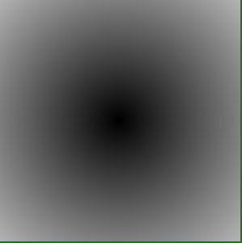
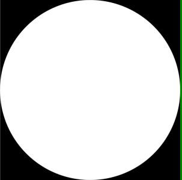
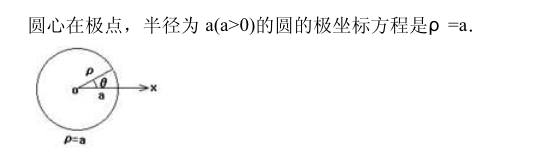
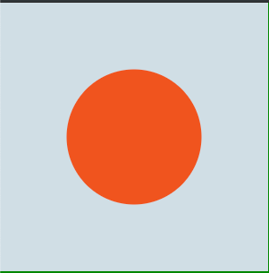

> 参考: https://thebookofshaders.com/07/?lan=ch

### 绘制一个圆
#### 1、通过控制距离-方法一(distance)
让距离圆心坐标(0.5, 0.5)的距离作为该点的颜色值。
```js
float pct = distance(st,vec2(0.5));
gl_FragColor = vec4(vec3(pct), 1.);
```


#### 2、通过控制距离-方法二(dot)
`dot()`点乘是另外一种用来高效计算圆形距离场的方式。
```js
uniform vec2 u_resolution;

float circle(in vec2 uv, in float rad){
  // 圆心坐标
  vec2 centerPos = vec2(0.5);
  // 当前像素和圆心构成的向量
  vec2 dist = uv-centerPos;
  float a = smoothstep(rad-rad*.01, rad+rad*.01, sqrt(dot(dist,dist)));
  return  1. - a;
}

void main(){
    vec2 uv = gl_FragCoord.xy;
    vec2 center = u_resolution.xy * 0.5;

    vec2 st = gl_FragCoord.xy/u_resolution.xy;
    vec3 color = vec3(circle(st, .5));
    gl_FragColor = vec4( color, 1.0 );
}
```



#### 3、通过控制距离-方法三(极坐标)


那么代码为:
```js
uniform vec2 u_resolution;

vec3 circle(vec2 st, float rad) {
  vec2 pos = st-vec2(.5);
  float r = length(pos);
  return vec3(step(r, rad));
}
void main(){
    vec2 st = gl_FragCoord.xy/u_resolution.xy;
    vec3 color = circle(st, .5);
    gl_FragColor = vec4(color, 1.0);
}
```
效果与上面相同。

#### 4、通过控制透明度
> 参考: https://www.shadertoy.com/view/XsjGDt

完整的片元着色器:
```js
uniform vec2 u_resolution;

/**
* Convert r, g, b to normalized vec3
*/
vec3 rgb(float r, float g, float b) {
  return vec3(r / 255.0, g / 255.0, b / 255.0);
}

/**
* 绘制一个圆
* uv: uv坐标
* pos: 圆心坐标
* rad: 半径
* color: 绘制圆的颜色
* 返回值: 处理后的颜色
*/
vec4 circle(vec2 uv, vec2 pos, float rad, vec3 color) {
  float d = length(pos - uv) - rad;
  // 等价于 => float t = d < .0 ? 0. : 1.;
  float t = clamp(d, 0.0, 1.0);
  return vec4(color, 1.0 - t);
}

void main(){
  vec2 uv = gl_FragCoord.xy;
  vec2 center = u_resolution.xy * 0.5;
  float radius = 0.25 * u_resolution.y;

  // Background layer
  vec4 layer1 = vec4(rgb(210.0, 222.0, 228.0), 1.0);

  // Circle
  vec3 red = rgb(225.0, 95.0, 60.0);
  vec4 layer2 = circle(uv, center, radius, red);

  // Blend the two
  gl_FragColor = mix(layer1, layer2, layer2.a);
}
```


#### 附录-极坐标表示圆完整代码:
```js
<style>
  body {
    margin: 0;
    padding: 0;
    background-color: green;
  }

  #container {
    position: fixed;
    width: 300px;
    height: 300px;
    background-color: #fff;
  }

</style>
<script src="../three.min.js"></script>
<script id="vertexShader" type="x-shader/x-vertex">
    void main() {
        gl_Position = vec4( position, 1.0 );
    }
</script>
<script id="fragmentShader" type="x-shader/x-fragment">
    uniform vec2 u_resolution;

    vec3 circle(vec2 st, float rad) {
      vec2 pos = st-vec2(.5);
      float r = length(pos);
      return vec3(step(r, rad));
    }
    void main(){
        vec2 st = gl_FragCoord.xy/u_resolution.xy;
        vec3 color = circle(st, .5);
        gl_FragColor = vec4(color, 1.0);
    }
</script>
<div id="container"></div>

<script>
  let container;
  let camera, scene, renderer;
  let uniforms;

  function init() {
    container = document.getElementById('container');
    camera = new THREE.Camera();
    camera.position.z = 1;
    scene = new THREE.Scene();
    var geometry = new THREE.PlaneBufferGeometry(2, 2);
    uniforms = {
      u_time: { type: "f", value: 1.0 },
      u_resolution: { type: "v2", value: new THREE.Vector2() },
      u_mouse: { type: "v2", value: new THREE.Vector2() }
    };

    var material = new THREE.ShaderMaterial({
      uniforms: uniforms,
      vertexShader: document.getElementById('vertexShader').textContent,
      fragmentShader: document.getElementById('fragmentShader').textContent
    });

    var mesh = new THREE.Mesh(geometry, material);
    scene.add(mesh);

    renderer = new THREE.WebGLRenderer();
    renderer.setPixelRatio(window.devicePixelRatio);

    container.appendChild(renderer.domElement);

    onWindowResize();
    window.addEventListener('resize', onWindowResize, false);

    document.onmousemove = function (e) {
      uniforms.u_mouse.value.x = e.pageX
      uniforms.u_mouse.value.y = e.pageY
    }
  }

  function onWindowResize(event) {
    container = document.getElementById('container');
    let w = container.clientWidth
    let h = container.clientHeight
    renderer.setSize(w, h);
    uniforms.u_resolution.value.x = renderer.domElement.width;
    uniforms.u_resolution.value.y = renderer.domElement.height;
    // console.error(uniforms.u_resolution)
  }

  function animate() {
    requestAnimationFrame(animate);
    render();
  }

  function render() {
    uniforms.u_time.value += 0.05;
    renderer.render(scene, camera);
  }


  init();
  animate();
</script>

```
<全文结束>
