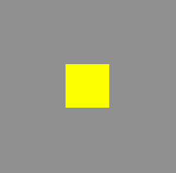
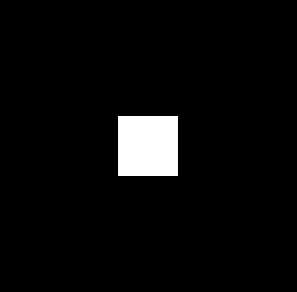

### 绘制矩形
#### 1、使用颜色混合
代码:
```js
uniform vec2 u_resolution;
uniform float u_time;

/**
* Convert r, g, b to normalized vec3
*/
vec3 rgb(float r, float g, float b) {
  return vec3(r / 255.0, g / 255.0, b / 255.0);
}

/**
* Draw a rectangle at vec2 `pos` with width `width`, height `height` and
* color `color`.
*/
vec4 rectangle(vec2 uv, vec2 pos, float width, float height, vec3 color) {
  float t = 0.0;
  if ((uv.x > pos.x - width / 2.0) && (uv.x < pos.x + width / 2.0)
    && (uv.y > pos.y - height / 2.0) && (uv.y < pos.y + height / 2.0)) {
    t = 1.0;
  }
  return vec4(color, t);
}

void main(){
  vec2 uv = gl_FragCoord.xy;
  vec2 center = u_resolution.xy * 0.5;
  float width = 0.25 * u_resolution.x;
  float height = 0.25 * u_resolution.x;

  // Background layer
  vec4 layer1 = vec4(rgb(144.0, 144.0, 144.0), 1.0);

  // Rectangle
  vec3 yellow = rgb(255.0, 255.0, 0.0);
  vec4 layer2 = rectangle(uv, center, width, height, yellow);

  // Blend the two
  gl_FragColor = mix(layer1, layer2, layer2.a);
}
```


#### 2、通过控制像素位置
```js
uniform vec2 u_resolution;
uniform float u_time;

float box(in vec2 st, in vec2 size){
  size = vec2(0.5) - size*.5;
  vec2 uv = smoothstep(size, size+vec2(.001), st);
  uv *= smoothstep(size, size+vec2(.001), vec2(1.) - st);
  return uv.x * uv.y;
}

void main(){
  vec2 st = gl_FragCoord.xy/u_resolution.xy;
  vec3 color = vec3(0.0);
  float ccc = box(st, vec2(.2, .2));
  color += vec3(ccc);
  gl_FragColor = vec4(color,1.0);
}
```


> 哈哈, 矩形与黑框是相同的代码,站在黑色的角度那就是黑框,站在白色的角度那就是白色矩形。
<全文结束>
