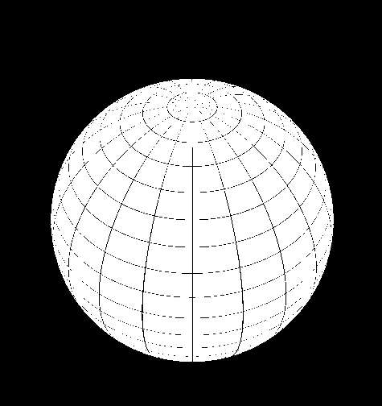
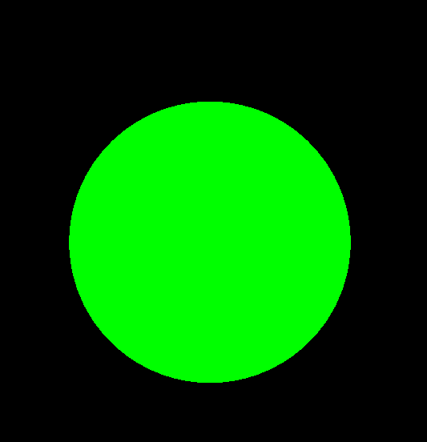
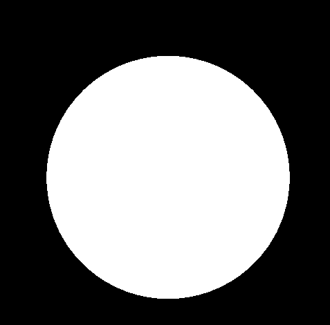
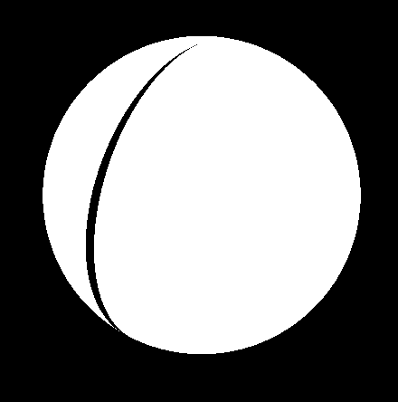
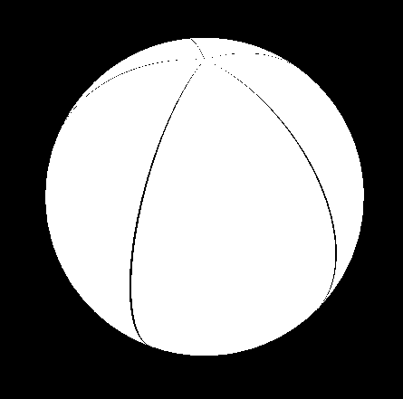

> 引子: 这是曾经的一道webgl面试题。

[出处](https://codepen.io/sfi0zy/pen/EGzKOd?editors=0110)

### 利用shader绘制一个带经纬度的球体

最终效果:

[代码](https://github.com/dslming/learningComputerGraphics/tree/master/Threejs%E4%B8%AD%E5%AD%A6shader/008---sphere)

#### 1、创建几何球体
这部分很基础,很快带过然后进入`shader`。
App.js
```js
class App {
  ...
  addObj() {
    // 几何球体
    const geometry = new THREE.SphereBufferGeometry(30, 64, 64);

    // 材质
    var material = new THREE.MeshBasicMaterial({ color: 0x00ff00 });

    // 网格
    var mesh = new THREE.Mesh(geometry, material);
    mesh.name = "spare"
    this.scene.add(mesh);
  }
}
```
创建一个球体:


#### 2、使用着色器材质
这个也是基础工作。
App.js
```js
import { fragmentShader } from './glsl.fragmentShader.js'
import { vertexShader } from './glsl.vertexShader.js'
class App {
  addObj() {
    ...
    // 材质
    var material = new THREE.ShaderMaterial({
      uniforms: this.uniforms,
      vertexShader: vertexShader,
      fragmentShader: fragmentShader
    });
    ...
  }
}
```

glsl.vertexShader.js
```js
export let vertexShader = `
// 这里使用 uv,将传给片元着色器使用。
varying vec2 vUv;
void main() {
  vUv = uv;
  gl_Position = projectionMatrix * modelViewMatrix * vec(position, 1.0);
}
`
```

glsl.fragmentShader.js, 这里先设置为白色。
```js
export let fragmentShader = `
varying vec2 vUv;
void main() {
  gl_FragColor = vec4(1.);
}
`
```


#### 3、绘制网格
重点终于来了!
##### 1)感受一下uv
```js
export let fragmentShader = `
varying vec2 vUv;
void main() {
  gl_FragColor = vec4(vec3(vUv.x), 1.0);
}
`
```
uv.x 范围是从0～1,那么体现在球体的x方向,颜色就是从黑色到白色。uv.y同理。


##### 2)绘制一条线
根据uv坐标的特性,对uv坐标进行不同处理,那么就可以绘制线了。

```js
export let fragmentShader = `
varying vec2 vUv;
void main() {
  float lineWidth = 0.01;
  if(vUv.x<lineWidth) {
    gl_FragColor = vec4(vec3(0.0), 1.0);
  } else {
    gl_FragColor = vec4(1.);
  }
}
`
```


##### 3) 绘制多条线
uv坐标有超出重复的特性,比如说:
>默认uv的坐标范围是0~1,如果超出1,就会重复贴图。

```js
varying vec2 vUv;
void main() {
  // 线的数量
  float lineNumber = 5.0;
  // 线的宽度
  float lineWidth = 0.01;

  // 取uv.x 的小数部分
  float x = fract(vUv.x * lineNumber);
  if(x<lineWidth) {
    gl_FragColor = vec4(vec3(0.0), 1.0);
  } else {
    gl_FragColor = vec4(1.);
  }
}
`
```
这样就会出现多条线:


#### 4、绘制经纬线
有了前面的基础,那么经纬线就很好绘制了。
```js
varying vec2 vUv;
void main() {
  float lineNumber = 20.0;
  float lineWidth = 0.01;
  float x = fract(vUv.x * lineNumber);
  float y = fract(vUv.y * lineNumber);
  if(x<lineWidth || y <lineWidth) {
    gl_FragColor = vec4(vec3(0.0), 1.0);
  } else {
    gl_FragColor = vec4(1.);
  }
}
`
```
最终效果:


<全文结束, 多多点赞会变好看, 多多评论会变有钱>
