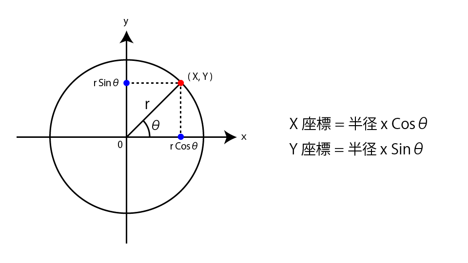
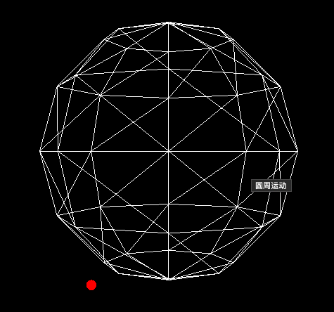
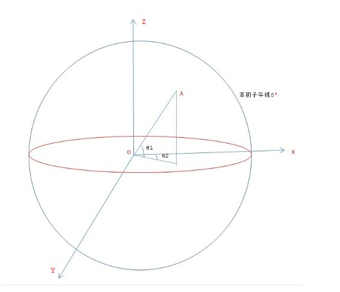
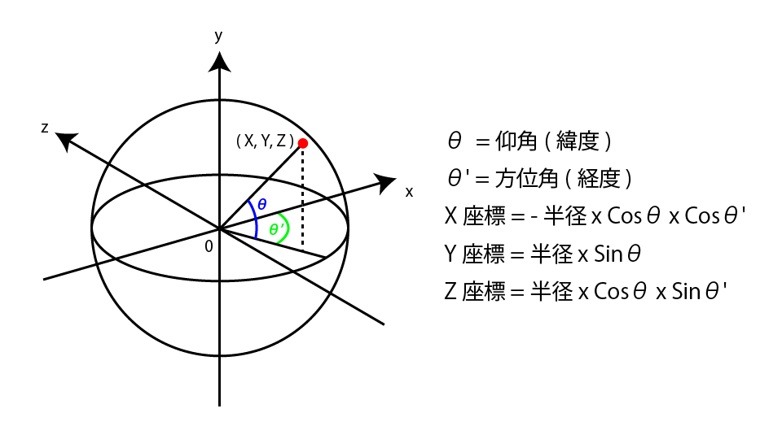
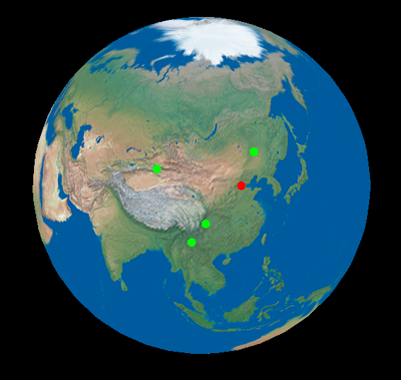
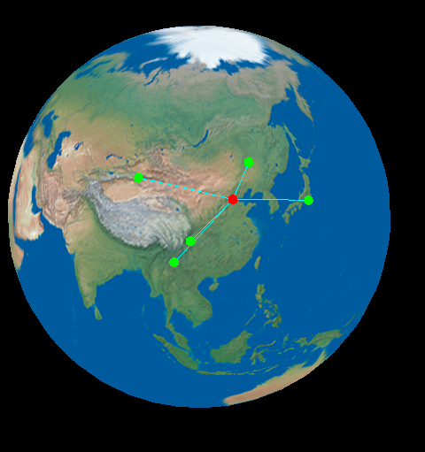

> 翻译自: https://ics.media/entry/15321/


### 对WebGL开发有用的重要三角公式和概念的摘要（Three.js）

我经常听到三角函数对于创建3D内容至关重要。我很惊讶，因为几乎没有在网站创建中使用三角函数的情况，但是当我学习WebGL时，我意识到很多情况下在3D中使用三角函数。因此，在本文中，我们总结了3D内容制作中经常使用的基本公式和概念。

我这次解释的内容很简单，但是这个公式是制作游戏和数据可视化的基础。根据您在高中数学中学到的知识，我们对其进行了编译，以便您可以通过三个示例进行学习。解释使用流行的WebGL库之一“ Three.js ”。

#### 1.应用-圆周移动
根据公式定义:


所以:
```js
class App {
  animate() {
    requestAnimationFrame(this.animate);
    ...
    degree += 5;
    // 角度转为弧度
    const rad = degree * Math.PI / 180;
    // X座標 = 半径 x Cosθ
    const x = radius * Math.cos(rad);
    // Y座標 = 半径 x Sinθ
    const y = radius * Math.sin(rad);
    sphere.position.set(x, y, 0);
  }
}
```

做一个圆周移动的例子。 [代码:step1-圆周运动](https://github.com/dslming/learningComputerGraphics/tree/master/Threejs%E4%B8%AD%E5%AD%A6shader/009-%E9%87%8D%E8%A6%81%E4%B8%89%E8%A7%92%E5%85%AC%E5%BC%8F%E5%92%8C%E6%A6%82%E5%BF%B5)



#### 2、 经纬度知识
[出处-经纬度计算](https://www.cnblogs.com/zrhai/p/3817492.html)
##### 1) 经线(子午线)
- 连接南北两极的线叫经线或子午线
- 经线指示南北方向，所有的经线长度相等
- 国际上将通过`英国伦敦格林尼治天文台原址`的那条经线称为0°经线，也叫**本初子午线**。

##### 1) 经度
- 英文 longitude 缩写 lng
- 以**本初子午线**的以东或以西的度数, 称为经度
- 范围: [-180,180]

##### 2) 纬度
- 英文 latitude  缩写 lat
- 纬度是指某点与地球球心的连线和地球赤道面所成的线面角
- 范围: [-90,90]

#### 3 应用-纬经度转换为三维坐标

如图，建立一个左手空间直角坐标系在赤道平面上, 因为WebGL是左手坐标系。X轴指向本初子午线，Y轴在赤道平面垂直X轴，Z轴指向北极。

已知经纬求3d坐标, A[θ1,θ2]，经度θ2 ，纬度θ1。假设半径为单位1。 其中纬度θ1称为**仰角**,经度θ2称为方位角。
```js
let x = cosθ1*cosθ2
let y = cosθ1*sinθ2
let z = sinθ1
positionA = (x, y, z)
```
下图中的公式计算球体上一个点的X，Y和Z坐标。做一个圆周移动的例子。 [代码:step2-经纬度和3d坐标转化](https://github.com/dslming/learningComputerGraphics/tree/master/Threejs%E4%B8%AD%E5%AD%A6shader/009-%E9%87%8D%E8%A6%81%E4%B8%89%E8%A7%92%E5%85%AC%E5%BC%8F%E5%92%8C%E6%A6%82%E5%BF%B5)


```js
function translateGeoCoords(latitude, longitude, radius) {
    // 仰角
    const phi = (latitude) * Math.PI / 180;
    // 方位角
    const theta = (longitude - 180) * Math.PI / 180;
    const x = -(radius) * Math.cos(phi) * Math.cos(theta);
    const y = (radius) * Math.sin(phi);
    const z = (radius) * Math.cos(phi) * Math.sin(theta);
    return new THREE.Vector3(x, y, z);
  }
```
有了上面的知识,来实现一个地球上描点。



#### 4、四元数应用
参考资料:
[四元数](https://wgld.org/d/webgl/w031.html)
[四元数和球面线性插值](https://wgld.org/d/webgl/w034.html)

让我们画一条线，连接上一章中绘制的地球上的点。做一个圆周移动的例子。 [代码:step3-连接点](https://github.com/dslming/learningComputerGraphics/tree/master/Threejs%E4%B8%AD%E5%AD%A6shader/009-%E9%87%8D%E8%A6%81%E4%B8%89%E8%A7%92%E5%85%AC%E5%BC%8F%E5%92%8C%E6%A6%82%E5%BF%B5)


使用四元数来获得两个球形点之间的轨迹坐标。四元数具有有关旋转轴和旋转角度的信息，并表示3D对象的方向。对于实现对象旋转很有用。

##### step1-获取旋转轴
创建生成四元数所需的轴。这次的轴是垂直于由从地球中心延伸的两个向量形成的平面的向量。在这种情况下，您可以通过找到两个向量(OA,OB)的叉积来获得垂直向量，因此cross()让我们使用该方法生成轴向量。


```js
getOrbitPoints() {
  ...
  // 获取两个向量的旋转轴
  const axis = startVec.clone().cross(endVec);
  // 单位化
  axis.normalize();
}
```

##### step2-获取旋转角
根据先前创建的轴找出旋转的角度。在这种情况下，从地心延伸的两个矢量之间 angleTo()的角度是旋转角度的极限值，因此可以使用该方法获得该角度。

```js
getOrbitPoints() {
  ...
  const angle = startVec.angleTo(endVec);
}
```

##### step3-得到旋转角
现在我们有了旋转轴和旋转角度，我们实际上生成了四元数。为了绘制一条平滑的线，请按顶点数一点一点地形成一个角度。
```js
getOrbitPoints() {
  // segmentNum: 两点线的段数
  for (let i = 0; i < segmentNum; i++) {
    // 围绕轴生成四元数
    const q = new THREE.Quaternion();
    q.setFromAxisAngle(axis, angle / segmentNum * i);
  }
}
```

##### step4-得到顶点
在OA向量中反映由四元数创建的旋转信息。
```js
getOrbitPoints() {
  for (let i = 0; i < segmentNum; i++) {
    ...
    // 旋转向量
    const vertex = startVec.clone().applyQuaternion(q);
    vertices.push(vertex);
  }

```

##### 小结
getOrbitPoints()现在可以从该函数获得连接两个点的轨迹的坐标。通过将轨迹坐标设置为直线的顶点，可以表示连接两个点的轨迹。

完整代码:
```js
getOrbitPoints(startPos, endPos, segmentNum) {
  // 包含顶点的数组
  const vertices = [];
  const startVec = startPos.clone();
  const endVec = endPos.clone();

  // 两个向量的旋转轴
  const axis = startVec.clone().cross(endVec);
  // 轴向量到单位向量
  axis.normalize();
  // 由两个向量交织的角度
  const angle = startVec.angleTo(endVec);

  // 击中顶点以绘制连接两个点的弧
  for (let i = 0; i < segmentNum; i++) {
    // 围绕轴生成四元数
    const q = new THREE.Quaternion();
    q.setFromAxisAngle(axis, angle / segmentNum * i);
    // 旋转向量
    const vertex = startVec.clone().applyQuaternion(q);
    vertices.push(vertex);
  }

  // 添加终点
  vertices.push(endVec);
  return vertices;
}
```

<全文结束>
