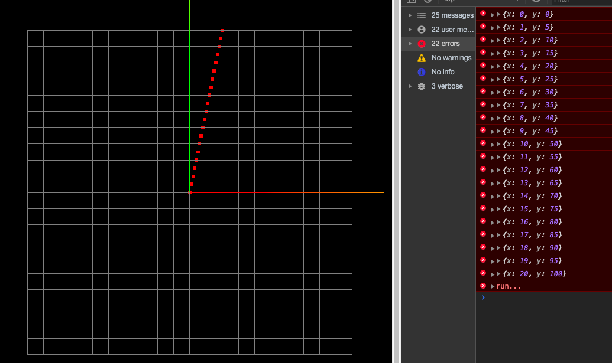

> 代码基于Three.js
> 参考: 计算机图形学基础教程(第一版)-课件
> 代码地址: https://github.com/dslming/learningComputerGraphics/tree/master/

### 001-画线算法-DDA
#### 1、基本思想
已知过端点 $p_0(x_0,y_0)$, $p_1(x_1,y1)$的直线段L: $y=kx+b$。
直线斜率为:  $ k = \frac{y_1-y_0}{x_1-x0}$
从x的左端点$x_0$开始, 向x的右端点步长=1(个像素),计算相应的y坐标作为当前点的坐标。

作为最底层的光栅图形算法，会被大量应用，因此，哪怕节约一个加法或减法，也是很了不起的改进。由此出发点，导致**增量算法的思想**。

计算:
```math
\begin{aligned}

y_{i+1} &= kx_{i+1} + b \\
        &= k(x_i+\Delta x) + b \\
        &= kx_i+b + k\Delta x   \\
        &= y_i + k\Delta x

\end{aligned}
```

当 $\Delta x = 1$时, $y_{i+1} = y_i + k$
即: 当x每递增1, y递增k (即直线斜率)。

#### 2、代码实现

```js
class DDA {
  ...
  addLinePoints(p0 = { x: 0, y: 0 }, p1 = { x: 0, y: 0 }) {
    let dx = p1.x - p0.x
    let dy = p1.y - p0.y
    let k = dy / dx
    let y = p0.y

    for (let x = p0.x; x <= p1.x; x++) {
      let tempPoint
      if (Math.abs(k) > 1) {
        tempPoint = new THREE.Vector3(x, parseInt(y + 0.5), 0)
      } else {
        tempPoint = new THREE.Vector3(parseInt(x + 0.5), y, 0)
      }
      this.setPoints(tempPoint)
      y = y + k
    }
  }
  ...
}
```

最后效果:


<全文结束>
