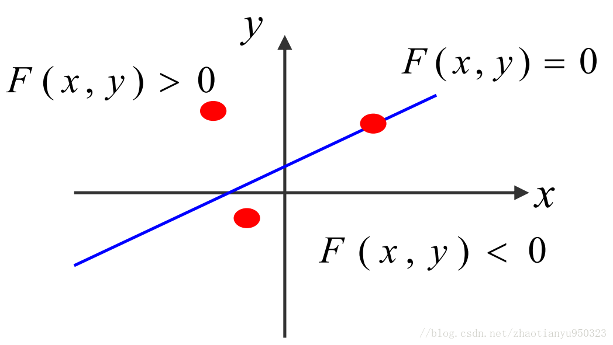
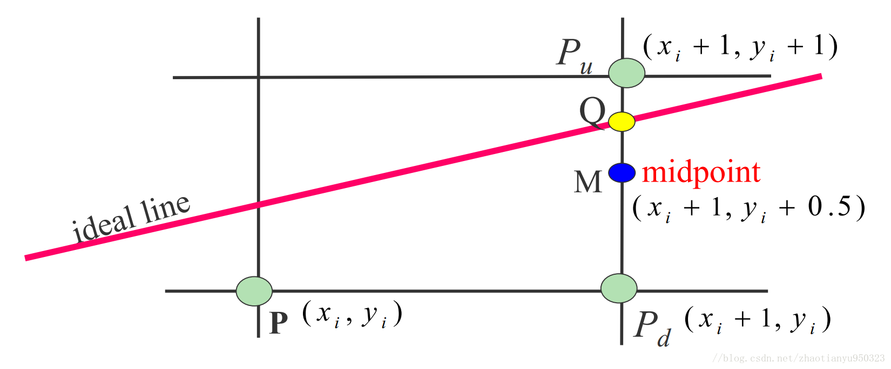
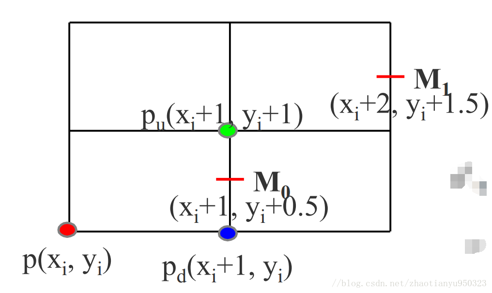
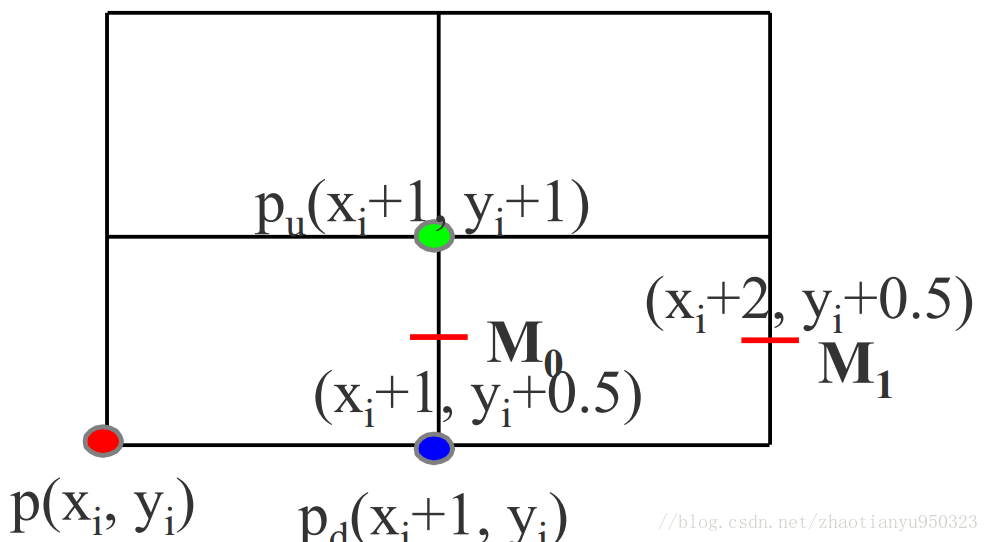
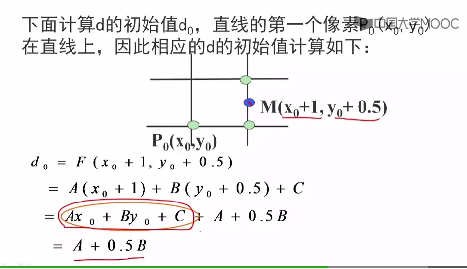

> 代码基于Three.js
> 参考:
【1】计算机图形学基础教程(第一版)-课件
【2】 中国大学MOOC 中国农业大学 计算机图形学课程
【3】[中点画线法](https://www.jianshu.com/p/6ee51df8b640)
> 代码地址: https://github.com/dslming/learningComputerGraphics/tree/master/

### 002-中点画线法
采用增量思想的DDA算法,虽然只需计算一个加法,但是是浮动数加法。

#### 1、基本原理
DDA算法采用直线的点斜式,中点画线法采用是直线的一般式:
```math
\begin{aligned}

F(x,y) &= 0 \\
Ax+By+C &= 0 \\

\end{aligned}
```

对于不同的点，我们可以利用其值和0进行比较来筛选。


- 对于直线上的点 F(x,y) = 0
- 对于直线上方的点 F(x,y) > 0
- 对于直线下方的点 F(x,y) < 0

#### 2、基本思想
- 像素上下左右单位为1, 也就是:
  - $y_{i+1}$ - ${y_i}$ = 1
  - $x_{i+1}$ - ${x_i}$ = 1
- 设当前象素点为: $ P(x_i, y_i) $
- 下一个象素点为:
  - $P_u(x_i+1,y_i+1)$ 或
  - $P_d(x_i+1,y_i)$
- 设 $M(x_{i+1}, y_i+0.5)$, 为$P_u$ 和 $P_d$ 的中点。
- Q为理想直线与$x=x_i+1$垂线的交点



将Q与M的y坐标进行比较。
1) 当M在Q的下方，则$P_u$离直线比较近，$P_u$应为下一个像素点。

2) 当M在Q的上方，则$P_d$离直线比较近，$P_d$应为下一个像素点。

开始求点M的坐标:
```math
\begin{aligned}

d = F(M)  &= F(x_m, y_m) \\
      &= F(x_i+1, y_i+0.5) \\
      &= A(x_i+1) + B(y_i+0.5) + C \\

\end{aligned}
```

其中:
```math
\begin{aligned}
 A &= y_i - y_{i+1} \\
 B &= x_{i+1} - x_i \\
 C &= x_iy_{i+1} - x_{i+1}y_i

\end{aligned}
```

- 当d<0,M在Q点下方,取右上方$P_u$为下一点
- 当d>0,M在Q点上方,取右下方$P_d$为下一点
- 当d=0,选P1或P2均可,约定取$P_u$为下一点

#### 3、改进算法
但这样做，每一个象素的计算量是4个加法，两个乘法。d是$(x_i, y_i)$的线性函数，因此可采用**增量计算**提高运算效率。
##### 步骤1: $ d < 0 $


若当前象素处于$d < 0$ 情况,取$P_u (x_{i+1}, y_i+1)$, 下一个中点情况:

```math
\begin{aligned}
  d_0 &= F(x_i+1, y_i+0.5) \\
      &= A(x_i+1) + B(y_i+0.5) + C \\
      \\

  d_1 &= F(x_i+2, y_i+1.5)  \\
      &= A(x_i+2) + B(y_i+1.5) + C  \\
      &= A(x_i+1) + B(y_i+0.5) + C + A + B \\
      &= d_0 + A + B

\end{aligned}
```

##### 步骤2: $d \geq 0 $


若当前象素处于$d \geq 0$ 情况,取$P_d (x_{i+1}, y_i)$, 下一个中点情况:


```math
\begin{aligned}
  d_0 &= F(x_i+1, y_i+0.5) \\
      &= A(x_i+1) + B(y_i+0.5) + C \\
      \\

  d_1 &= F(x_i+2, y_i+0.5)  \\
      &= A(x_i+2) + B(y_i+0.5) + C  \\
      &= A(x_i+1) + B(y_i+0.5) + C + A  \\
      &= d_0 + A

\end{aligned}
```

##### 步骤3: 计算$d_0$初值


```math
\begin{aligned}

d_0 &= F(x_0+1, y_0+0.5) \\
    &= A(x_0+1) + B(y_0+0.5) + C \\
    &= Ax_0 + By_0 + C + A + 0.5B \\
    &= A + 0.5B
\end{aligned}
```
又因为d只关心符号，所以可以用2d来代替d来拜托浮点运算。这样中点画线算法就提高到了整数加法，优于DDA算法。


#### 1、算法实现

