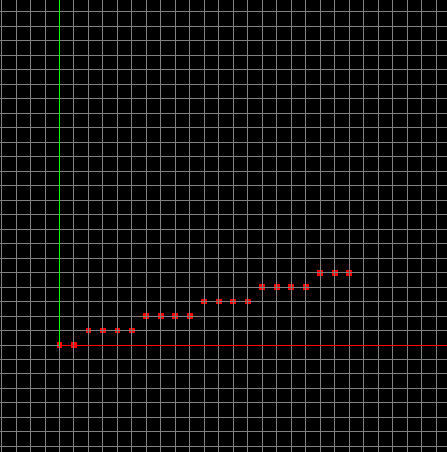

> 代码基于Three.js
> 参考:
【1】计算机图形学基础教程(第一版)-课件
【2】中国大学MOOC 中国农业大学 计算机图形学课程
【3】[Bresenham画线算法](https://www.cs.helsinki.fi/group/goa/mallinnus/lines/bresenh.html)

> 代码地址: https://github.com/dslming/learningComputerGraphics/tree/master/

### 003-画线算法-Bresenham

#### 1、基本思想


设:
- 直线斜率范围 $ 0 \leq m \leq 1 $
- 当前点坐标等于$(x,y)$
- 当前点与真实直线的误差等于 $\epsilon$
- 下一点坐标可能是$(x+1,y)$或者$(x+1, y+1)$
- 下一点的误差等于 $ \epsilon  + m $。

画线问题成为在每个步骤中确定两种可能性之间的问题。我们将下一点的误差与`0.5`比较, 如果小于0.5我们将选择绘制$(x + 1，y)$,否则选择$(x+1,y+1)$。

$$
\begin{cases}
\epsilon  + m < 0.5   \quad (x+1, y)   \\
\epsilon  + m > 0.5   \quad (x+1, y+1)
\end{cases}
$$

应该清楚的是，这样做可以使数学线段和实际在显示器上绘制的线段之间的总误差最小。

因为直线的起始点在象素中心，所以误差项d的初值d0＝0。
X下标每增加1，d的值相应递增直线的斜率值k，即d＝d＋k。一旦d≥1，就把它减去1，这样保证d在0、1之间

为方便计算, 令e＝d-0.5,e的初值为-0.5,只需要判断e的符号就行了。
这样e大于零，y加一, e小于零，y不变。

#### 2、代码实现
```js
class Bresenham {
  ...
  addLinePoints(p0 = { x: 0, y: 0 }, p1 = { x: 0, y: 0 }) {
    let x = p0.x
    let y = p0.y
    let dx = p1.x - p0.x
    let dy = p1.y - p0.y
    let k = dy / dx
    let e = -0.5

    for (let i = 0; i <= dx; i++) {
      this.setPoints({ x, y })
      x += 1
      e += k
      if (e >= 0) {
        y++
        e = e - 1
      }
    }
  }
  ...
}
```



<全文结束>
