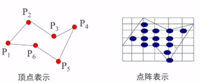
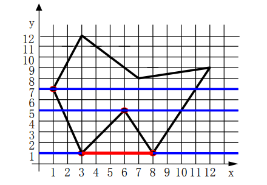
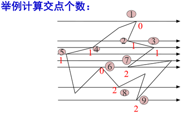
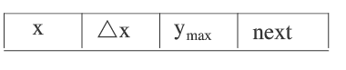
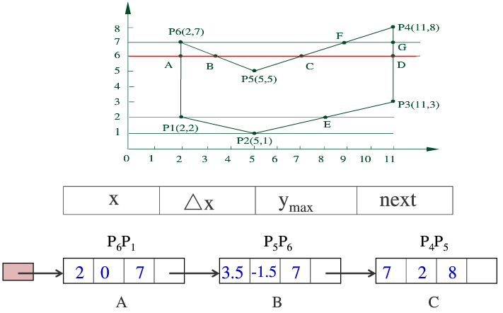
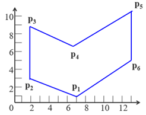
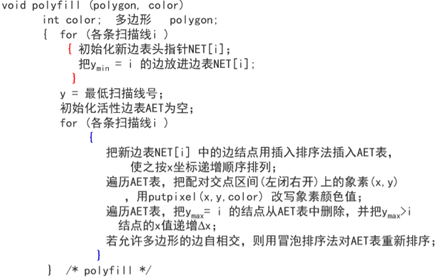

> 代码基于Three.js
> 参考:
【1】计算机图形学基础教程(第一版)-课件
【2】中国大学MOOC 中国农业大学 计算机图形学课程
【3】[多边形扫描算法](https://www.cnblogs.com/keguniang/p/9672098.html)

# 多边形的扫描转换
前面讲的都是绘制直线,接下来的目标就是如何绘制2d的多边形。

把多边形的顶点表示转换为点阵表示。这种转换称为**多边形的扫描转换**。

## 1、基础知识
多边形有两种重要的表示方法：**顶点表示**和**点阵表示**。


**1)** 顶点表示:是用多边形的顶点序列来表示多边形
- 优点: 这种表示直观、几何意义强。占内存少，易于进行几何变换。
- 缺点：没有明确指出哪些像素在多边形内，故不能直接用于面着色。

**2)** 点阵表示：用位于多边形内的像素集合来刻画多边形
- 优点：是光栅显示系统显示时所需的表现形式
- 缺点：丢失了许多几何信息（如边界，顶点等）

多边形分类：
- 凸多边形：任意两点的连线均在多边形内
- 凹多边形：两顶点的连线有可能不在多边形内
- 含内环的多边形：多边形内包含多边形


## 2、X-扫描线算法
按扫描线顺序，计算扫描线与多边形的相交区间，再用要求的颜色显示这些区间的象素，即完成填充工作。


**算法步骤:**

(1) 确定多边形所占有的最大扫描线数，得到多边形顶点的最小和最大y值（ymin和ymax）

(2)从y = ymin到y = ymax，每次用一条扫描线进行填充

(3) 对一条扫描线填充的过 程可分为四个步骤：
- a、求交：计算扫描线与多边形各边的交点
- b、排序：把所有交点按递增顺序进行排序(**按交点x值递增排序，才能确保交点两两配对时填充区间的正确性。**)
- c、交点配对：确定填充区间, 第一个与第二个，第三个与第四个
- d、区间填色：把这些相交区间内的像素置成不同于背景色的填充色

**交点的数量：**
- 检查共享顶点的两条边的另外两个端点的y值，按这两 个y值中大于交点y值的个数来决定交点数

**交点的取舍:**
当扫描线与多边形顶点相交时,交点的个数应保证为偶数个。取舍判断条件:
- 顶点的两条边的另外两个端点的y值。按这两个y值中大于交点y值的个数是0,1,2来决定。



拿交点①来说,顶点②和顶点④的y值都小于交点①的y值,所以①的交点数量等于0。


**存在的问题：**
- 为了计算每条扫描线与多边形各边的交点，最简单的方法是把多边形的所有边放在一个表中。在处理每条扫描线时，按顺序从表中取出所有的边，分别与扫描线求交。
- 这个算法效率低，因为求交的计算量是非常大。

## 3、X-扫描线算法的改进
### 1.三方面的改进
- a. 处理一条扫描线，仅对与它相交的多边形的边（有效边）进行求交运算。（也就是避免把所有的边都进行求交，因为大部分的边求交结果为空。所以设置一个表来记录有效边。即下面提到的AET）

- b. 考虑边的连贯性：当前扫描线与各边的交点顺序与下一条扫描线与各边的交点顺序很可能相同或非常相似。

- c. 多边形的连贯性：当某条边与当前扫描线相交时，它很可能也与下一条扫描线相交。

### 2.数据结构
通过引入新的数据结构来避免求交运算。

**(1)活性边表**
- a.  活性边表（AET）:把和当前扫描线相交的边称为活性边，并把它们按交点x坐标递增的顺序存于一个链表中。

- b.  结点内容

Δx=1/k，ymax 是为了知道何时达到边界

- c. 举例


**(2)新边表(NET)**
建立AET需要知道与哪些边相交，所以定义NET来存储边的信息，从而方便AET的建立。

- a.  构造一个纵向链表，长度为多边形占有的最大扫描线数。每个节点（称为吊桶）对应多边形覆盖的一条扫描线。

- b.  结点内容

  ymax：该边的y最大值
  xmin：该边较低点的x坐标

- c. NET挂在与该边较低端y值相同的扫描线吊桶中

此时NET也就记录了6条有效边。

**(3)NET与AET的使用流程**
首先我们得明白，AET的目的是为了使用增量方法避免求交运算，而NET是用在构造AET的。
- a.  所以第一步为构造NET。
  方法：遍历所有扫描线，把ymin = i 的边放进NET[ i ]中，从而构造出整个NET。

- b.  然后构造AET。
  方法：循环取出扫描线，直接将此扫描线在NET中的边结点插入到AET中。此时AET就存储了哪些边是有效边了。

  **注意**: 我们来回看2个表里的结点可发现，NET里的1/k、xmin、ymax正好对应AET里的Δx、x、ymax。这也是能用NET构造AET的原因。

- c. 区间填色。
  方法：取第一条扫描线，在配对点区间中填色。当扫描线达到ymax时，舍弃此边结点。否则使用增量方法得到下一个配对结点的x坐标。取下一条扫描线，重复c操作。

```js
那么到底是如何实现避免求交的？

答：
1) 第一个交点的x坐标是NET中传到AET的，也就是最低端的点,此点先渲染。
2) 然后根据两条边的斜率来进行增量方法得到下一对配对交点的x坐标，
   取下一条扫描线时,根据x坐标和扫描线y值可得交点的具体坐标，
   从而用增量方法代替了求交运算。
3) 要注意的是：只要扫描线<ymax, 那么它对应的NET都是相同的，
   因为NET挂在与该边较低端y值相同的扫描线吊桶中。
```

**(4)伪代码:**



<全文结束>
