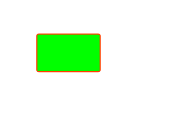

> 代码基于Three.js
> 代码地址: https://github.com/dslming/learningComputerGraphics/tree/master/

> 参考:
【1】计算机图形学基础教程(第一版)-课件
【2】中国大学MOOC 中国农业大学 计算机图形学课程
【3】[区域填充](https://www.cnblogs.com/LiveForGame/p/11790369.html)

## 005-绘制多边形-区域填充

#### 1、区域的表示方法
定义一个区域可以有两种方法，即`内点表示法`和`边界表示法`，内点表示就是指用一种颜色表示区域内的点，只要当前像素是这种颜色就在区域内，边界表示就是用一种颜色表示区域边界，只要当前像素是这种颜色就表示到达了区域边界。

#### 2 简单的种子填充算法
最简单暴力的填充算法即是从区域内一点出发，向四周扩散填充，到达区域边界时停止，常见的有四邻法和八邻法两种，顾名思义，一个是向上下左右四个方向扩散填充，另一个是向周围八个方向扩散，四邻法可以确保不溢出区域边界，但有可能出现一次填不满区域的情况，八邻法则相反，一定能填充满当前区域，但有从对角线溢出边界的危险。

#### 3、简单填充的代码
```js
class floodfill {
  ...
  floodFill4(x, y, boundaryColor, newColor) {
    const color = this.getPixelColor(x, y)
    let ret1 = FloodFill.colorEquals(color, boundaryColor, 20)
    let ret2 = FloodFill.colorEquals(color, newColor, 20)

    if (ret1 && ret2) {
      this.setPixel(x, y, newColor);
      this.floodFill4(x + 1, y, boundaryColor, newColor);
      this.floodFill4(x - 1, y, boundaryColor, newColor);
      this.floodFill4(x, y + 1, boundaryColor, newColor);
      this.floodFill4(x, y - 1, boundaryColor, newColor);
    }
  }
  ...
}
```
红色边框的多边形填充绿色：


#### 4 扫描线种子填充算法
为了提高效率可以使用扫描线种子填充算法，这里的扫描线就是与x轴相平行的线，该算法可以由以下4个步骤实现：
- 1）初始化：堆栈置空，将初始种子点(x,y)入栈
- 2）出栈：若栈空则算法结束，否则取栈顶元素(x,y)，以y作为当前扫描线
- 3）填充并确定种子点所在区段：从种子点(x,y)出发，向左右两个方向填充，直到边界。标记区段左右断点为xl和xr。
- 4）确定新的种子点：在区间[xl,xr]中检查与当前扫描线y上下相邻的两条扫描线上的像素。若存在非边界、未填充像素，则把每一区间最右像素作为种子点压入堆栈，返回第二步。

#### 5、扫描线种子代码实现
<making...>
