> 代码地址: https://github.com/dslming/learningComputerGraphics/tree/master/

> 参考:
【1】计算机图形学基础教程(第一版)-课件
【2】中国大学MOOC 中国农业大学 计算机图形学课程
【3】[[计算机图形学经典算法] Cohen－Sutherland 算法 （附Matlab代码）](https://blog.csdn.net/soulmeetliang/article/details/79179350)
【4】[Cohen-Sutherland算法](https://www.cnblogs.com/cnblog-wuran/p/9813788.html)
【5】[代码实现c](https://github.com/Maycon-Ferreira/cohen-sutherland/blob/master/main.c)

## 裁剪
确定图形中哪些部分落在显示区之内，哪些落在显示区之外,以便只显示落在显示区内的那部分图形。这个选择过程称为**裁剪**。

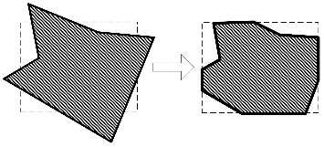

最简单的裁剪方法是把各种图形扫描转换为点之后，再判断各点是否在窗内。但那样太费时，一般不可取。这是因为有些图形组成部分全部在窗口外，可以完全排除，不必进行扫描转换。所以一般采用先裁剪再扫描转换的方法。

**直线段裁剪**
直线段裁剪算法是复杂图元裁剪的基础。复杂的曲线可以通过折线段来近似，从而裁剪问题也可以化为直线段的裁剪问题。

- Cohen-Sutherland
- 中点分割算法
- 梁友栋－Barskey算法。

### 一、Cohen-Sutherland 算法

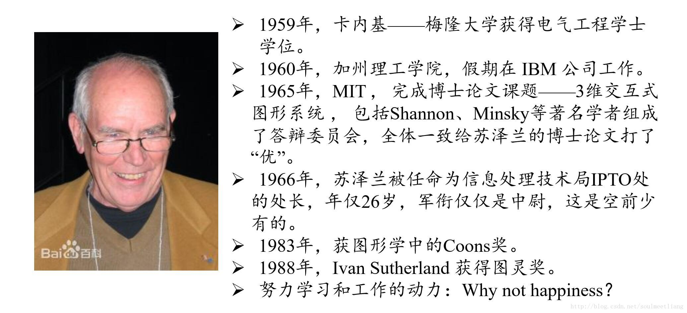

是啊, `Why not happiness?`

#### 1、编码思想
- Cohen-Sutherland 算法是早期图形学算法中的一颗明珠，这种算法使用了一种较少使用的编码方法，较好地解决了直线段的剪裁问题，在效率和简便性上均表现良好。
- 为介绍 Cohen-Sutherland 算法，我们先描述对窗体所在平面的编码。
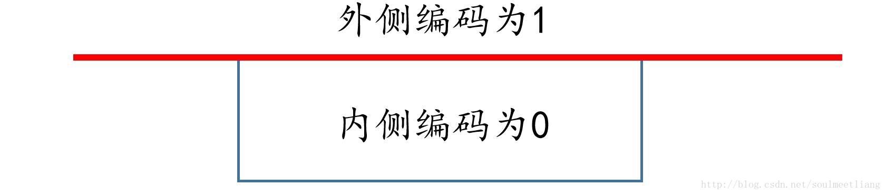

#### 2、编码规则
- 每个区域赋予4位编码 $ C_tC_bC_rC_l $,对应`上`、`下`、`右`、`左`。

$$
C_t =
      \begin{cases}
      1   \quad y > y_{max}   \\
      0   \quad other
      \end{cases}
\quad
C_b =
      \begin{cases}
      1   \quad y < y_{min}   \\
      0   \quad other
      \end{cases}
$$

$$
C_r =
      \begin{cases}
      1   \quad x > x_{max}   \\
      0   \quad other
      \end{cases}
\quad
C_l =
      \begin{cases}
      1   \quad x < x_{min}   \\
      0   \quad other
      \end{cases}
$$

- 每个线段，根据其坐标所在的区域，两端各赋予一个4位的二进制码。

示例:
```js
let C = []
y > yTop ? C[0] = 1 : C[0] = 0
y < yBottom ? C[1] = 1 : C[1] = 0
x > xRight ? C[2] = 1 : C[2] = 0
x < xLeft ? C[3] = 1 : C[3] = 0
```
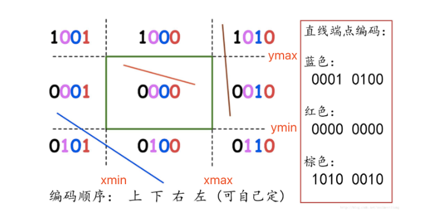

#### 3、线段处理
对于每条线段p1p2可分为三种情况处理:

(1) 若点p1和p 2完全在裁剪窗口内
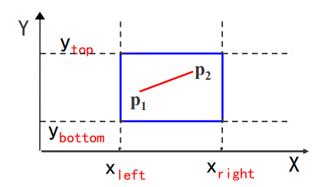
“简取”之。

(2) 若点p1(x1,y1)和点p2(x2,y2)明显在窗口外
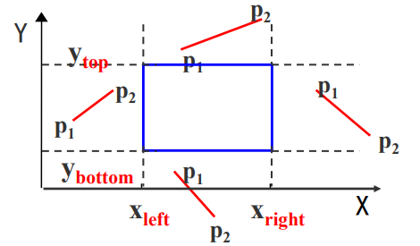
“简弃”之。
“简弃”的条件:
```math
x_1 < x_{left} \quad且\quad x_2 < x_{left}
```
```math
x_1 > x_{right} \quad且\quad x_2 > x_{right}
```

```math
y_1 < y_{bottom} \quad且\quad y_2 < y_{bottom}
```

```math
y_1 > y_{top} \quad且\quad y_2 > y_{top}
```

(3)如果直线段既不满足“简取”的条件，也不满足 “简弃”的条件
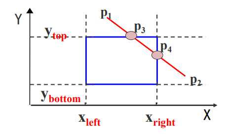
在交点处把线段分为两段。其中一段完全在窗口外，可弃之。然后对另一段重复上述处理。

#### 4、算法步骤
裁剪一条线段时，先求出端点p1和p2的编码code1和code2。然后进行二进制“ 或 ” 运算和“ 与”运算：
（1）判断简取条件,code1|code2=0
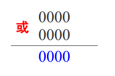
（2）判断简弃条件,code1&code2≠0
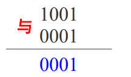

（3）若上述两条件均不成立
需求出直线段与窗口边界的交点在交 点处把线段一分为二。
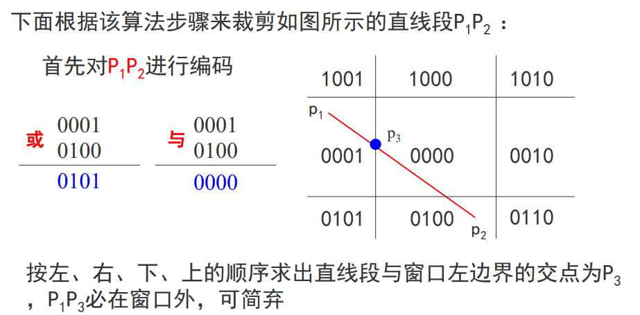
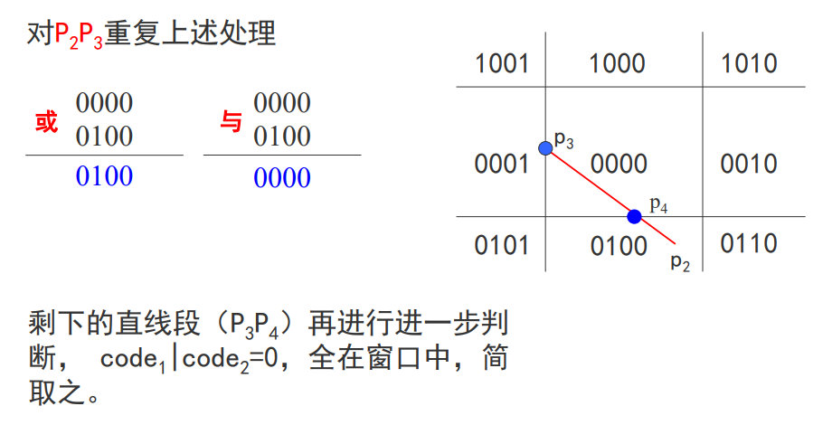


#### 5、伪代码
```js
// 计算线段p1(x1,y1)和p2(x2,y2)与窗口边界的交点
if (LEFT&code !=0){
  x=XL;
  y=y1+(y2-y1)*(XL-x1)/(x2-x1);
}
else if (RIGHT&code !=0) {
  x=XR;
  y=y1+(y2-y1)*(XR-x1)/(x2-x1);
}
else if (BOTTOM&code !=0) {
  y=YB;
  x=x1+(x2-x1)*(YB-y1)/(y2-y1);
}
else if (TOP & code !=0) {
  y=YT;
  x=x1+(x2-x1)*(YT-y1)/(y2-y1);
}
```

#### 6、小结
- Cohen-Sutherland算法用编码的方法实现了对直线段的裁剪
- 编码的思想在图形学中甚至在计算机科学里也是非常重要的 ，一个很简单的思想可以带来很了不起的作用。
- 比较适合两种情况：一是大部分线段完全可见；二是大部分 线段完全不可见。

#### 7、代码实现
运行效果:
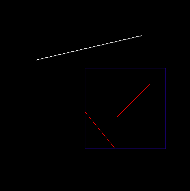
App.js
```js
import { Stage } from './Stage.js'
import { CohenSutherland } from './CohenSutherland.js'

class App {
  constructor() {
    let stage = new Stage()
    // 剪裁区域大小
    let size = {
      xMax: 110,
      xMin: 10,
      yMax: 110,
      yMin: 10
    }
    stage.addPlanBox(size)
    let cs = new CohenSutherland(size)
    this.drawLine(cs, stage)
    stage.run()
  }

  drawLine(cs, stage) {
    // 1)完全在区域内
    let pointStart = new THREE.Vector3(50, 50, 0);
    let pointEnd = new THREE.Vector3(90, 90, 0);

    // 2)完全在区域外
    let pointStart2 = new THREE.Vector3(-50, 120, 0);
    let pointEnd2 = new THREE.Vector3(80, 150, 0);

    // 3)上面情况都不满足
    let pointStart3 = new THREE.Vector3(-10, 80, 0);
    let pointEnd3 = new THREE.Vector3(80, -30, 0);

    let lines = [
      {
        p1: pointStart,
        p2: pointEnd
      },
      {
        p1: pointStart2,
        p2: pointEnd2
      },
      {
        p1: pointStart3,
        p2: pointEnd3
      }
    ]

    lines.forEach(line => {
      // 在剪裁区域内的直线
      let newLine = cs.cohenSutherland(line.p1, line.p2)

      newLine && stage.drawLine({
        p1: newLine.p1,
        p2: newLine.p2,
        color: `#ff0000`
      })
    });
  }
}

new App()
```

CohenSutherland.js
```js
export class CohenSutherland {
  constructor({ xMin, xMax, yMin, yMax }) {
    this.xMin = xMin
    this.xMax = xMax
    this.yMin = yMin
    this.yMax = yMax
  }
  cohenSutherland(p1, p2) {
    let x1_coord = 0
    let y1_coord = 0
    let x2_coord = 0
    let y2_coord = 0

    //初始化区域码
    let code1 = this.initPositionCode(p1)
    let code2 = this.initPositionCode(p2);

    // 1) 简弃
    if (this.isForgo(code1, code2)) {
      this.drawLine(p1, p2, "out");
      return
    }

    // 2)简取, code1 || code2 = 0
    if (code1.every(i => { return i == 0 })) {
      x1_coord = p1.x
      y1_coord = p1.y
    }
    if (code2.every(i => { return i == 0 })) {
      x2_coord = p2.x
      y2_coord = p2.y
    }

    if (code1.find(i => { return i == 1 })) {
      let index = code1.findIndex(i => { return i == 1 })
      let k = (p1.y - p2.y) / (p1.x - p2.x);

      switch (index) {
        case 0:
          // top
          x1_coord = (this.yMax - p2.y) / k + p2.x
          y1_coord = this.yMax
          break;
        case 1:
          // bottom
          x1_coord = (this.yMin - p2.y) / k + p2.x
          y1_coord = this.yMin
          break
        case 2:
          // right
          x1_coord = this.xMax
          y1_coord = (this.xMax - p1.x) * k + p1.y
          break
        case 3:
          // left
          x1_coord = this.xMin
          y1_coord = (this.xMin - p1.x) * k + p1.y
          break
      }
    }

    if (code2.find(i => { return i == 1 })) {
      let index = code2.findIndex(i => { return i == 1 })
      let k = (p1.y - p2.y) / (p1.x - p2.x);
      switch (index) {
        case 0:
          // top
          x2_coord = (this.yMax - p2.y) / k + p2.x
          y2_coord = this.yMax
          break
        case 1:
          // bottom
          x2_coord = (this.yMin - p2.y) / k + p2.x
          y2_coord = this.yMin
          break
        case 2:
          // right
          x2_coord = this.xMax
          y2_coord = (this.xMax - p1.x) * k + p1.y
          break
        case 3:
          // left
          x2_coord = this.xMin
          y2_coord = (this.xMin - p1.x) * k + p1.y
          break
      }
    }
    return {
      p1: {
        x: x1_coord,
        y: y1_coord,
      },
      p2: {
        x: x2_coord,
        y: y2_coord,
      }
    }
  }

  isForgo(code1, code2) {
    let ret = false
    for (let i = 0; i < 4; i++) {
      if (code1[i] * code2[i] != 0) {
        ret = true
      }
    }
    return ret
  }

  //画线
  drawLine(startPoint, endPoint, lineType = 'in') {
    let geometry = new THREE.Geometry();/* 简单基础几何 */
    let lineMaterial;	//线材质
    if (lineType == 'out') {
      lineMaterial = new THREE.LineBasicMaterial({ color: 0xffffff });
    } else {
      lineMaterial = new THREE.LineBasicMaterial({ color: 0xff0000 });
    }
    geometry.vertices.push(startPoint);
    geometry.vertices.push(endPoint);
    let newLine = new THREE.Line(geometry, lineMaterial);
    scene.add(newLine);
  }

  //初始化区域码
  initPositionCode(aPoint) {
    // tbrl
    let positionCode = [];

    // positionCode[0] = top
    if (aPoint.y > this.yMax) {
      positionCode.push(1);
    } else {
      positionCode.push(0);
    }

    // positionCode[1] = bottom
    if (aPoint.y < this.yMin) {
      positionCode.push(1);
    } else {
      positionCode.push(0);
    }

    // positionCode[2] = right
    if (aPoint.x > this.xMax) {
      positionCode.push(1);
    } else {
      positionCode.push(0);
    }

    // positionCode[3] = left
    if (aPoint.x < this.xMin) {
      positionCode.push(1);
    } else {
      positionCode.push(0);
    }

    return positionCode;
  }
}
```

Stage.js
```js
export class Stage {
  constructor() {
    this.container = ""
    this.cb = null
    this.control = null
    this.camera = null
    this.scene = null
    this.renderer = null
    this.uniforms = null
    this.onWindowResize = this.onWindowResize.bind(this);
    this.animate = this.animate.bind(this);

    this.initStage()
    this.initControls()

    window.addEventListener('resize', this.onWindowResize, false);
  }

  static loadTexture(url) {
    return new Promise((resolve, reject) => {
      const loader = new THREE.TextureLoader();
      loader.load(url, (res) => {
        resolve(res)
      });
    })
  }

  run(cb) {
    console.error("run...");
    this.cb = cb

    // this.addAxes()
    // 开始渲染
    this.onWindowResize();
    this.animate();
  }

  initStage() {
    // 相机
    this.camera = new THREE.PerspectiveCamera(45, window.innerWidth / window.innerHeight, 0.1, 10000);
    this.camera.position.set(0, 0, 500);
    this.camera.lookAt(new THREE.Vector3(0, 0, 0));
    this.camera.name = "camera"

    // 场景
    this.scene = new THREE.Scene();
    window.scene = this.scene
    this.scene.add(this.camera)

    // 渲染器
    this.container = document.getElementById('container');
    this.renderer = new THREE.WebGLRenderer();
    this.renderer.setPixelRatio(window.devicePixelRatio);
    this.renderer.autoClearColor = false;
    this.container.appendChild(this.renderer.domElement);

    // 光
    let ambientLight = new THREE.AmbientLight(0x333333);
    ambientLight.name = "ambientLight"
    this.scene.add(ambientLight);
    let directionalLight = new THREE.DirectionalLight(0xffffff, 1);
    directionalLight.name = "directionalLight"
    directionalLight.position.set(100, 300, 200);
    this.scene.add(directionalLight);
  }

  initControls() {
    let control = new THREE.OrbitControls(this.camera, this.renderer.domElement);
    this.control = control
    // 使动画循环使用时阻尼或自转 意思是否有惯性
    control.enableDamping = true;
    //动态阻尼系数 就是鼠标拖拽旋转灵敏度
    control.dampingFactor = 0.35;
    //是否可以缩放
    control.enableZoom = true;
    control.zoomSpeed = 0.35;
    //是否自动旋转
    control.autoRotate = false;
    //设置相机距离原点的最远距离
    // control.minDistance = 22; //1000
    //设置相机距离原点的最远距离
    // control.maxDistance = 50; //3000
    //是否开启右键拖拽
    control.enablePan = false;
  }

  onWindowResize() {
    this.renderer.setSize(window.innerWidth, window.innerHeight);
  }

  animate() {
    requestAnimationFrame(this.animate);
    this.renderer.render(this.scene, this.camera);
    this.cb && this.cb()
    // this.control && this.control.update()
  }

  /**
   * 绘制参考平面 XOY
   * 中心是原点坐标,每个格子表示20
   *
   * Y
   * /\
   * |
   * |
   * |
   * |
   * |---------------> X
   * O
   *
   */
  addPlan() {
    let length = 100
    let geometry = new THREE.Geometry();/* 简单基础几何 */
    let lineMaterial = new THREE.LineBasicMaterial({ color: 0x808080 });/* 基础线材质 */

    geometry.vertices.push(new THREE.Vector3(-length / 2, 0, 0));/* 顶点(-100, 0, 0) */
    geometry.vertices.push(new THREE.Vector3(length / 2, 0, 0)); /* 顶点( 100, 0, 0) */

    /* 循环创建线段 */
    for (let i = 0; i <= length / 1; i++) {
      /* 横向线段 */
      let lineX = new THREE.Line(geometry, lineMaterial);
      lineX.position.y = (i * 1) - length / 2;
      lineX.name = "lineX"
      this.scene.add(lineX);

      /* 纵向线段 */
      let lineY = new THREE.Line(geometry, lineMaterial);
      lineY.rotation.z = -0.5 * Math.PI;
      lineY.position.x = (i * 1) - length / 2;
      lineY.name = "lineY"
      this.scene.add(lineY);
    }
  }

  addPlanBox({ xMin, xMax, yMin, yMax }) {
    let lines = [
      {
        p1: {
          x: xMin,
          y: yMax,
          z: 0,
        },
        p2: {
          x: xMax,
          y: yMax,
          z: 0
        }
      },
      {
        p1: {
          x: xMin,
          y: yMin,
          z: 0,
        },
        p2: {
          x: xMax,
          y: yMin,
          z: 0
        }
      },
      {
        p1: {
          x: xMin,
          y: yMax,
          z: 0,
        },
        p2: {
          x: xMin,
          y: yMin,
          z: 0
        }
      }, {
        p1: {
          x: xMax,
          y: yMax,
          z: 0,
        },
        p2: {
          x: xMax,
          y: yMin,
          z: 0
        }
      },
    ]
    lines.forEach(line => {
      this.drawLine(line)
    });
  }

  drawLine({
    p1, p2, color
  }) {
    let geometry = new THREE.Geometry();/* 简单基础几何 */
    let lineMaterial = new THREE.LineBasicMaterial({ color: color || 0x0000ff });/* 基础线材质 */
    geometry.vertices.push(new THREE.Vector3(p1.x, p1.y, p1.z));
    geometry.vertices.push(new THREE.Vector3(p2.x, p2.y, p2.z));
    let line = new THREE.Line(geometry, lineMaterial);
    line.name = "line"
    this.scene.add(line);
  }

  addAxes() {
    // 红绿蓝(RGB)，R、G、B三种颜色坐标轴是分别表示X、Y、Z轴
    var axesHelper = new THREE.AxesHelper(120);
    axesHelper.name = "axesHelper"
    this.scene.add(axesHelper);
  }

  drawPoints(v = { x, y }) {
    let vector = new THREE.Vector3(v.x, v.y, 0)
    let pointsGeometry = new THREE.Geometry();
    pointsGeometry.vertices.push(vector);
    let pointsMaterial = new THREE.PointsMaterial({ color: 0xff0000, size: 1 });
    let points = new THREE.Points(pointsGeometry, pointsMaterial);
    points.name = "point"
    this.scene.add(points);
  }
}
```

<全文结束>
