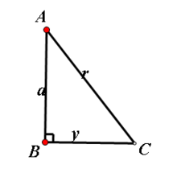
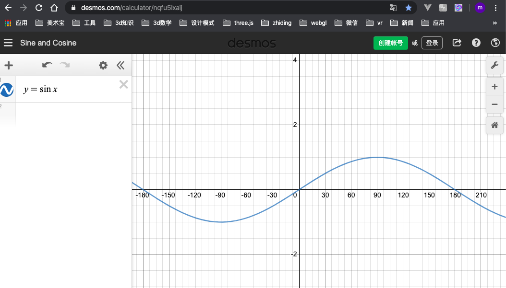
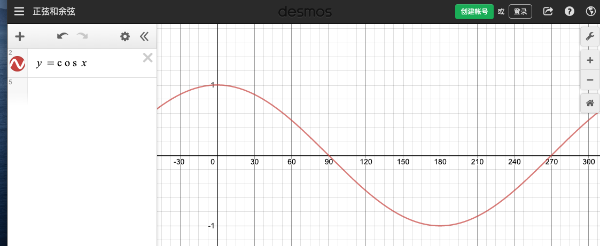

> 参考：
https://www.mathsisfun.com/algebra/trigonometry.html

## 三角函数
古代说的`勾三股四弦五`,以角A为例, `股`就是角A的对边v,`勾`就是角A的短邻边a,`弦`,就是三角形的最长边r。

### 一、正弦函数(sin)
#### 1、定义
在直角三角形中，任意一锐角∠A的**对边**与**斜边**的比叫做∠A的正弦。记作: $ sin(A) = v/r $

#### 2、图像
这里推荐一个函数图像绘制:[工具](https://www.desmos.com/calculator/nqfu5lxaij)。

这里注意:
- sin(90) = 1
- sin(0) = 0

### 二、余弦函数
#### 1、定义
在直角三角形中，任意一锐角∠A的**邻边**与**斜边**的比叫做∠A的正弦。记作: $ cos(A) = a/r $

#### 2、图像

这里注意:
- cos(90) = 0
- sin(0) = 1

<全文结束>
