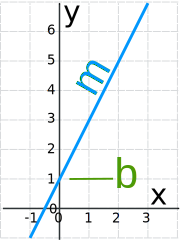
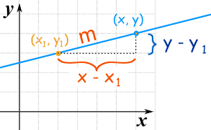

> 参考: https://www.mathsisfun.com/equation_of_line.html

### 直线方程

#### 1、斜截式
直线的方程式:
$ y = mx + b $


- m: 直线的斜率
- b: 与y轴的截距

#### 2、点斜式
已知一个点(x1,y1), 斜率是m, 那么直线的方程式:

$ y-y1 = m（x-x1）$

它的原理是基于斜率:


#### 3、一般式
由斜截式:$y=kx+b$,
有: $ kx+b-y=0 $
令: k = A; -1=B; b = C
=> $ Ax + By + C = 0 $

因此: $ k=- \frac {B}{A} $
带入到点斜式方程:

```math
\begin{aligned}

y-y_1 &= \frac {y_2-y_1}{x_2-x_1} (x-x_1) \\

\frac {y-y_1}{x-x_1} &= \frac {y_2-y_1}{x_2-x_1} \\


\end{aligned}
```

=> $x(y_2-y_1) + y(x_1 - x_2) + x_2y_1 - x_1y_2 = 0$

A、B、C 三个系数:
```math

\begin{aligned}

A &= y_1-y_2 = -(\Delta y) \\
B &= x_2-y_2 = \Delta x \\
C &= x_1y_2 - x_2y_1 = −B(\Delta x)\\

\end{aligned}
```


<全文结束>
