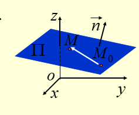

> 作图工具:https://threejs.org/editor/

### 平面方程


#### 1、点法式


由平面的一点M0(x1,y1,z1)和法线n(A,B,C)确定:
```js
// 向量M0M = (x-x0, y-y0, z-z0)
// M0M * n = 0
A(x-x0) + B(y-y0) + C(z-z0) = 0
```

#### 2、一般式
待续...

<全文结束>
