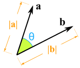
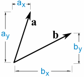
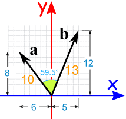
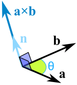
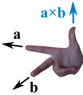
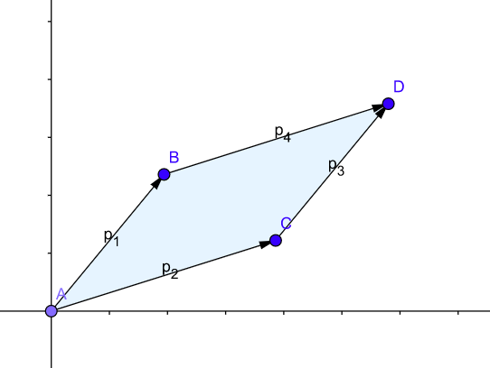

> 参考: https://www.mathsisfun.com/algebra/vectors-dot-product.html

### 一、向量点乘

可以这样写:

```js
a · b = |a| × |b| × cos(θ)
```

也可以这样:

```js
a · b = ax * bx + ay * by
```

两种方法是相同的。



### 二、向量叉乘
可以这样计算:

```js
a × b = |a| |b| sin(θ) n
```

也可以这样计算:


```js
cx = aybz − azby
cy = azbx − axbz
cz = axby − aybx
```

方向满足“右手规则”


叉积的大小（长度）等于边为矢量a和b 的平行四边形的面积：


#### 叉乘方向
[参考](https://riteme.site/blog/2016-4-12/geometry.html)



叉积是有方向的。$p1 \times p2 = - p2 \times p1$

叉积结果的符号与p1和p2的相对位置关系有很大联系：
- 当p2在p1的`顺时针`方向时,$p1 \times p2 < 0$
- 当p2在p1的`逆时针`方向时,$p1 \times p2 > 0$
- 当p2在p1`公线`时,$p1 \times p2 = 0$


[图片出处](https://mathinsight.org/cross_product)
<全文结束>
