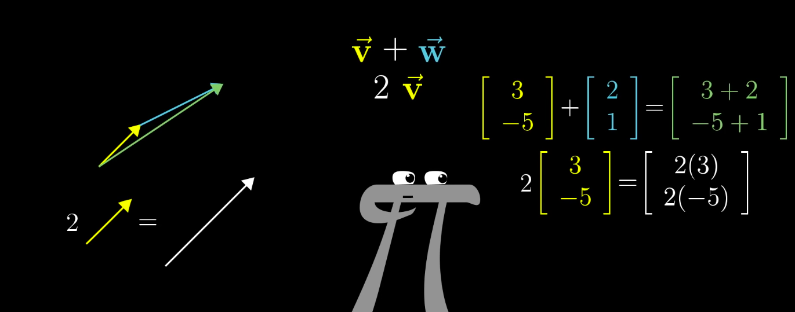
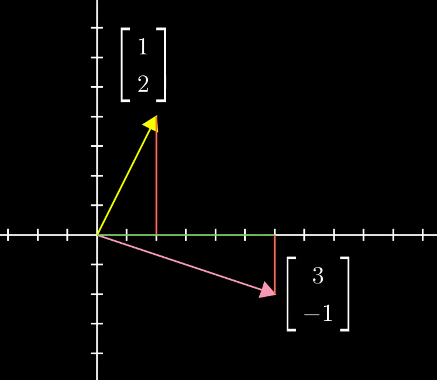
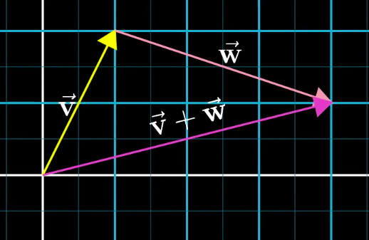
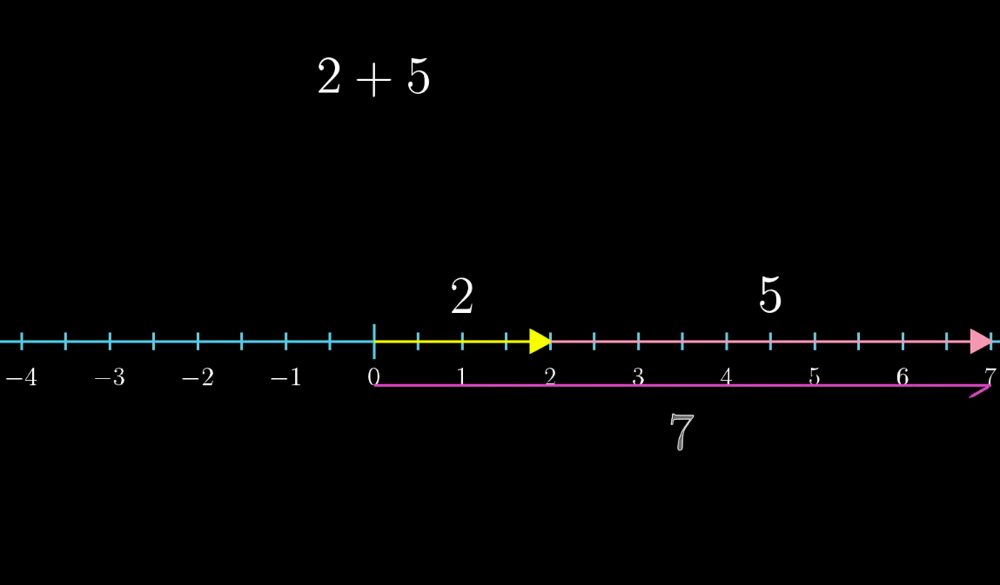
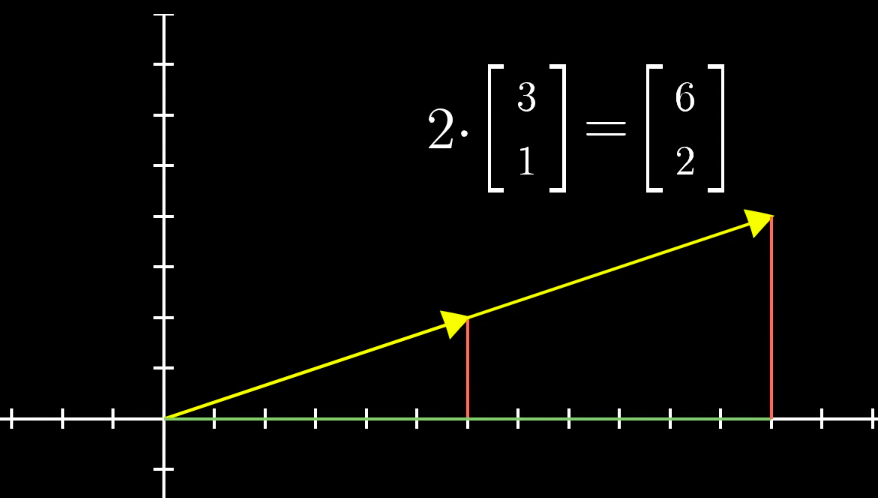
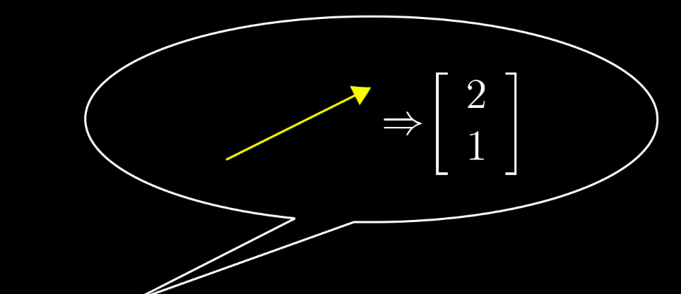

> 内容出自`3Blue1Brown`的:[线性代数的本质](https://www.bilibili.com/video/av6731067/)

这个系列是关于**线性代数的本质**,几何理解线性代数是非常有用的:

### 01-向量究竟是什么?

#### 1、向量定义的角度

**1) 物理专业角度**
向量是空间中有`方向`和`长度`箭头。

**2) 计算机专业角度**
向量是有序的数字列表。例如做房价分析,只关心两个特征:`房屋面积`和`价格`,用二维向量进行建模。

**3)数学专业角度**
向量可以是任何东西,只要保证`两个向量相加`以及`数字与向量相乘`有意义即可。

#### 2、几何意义的向量
**1)向量的表示**
- 它是一个箭头

- 落在某个坐标系下,比如x-y平面,起点位于原点

- 表示这个向量:

**2)向量的运算**
- 向量加法

这里可以这样理解:
把向量看作一种特定的运动:在空间中朝着某个方向迈出的一定距离。

先走了$\vec{v}$,再走了$\vec{w}$,总体效果与$\vec{w}$+$\vec{v}$相同。
这种理解可以看作是数轴上加法的扩展。

先移动2步,再移动5步,总体效果就是移动了7步。
向量加法就是对应项相加。

- 向量数乘

向量与标量相乘就是将向量中的每个分量与标量相乘。

#### 3、小结
体会向量与行列式的转换。

<全文结束>
