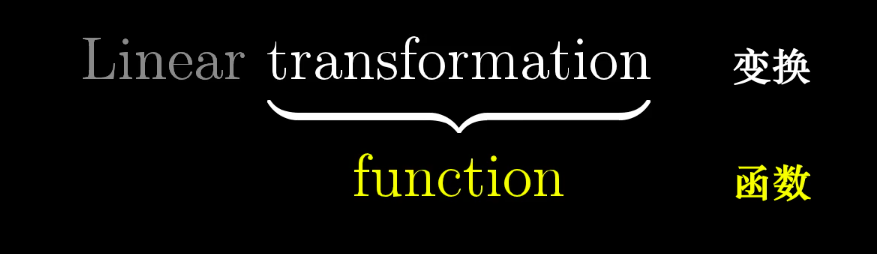
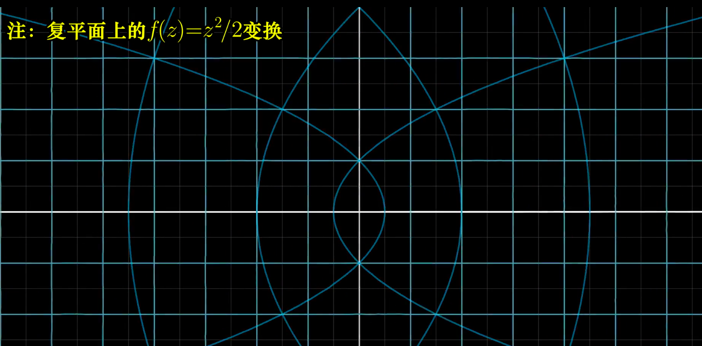
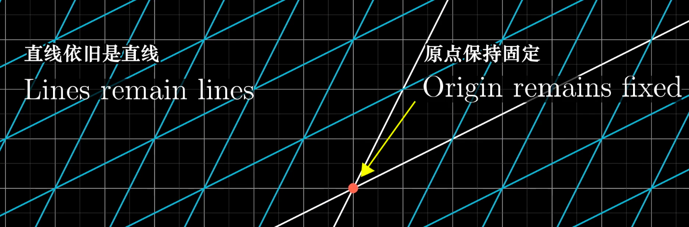
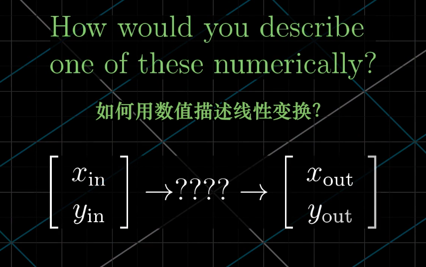
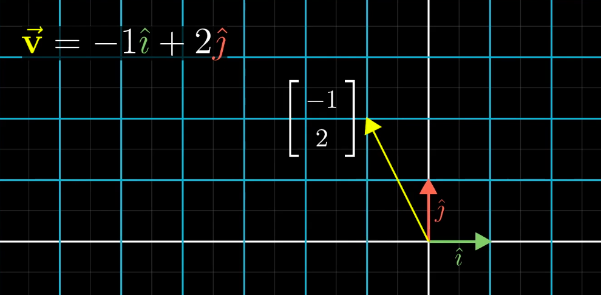
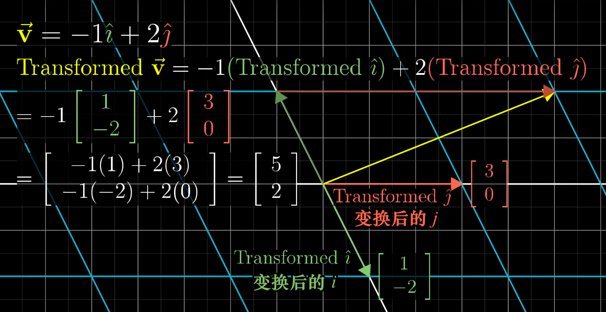
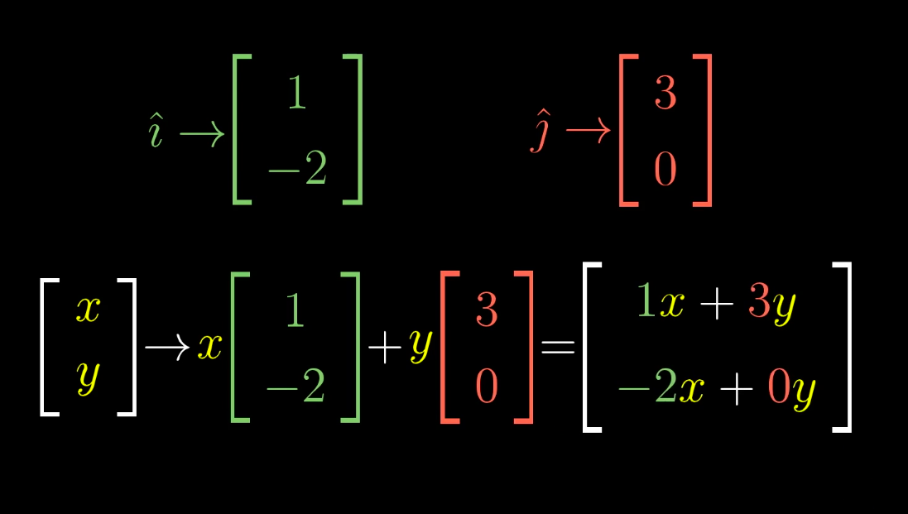
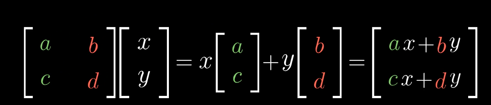
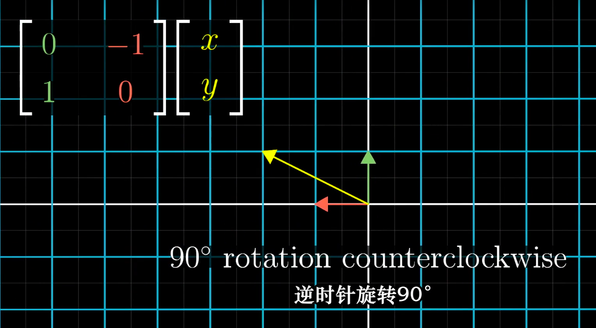

> 内容出自`3Blue1Brown`的:[线性代数的本质](https://www.bilibili.com/video/av6731067/)

### 03-线性变换与矩阵

#### 1、变换

线性变换是一个函数,对输入处理,然后输出。这里考虑输入是向量。

为什么不用`函数`而使用`变换`？
因为**变换**是在暗示以特定方式可视化这一输入-输出关系。

#### 2、线性
变换后的结果要求:

称为线性变换。

网格线保持平行且等距的变换,如旋转:

#### 3、如何用数值描述线性变换？
给定一个输入向量坐标,得到一个输出向量坐标。

举一个例子:输入向量$\vec{v}=(-1,2)$,输出向量$\vec{w}=(5,2)$

想求这个变换矩阵,实际结果是只要记录两个基向量$i,j$变换后的位置.变换后$\vec{i}=(1,-2)$,$\vec{j}=(3,0)$,那么变换后的向量:

任给一个向量(x,y)指定变换后$i,j$的位置:

#### 4、变换矩阵
将变换后$i,j$封装到$2*2$的格子中,称为$2*2$矩阵

更一般的情况,这也是矩阵乘法的定义:

矩阵的列看成是变换后的基向量。矩阵向量乘法看成是他们的线性组合。

举例:
将基向量逆时针旋转90度,那么变换后的$\vec{i}=(0,1)$,$\vec{j}=(-1,0)$。任给向量(x,y)只要和变换矩阵相乘即可。

#### 5、小结
线性变换是空间变换。

<全文结束>
